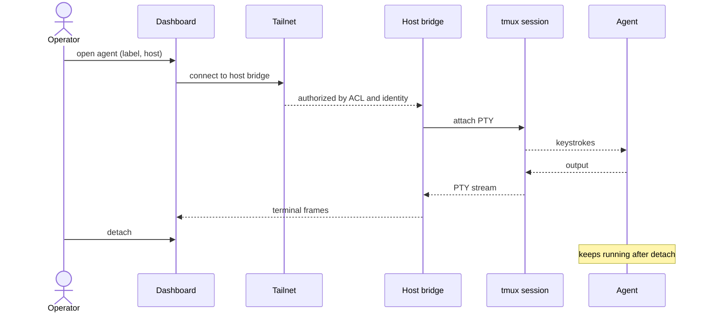

# ADR-0097: Operator surfaces reach any agent on any host over the tailnet

- **Status:** accepted (2026-08-13, operator)
- **Date:** 2026-08-12
- **Amends:** ADR-0073 (local-only attach), ADR-0056 (localhost-only dashboard)
- **Related:** ADR-0095 (named agents bind to hosts)

## Context

Two operator surfaces exist, and both assume one machine.

ADR-0073 gives `cc-attach <label>`, a wrapper around `tmux a -t <label>`. Putting Claude inside tmux "is what makes interactive attach possible." That works only from a shell on the machine hosting the session. ADR-0056 ships the dashboard as a static React SPA on port 5174, explicitly "**Single-operator-local v1.** No auth, no multi-tenant. Behind `localhost`," with a planned `/ws/events` seam.

ADR-0095 places agents on several hosts. Under the current surfaces the operator opens a shell per machine, and each dashboard shows one machine.

The operator's requirement: "I'd love to build toward a future where I could run agents pinned on multiple machines and open up a web or native app that lets me look at any of them regardless of which machine I'm on. So long as I'm on the tailnet I can connect to them." The operator also names the capability to preserve from `exec_otp`: "the ability... of being able to open a panel and go interactive with an agent, or make them headless."

## Decision

We decided that **operator surfaces address an agent by `(label, host)` and reach it over the tailnet, and that the tailnet is the authentication boundary.**

1. **Each host exposes a terminal bridge.** The per-host supervisor (ADR-0095) serves a WebSocket endpoint that attaches to a named session's tmux PTY. Attaching over the network and attaching with `cc-attach` are the same attachment to the same PTY.
2. **One dashboard, every host.** The dashboard lists agents across hosts and opens a terminal for any of them through that host's bridge. `cc-attach` remains, unchanged, for local use.
3. **Bind to the tailnet interface only.** The dashboard and every bridge bind to the host's Tailscale address. They never bind `0.0.0.0` or a LAN address.
4. **Access control is Tailscale's.** We use Tailscale ACLs and Tailscale-supplied identity. We do not author an authentication system, and **Tailscale Funnel is never enabled** for these services.
5. **Interactive and headless is attach and detach.** Attaching does not change an agent's lifecycle; detaching leaves it running.

## Alternatives considered

- **Incumbent: `cc-attach` plus the localhost dashboard (ADR-0073, ADR-0056).** **Why insufficient:** both bind to the machine that runs them. With agents on several hosts, the operator needs one shell per machine, and no surface shows the fleet.
- **SSH to each host, then `cc-attach`.** The status quo generalised. Rejected as the primary surface: it works, but it offers no fleet view and no path to a web or native client, which is the stated goal. It remains the fallback when a bridge is down.
- **Hand-rolled authentication on a publicly bound dashboard.** Rejected. These sessions run with permissions bypassed, so a terminal endpoint is a remote shell holding an agent. We are not qualified to be the only thing between that and the internet, and Tailscale already solves it.
- **`exec_otp`'s dashboard model.** Its single pane over the fleet is the capability we want, and its postmortem §3.7 keeps it. Rejected as an implementation because it read a distributed store to build the view (§4.1); ours reads the event log.

## Consequences

### Good
- One surface reaches every agent, from any device on the tailnet.
- No new authentication system, and no new secret to manage.
- The terminal an operator sees over the web is the same PTY the supervisor sees, so there is no second source of truth about what an agent is doing.

### Bad / trade-offs
- Off the tailnet there is no access. This is deliberate.
- Each host now runs a network-facing service, which is new attack surface on every machine.
- Terminal streaming over a WebSocket is a poorer experience than a local tmux attach for latency-sensitive interaction.

### Risks
- A bridge bound to the wrong interface exposes a permissions-bypassed shell. The service must assert its bind address at startup and refuse a non-Tailscale address.
- Tailscale ACL drift silently widens access. The ACL is part of this decision and belongs under review.
- **Falsifier:** an operator surface listening outside the tailnet, or reaching an agent requiring credentials we issued ourselves.
- **Check:** none yet — see Follow-ups.

## Diagram

## Follow-ups

- Whether the native client is a wrapper over the web surface or a separate application.
- Whether scale-to-zero for idle sessions returns, which would give "headless" a lifecycle meaning beyond "not attached."
- Read-only observation as a distinct permission from interactive attach.

## References

- ADR-0073 §2 (tmux owns the TTY); ADR-0056 (dashboard scope and the `/ws/events` seam).
- `exec_otp` postmortem §3.7 and §4.1: `~/obsidian/lepper/exec-otp/exec_otp Postmortem.md`.
