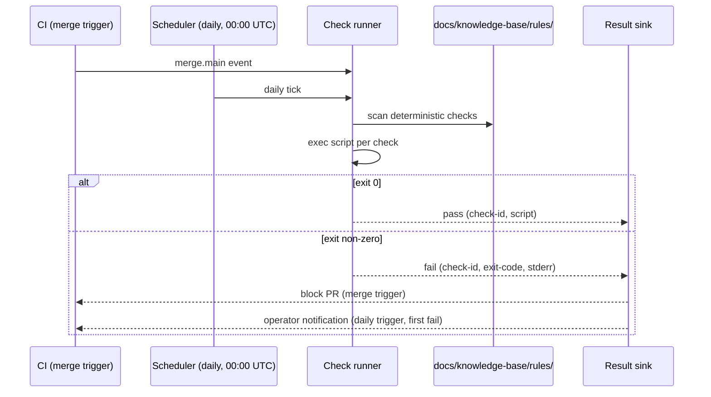

# ADR-0099: Scheduled conformance check-runner

- **Status:** proposed
- **Date:** 2026-08-13
- **Related:** ADR-0006, ADR-0098

## Context

ADR-0006 defined the rule primitive — YAML documents under
`docs/knowledge-base/rules/` with `checks` that declare either a
deterministic script (exit-code contract) or an LLM-judge prompt. ADR-0006
deferred the engine that actually runs those checks: "Until then, rules are
documents. Their checks are real (runnable scripts; well-formed prompts) but
no Treadmill component yet runs them."

ADR-0098 (proposed) added the falsifier-declaration mandate: every ADR binds
a `Check` so it can be falsified. But ADR-0098 split off the Check mandate from
the runner, naming the risk explicitly: "the rules directory becomes a graveyard
of unrun checks if nothing executes them on a schedule." A check declared by an
ADR or crystallized into a rule is inert if nothing runs it. A regression after
merge is the exact failure mode ADR-0098 exists to catch — exec_otp's hot-loaded
fix was implemented then silently lost precisely because no periodic sweep
confirmed the property held after the merge window closed.

We need a runner that makes declared checks meaningful.

**Falsifier:** a deterministic check bound to an ADR or rule regresses after a
merge to main, and no automated run detects or reports it within 24 hours.

## Decision

We decided to adopt a scheduled conformance check-runner that executes the
deterministic checks declared by ADRs and rules on two triggers:

1. **On merge to main (CI gate).** Every merge runs all deterministic checks
   against the merged state. This catches regressions at the commit boundary.
2. **Daily periodic sweep.** A scheduled job runs the same suite at a fixed
   cadence (daily at 00:00 UTC). This catches post-merge drift — configuration
   changes, environment drift, or external dependency shifts that a merge-time
   run would not see.

The runner scans:

- All `checks` entries with `type: deterministic` under `docs/knowledge-base/rules/`.
- Any `Check:` binding declared in an ADR that references a script path.

LLM-judge checks are excluded from this runner; they require diff context and
PR-scoped evaluation. The runner is deterministic-only.

Results are reported per check: pass (exit 0) or fail (non-zero), with the
check id, script path, exit code, and stdout/stderr tail. Failures are surfaced
as a CI status check (blocking on merge trigger) and as a logged artifact (periodic
trigger, with operator notification on first failure per check per day).

Once this runner exists, a follow-up amends the `/decide` skill template to add
the Check line to the ADR template — the deferred half of ADR-0098.

## Alternatives considered

- **Incumbent: nothing runs checks today.** ADR-0006 deferred the engine and
  no subsequent ADR filled that gap. Rules under `docs/knowledge-base/rules/`
  have runnable scripts; none of them execute on any trigger. ADR-0098's
  declared checks sit similarly inert. **Why insufficient:** an unrun check is a
  false promise. The exec_otp case proves that a property can be lost after merge
  with no detection. The whole point of the falsifier-and-check mandate in ADR-0098
  is detection, which requires execution.

- **Run checks only in CI at merge.** A merge-time CI run catches regressions
  at the commit boundary but misses post-merge drift. The exec_otp regression was
  not introduced by a single bad commit; it was a property that held at merge and
  degraded later as surrounding code changed. A once-at-merge-only runner would
  have passed on that day and never fired again. **Why rejected:** this is exactly
  the scenario ADR-0098's falsifier mandate is designed to catch. Omitting the
  periodic sweep guts the core guarantee.

- **Run LLM-judge checks on the same schedule.** LLM checks require PR diff
  context, a cost budget, and a non-deterministic result that varies by prompt
  version. Running them daily without a diff would produce noisy results and
  unclear pass/fail signals. **Why rejected:** LLM checks belong in the PR-time
  pipeline where diff context exists. The scheduled runner targets the stable,
  repeatable, cheap deterministic subset.

## Consequences

### Good

- Declared checks become executable guarantees, not documentation artifacts.
- Post-merge drift is detected within 24 hours, not never.
- The runner is simple: `find`, `sh script`, check exit code. No new runtime
  dependencies.
- Adding a new deterministic check to any rule or ADR automatically enrolls it
  in the next sweep with no runner changes needed.

### Bad / trade-offs

- Two trigger modes (CI + daily) require two integration points: a CI step and
  a scheduled job (cron or equivalent). Maintenance surface doubles.
- Deterministic-only scope leaves LLM checks unenforced on a schedule; a
  separate PR-time pipeline is still needed for them.

### Risks

- Check scripts that are slow or stateful could make the daily sweep noisy.
  Mitigation: ADR-0006 already requires deterministic checks to exit with a
  defined contract; slow scripts are an authoring defect, not a runner defect.
  A per-check timeout (e.g. 30s) bounds blast radius.
- The daily sweep fires regardless of whether the repo has changed. For a
  stable repo this is harmless; for an active one it may surface environmental
  flakiness as false failures.

## Diagram

## References

- ADR-0006 — rules and remediations primitive; deferred the engine.
- ADR-0098 (proposed) — falsifier-declaration mandate; named the unrun-check risk.
- `docs/knowledge-base/rules/` — current check inventory the runner scans.

## Follow-ups

- Implement the runner (a follow-up plan task; this ADR scopes only).
- Amend the `/decide` skill template to add the Check line once the runner
  exists (the deferred half of ADR-0098).
- Scope LLM-judge scheduling in a separate ADR when the PR-time pipeline matures.
