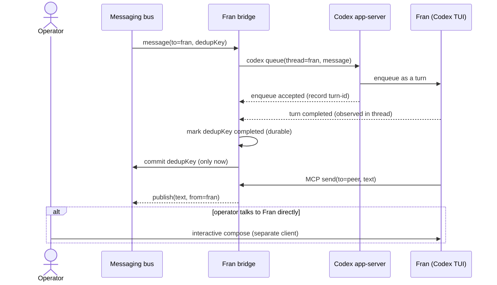

# ADR-0102: A non-Claude-Code sibling joins the fleet through the Codex App Server

- **Status:** accepted (2026-09-11; cross-model review by Fran + sibling verified co-sign by treadmill-ernie)
- **Date:** 2026-09-11
- **Related:** ADR-0093 (durable, ordered agent messaging), ADR-0095 (named agents bind to hosts), ADR-0073 (persistent sessions and interactive attach), ADR-0070 (review surface), ADR-0084 (coordinator-led execution)

## Context

The fleet runs Claude Code exclusively. The operator wants a second coding harness — OpenAI Codex — for genuine cross-harness diversity: an agent that fails and succeeds differently, and a cross-family reviewer that is not merely a model swap inside one harness (operator, 2026-09-11). The first instance is an experimental sibling, "Fran."

Fran must be reachable through our messaging the way a Claude Code sibling is, and peer messages must not disturb the operator while he types to her — the clobbering failure of the retired fabric. Our messaging model is durable, ordered, effectively-once, addressed by **label**, identity `(label, host)` (ADR-0093, ADR-0095). The live transport that reaches siblings is the Claude Code **harness** bus (`CLAUDE_CODE_MESSAGING_SOCKET`); a Codex process has no client for it.

## Decision

We decided that a non-Claude-Code sibling joins the fleet as a **supervised interactive Codex session integrated through the Codex App Server**: a `codex` TUI in tmux under systemd (the ADR-0073 substrate), attached to the local app-server daemon, made addressable by label through a **bridge**. Two directions, one contract each:

- **Inbound (bus → Fran): `codex queue` — exactly-once at the COMMIT boundary, at-least-once in EXECUTION.** The bridge is an ADR-0093 receiver for label `fran` and embeds the `dedupKey` in every queued message. Two facts force an honest, narrow guarantee: `codex queue` is not idempotent (verified: the consumer accepted the same key twice), no timeout can prove an in-flight retry will not still arrive, and a **Codex turn is not an idempotent receiver** — it writes files, calls tools, and sends peer messages via the explicit outbound path (this Decision's second bullet), so ADR-0093's "at-least-once to an *idempotent* receiver" premise does not hold for Fran's execution. Therefore: the bridge keeps a durable ledger keyed by `dedupKey` and **commits each `dedupKey` exactly once** — on the first observed turn completion — so a peer message is *acknowledged* once and the commit boundary is turn COMPLETION. But a duplicate turn that slips through **still executes**, and its side effects are **not retracted** by suppressing its completion record. We claim **exactly-once acknowledgment/commit, at-least-once execution** (see Consequences for the side-effect scope and mitigations); we do **not** claim exactly-once execution. Re-enqueue is best-effort recovery for a never-completed key. `tmux send-keys` injection is prohibited. (Build-time: queue idempotency/cancel support, turn visibility, restart survival — a guessed timeout is not a correctness argument.)
- **Outbound (Fran → bus): an explicit MCP `send` tool; delivery is at-least-once, dedup is best-effort.** Fran emits to a named recipient by calling a bridge-provided MCP tool; replies are **never auto-forwarded** (an operator-directed reply must not leak onto the bus). Outbound has the mirror of the inbound limit and we state it honestly: **delivery is at-least-once** — the relay can crash after a peer receives a message but before recording it, and exactly-once delivery is impossible unless the *destination* dedups. The relay reduces duplicates **best-effort** by stamping each send with an **operation key** (`originating-inbound-dedupKey + a content-stable operation id`, never a positional sequence — divergent re-executions of a turn send different calls in different order, so a positional sequence would mis-match) and dropping a repeat of the **same key+content**. Three limits remain by construction and are accepted: (a) a **divergent** re-execution (different content) is not deduped; (b) exactly-once requires the destination to dedup on the operation key — a peer that needs it must; (c) an **intentional identical resend** within one turn (same recipient + same text twice, on purpose) is indistinguishable from a duplicate and one copy is dropped. We claim: at-least-once outbound delivery, best-effort suppression of identical resends.

## Alternatives considered

- **Incumbent: the Claude Code harness bus.** We **retain** it — Fran's outbound rides it through the bridge/MCP. **Why insufficient alone:** it has no inbound path to a non-Claude-Code process; that missing inbound leg is the gap this ADR fills.
- **`tmux send-keys` into the Codex TUI (the naive inbound default).** Rejected: it types into the live TTY, clobbering the operator's compose, and carries none of ADR-0093's ordering/dedup. This is the failure we will not repeat. Verified 2026-09-11: `codex queue` delivers the message as its own turn with the composer untouched.
- **A direct App-Server JSON-RPC client instead of the `codex queue` CLI.** Deferred, not rejected: the same seam, lower-level. We start with `codex queue` (proven present in 0.154.0) and may drop to the raw protocol if we need finer control over turn scheduling.
- **Headless `codex exec` per message.** Rejected for a persistent sibling: no continuity across turns without external bookkeeping, and no interactive attach for the operator.

## Consequences

### Good
- Genuine cross-harness diversity, and cross-family review that is not merely a model swap. (Demonstrated 2026-09-11: this ADR's own cross-model reviewer was a Codex sibling.)
- Clobber-free inbound: `codex queue` delivers a peer message as its own turn. Demonstrated once end-to-end; the invariant is established by the foils in the plan, not by that single case.
- Reuses the ADR-0073 supervise-in-tmux substrate; the App Server exposes Codex to clients over JSON-RPC.

### Bad / trade-offs
- A bridge process per non-Claude-Code sibling — new glue we own (an ADR-0093 receiver/outbox plus the dedup-ledger reconciliation and turn-completion observation).
- **The contract is exactly-once COMMIT, at-least-once everything else.** "Exactly-once commit" means the `dedupKey` reaches its durable committed state once (one logical state transition) — not a guarantee about how many acknowledgment transmissions occur. A duplicate turn that slips through still runs; with Fran at fleet parity, its side effects (file writes, tool calls, an outbound `send_message`) already happened and are not undone. So: (a) duplicate turns must be side-effect-tolerable, and the window is kept small by a best-effort enqueue-time ledger check; (b) the outbound relay dedups **best-effort** on a content-stable operation key — it suppresses *identical* resends but does **not** make delivery exactly-once, so a duplicate peer message is possible and accepted (exactly-once delivery would need the destination to dedup); (c) true exactly-once *execution* would require codex-queue idempotent submission or cancel/fence — a build-time capability we do not assume. We claim exactly-once commit; we accept at-least-once execution **and** at-least-once delivery.
- Two auth surfaces: a set `OPENAI_API_KEY` in the environment makes the daemon serve API-key mode; the **daemon's effective account**, not just the launcher env, governs auth, so a daemon started with the key contaminates every session it serves.
- Fran runs with the Codex sandbox and approvals **bypassed** (`--dangerously-bypass-approvals-and-sandbox`, operator directive 2026-09-11 for fleet parity) — full host write access is a deliberate, real trust surface for an experimental non-Claude-Code sibling. The auth guard still enforces ChatGPT-only / no API key.
- ChatGPT-subscription usage limits can stall a turn mid-flight.
- The App Server is experimental; its protocol may shift.

### Risks
- The key unknown is whether a `codex queue` turn that is **enqueued but not yet executed survives a daemon restart** and still runs. If it does not survive, the ledger re-enqueues on restart — this may cause a duplicate *execution* (the accepted at-least-once cost), but never a double *commit* — and a plan foil must pin the acknowledgment-exactly-once-across-restart behavior. The ADR-0093 receiver library must also expose a **deferrable commit** (commit held until the bridge observes turn completion); if it cannot, the design must change.
- `codex queue` ordering across rapid messages, and its interleaving with an in-flight operator turn, are unproven beyond one round-trip.
- **Falsifier:** (a) a `dedupKey`'s durable committed state is reached **more than once** (a double commit), or an inbound peer message is **never committed/lost** — the commit guarantee failed. Duplicate *execution* and duplicate *outbound delivery* are accepted, documented costs, **not** falsifiers. OR (b) two rapid peer messages A then B are delivered **out of order, merged, or dropped**, or a message injected while the operator is mid-compose **disturbs his composer or drops his turn**; OR (c) Fran cannot be addressed by her label, or `from=fran` fails to render as a first-class label wherever the event log is folded (dashboard rows, ADR-0070 review queues, agent enumeration).

## Diagram

## Follow-ups

- Confirm the ADR-0093 receiver library exposes a commit deferrable to turn-completion.
- v1 is **unicast-only**; channel/broadcast delivery needs the ADR-0093 composite `(subscriber, broadcast_id)` key and is out of scope here.
- The owner of the dashboard / review-surface / agent-registry tree must confirm `from=fran` renders as a first-class label before merge.

## References

- Spike, 2026-09-11: Codex 0.154.0, `app-server daemon` + `codex queue` clobber-free round-trip on ChatGPT-subscription auth. Cross-model review by the Fran sibling; sibling review by Ernie.
- ADR-0093, ADR-0095, ADR-0073, ADR-0070.
