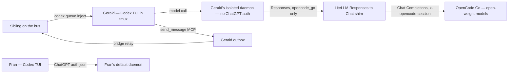

# ADR-0104: Open-weight sibling (Gerald) — Codex harness on the OpenCode Go endpoint

- **Status:** accepted (2026-09-11; cross-model review by Fran cleared over two rounds + sibling co-sign by Ernie, verified live). OPERATIONAL NOTE (2026-09-12): the persistent Gerald agent was stood down (services stopped + disabled) by operator decision. Open-weight capability is now consumed as REVIEW via the ADR-0107 model gateway + cross-model panel, not as a persistent agent — this reserves the OpenCode Go budget for reviews. The Gerald substrate (this ADR's harness/shim/bridge) still underlies the gateway's open-weight access and the runtime is revivable; the decision here is not reversed, only the always-on agent is retired.
- **Date:** 2026-09-11
- **Related:** ADR-0102 (non-Claude-Code sibling via the Codex App Server), ADR-0103 (shared agent skills)

## Context

We want a fleet sibling that codes with OPEN-WEIGHT models, to add model
diversity to cross-model review and to the work itself. The operator subscribed
this idea to a $10/month **OpenCode Go** plan, which exposes 30+ curated
open-weight coding models (DeepSeek, Qwen3, GLM, Kimi K2, MiniMax) behind a
single OpenAI-compatible endpoint at `https://opencode.ai/zen/go/v1`.

The obvious harness is OpenCode's own client. A spike on OpenCode 1.18.30
disproved it for our use. OpenCode's client/server split gives a clobber-free
injection primitive (`POST /session/:id/prompt_async`), and headless injection
executes reliably against free open-weight models. But an injected turn does NOT
render live in an ATTACHED TUI — it reproduces the documented render bugs
(`anomalyco/opencode` #8564, #19176). So a watchable, tmux-hosted sibling that
the operator talks to — the shape every current sibling has, and the shape the
operator asked for — is not reliably supported by OpenCode's TUI today.

We already run a Codex sibling (Fran, ADR-0102) with a proven watchable TUI, a
clobber-free injection channel (`codex queue`), and full bus integration. Codex
0.154.0 accepts custom OpenAI-compatible model providers, and OpenCode Go's
endpoint is OpenAI-compatible. So the open-weight MODELS and a proven HARNESS can
be combined — but not directly. The spike found a **wire-format incompatibility**:
Codex 0.154 dropped `wire_api = "chat"` and speaks the OpenAI **Responses** API
only to custom providers, while Go's open-weight models speak **Chat Completions**
only (`/responses` returns "model not supported for format openai"; only Go's
proprietary GPT-family models accept Responses). A translation layer is required.

## Decision

We added **Gerald**, an open-weight sibling that runs the **Codex harness →
a local Responses→Chat shim → the OpenCode Go endpoint**. Gerald reuses the Fran
substrate (ADR-0102): tmux-hosted Codex session, `codex queue` inbound injection,
the MCP `send_message` outbox, and the systemd supervise/reap units. He differs in
three ways:

1. **The shim** — a LiteLLM proxy (`gerald-shim.service`, `127.0.0.1:4141`) that
   translates Codex's Responses requests to Go Chat Completions
   (`use_chat_completions_api`) and injects the required `x-opencode-session`
   header. It is a supervised daemon, alongside the Fran/Gerald substrate.
2. **An isolated Codex home** — Gerald runs with `CODEX_HOME=~/gerald/.codex`, his
   OWN app-server daemon (own control socket; the managed binary is shared by
   symlink). That home has NO `auth.json` (no ChatGPT) and defines ONLY the
   `opencode_go` provider (`base_url = http://127.0.0.1:4141/v1` — the shim —
   `env_key = OPENCODE_API_KEY`, `wire_api = "responses"`), which is also the
   default. Default model `qwen3.8-max`; a per-message `[[model: …]]` marker
   selects another via `codex queue --model`.
3. **Open-weight only — enforced on the configured route, within the fleet's
   cooperative same-UID trust model.** Gerald's isolated home makes open-weight the
   default and only *configured* path: his daemon has no proprietary provider or
   credential, so the normal request routes cannot select one. Verified by foil:
   `--model gpt-6-astra` errors ("not found"), and `-c model_provider=openai` is
   refused by `codex queue` against a running daemon. Defense in depth: the shim
   lists open-weight models only; the auth-guard parses the shim config against an
   open-weight ALLOWLIST (fail-closed), requires `opencode_go.base_url` to be the
   local shim over `wire_api = "responses"`, and refuses to start if Gerald's home
   has `auth.json` or any non-`opencode_go` provider; the unit unsets
   `OPENAI_API_KEY`/`ANTHROPIC_API_KEY`; AGENTS.md forbids proprietary use.
   This is NOT a hard sandbox. Gerald runs as the same UNIX user as the rest of
   the fleet with a bypassed shell, so a Gerald that deliberately broke policy
   could read `~/.codex/auth.json` or run `CODEX_HOME=~/.codex codex …` and reach
   Fran's default daemon — exactly as any fleet agent could reach any other's
   files today. The guarantee is configured-route isolation plus cooperative
   agent/operator policy, not OS-level containment. A hard boundary (a separate
   UNIX user or container with no read access to other homes) is a fleet-wide
   follow-up, not specific to Gerald. (The earlier shared-daemon design was weaker
   still — the daemon Gerald attached to held Fran's live ChatGPT auth on the
   normal route; cross-model reviews from both Fran and Ernie caught it.)

This buys the open-weight models via Codex's coding approach — explicitly NOT
OpenCode's coding approach, which the render bug ruled out for a watchable sibling.

**Cross-model routing topology.** With Gerald added, cross-model review can run in
any direction over the bus: a Claude sibling ↔ Fran (GPT/`gpt-6-astra`), a Claude
sibling ↔ Gerald (open weight), and Fran ↔ Gerald. How the fleet's review
discipline USES these voices (routing away from Tapestry evaluators, and requiring
two independent cross-model passes) is a separate decision — see ADR-0105.

## Alternatives considered

- **Incumbent: OpenCode's own client (the native harness for Go).** Its attached
  TUI does not render injected turns on 1.18.30 (#8564/#19176), proven in the
  spike. **Why insufficient:** a sibling the operator cannot watch fails the
  fleet's interaction model. Headless-OpenCode remains a valid but different
  product (no live TUI); it is not what we chose here.
- **crush (Charm, Go TUI) or GitHub Copilot CLI pointed at Go.** Both take an
  OpenAI-compatible provider and have a TUI. **Why rejected:** neither has a
  proven clobber-free external-injection channel, and neither is bus-integrated.
  Codex already has both; choosing them would re-solve what Fran already solved.
- **A second OpenCode-native (headless) sibling.** **Why rejected for now:** the
  operator asked for a watchable TUI; headless is deferred, not dismissed.
- **Pin an older Codex that still supports `wire_api = "chat"`** (no shim). **Why
  rejected:** Codex is a shared install and a shared daemon with Fran; pinning an
  old version to dodge the wire-format change risks Fran and forgoes current Codex
  fixes. The shim isolates the workaround to Gerald's path.
- **Use only Go's GPT-family models (Responses-native, no shim).** **Why
  rejected:** those are proprietary — it defeats the entire point of an
  open-weight sibling.

## Consequences

### Good
- Open-weight models in the fleet with a watchable TUI and zero new injection risk.
- Maximal reuse of the ADR-0102 substrate — small, well-understood surface.
- Cross-model review gains a genuinely different model family.

### Bad / trade-offs
- We get open-weight models through Codex's harness, not OpenCode's. If OpenCode's
  specific coding behavior is ever wanted, that is separate work.
- **Gerald runs a second app-server daemon** (his isolated home) beside Fran's
  default one. Cost: a second daemon process, and the managed binary must be
  reachable from `~/gerald/.codex` (a symlink to the shared standalone package).
  Benefit: no shared-daemon auth coupling, no cold-boot key race, no flapping Fran
  — and the open-weight boundary is structural. The shim (`gerald-shim.service`)
  is a new supervised daemon and a single point of failure for Gerald's model
  calls; its readiness is gated (auth-guard waits for `curl -f` liveliness) and a
  bad config exits 78 (RestartPreventExitStatus) instead of crash-looping.
- **Shim translation is lossy in principle** (`drop_params: true` drops unmapped
  params; reasoning items are reshaped). Acceptable for a reviewer/coding sibling;
  revisit if a model needs a dropped parameter.
- Model quality varies across the Go catalog; per-model dollar caps ($15–$60/mo)
  can throttle Gerald mid-task.

### Risks
- A Codex version bump could change custom-provider config or the `wire_api`
  handshake; pin the Codex version and re-verify.
- The Go endpoint or a specific model can rate-limit or 402 when a cap is hit;
  Gerald must surface that, not hang.
- **Falsifier:** Gerald produces a model turn served by a proprietary model or a
  provider other than `opencode_go` — observable as a turn whose model is a
  gpt/chatgpt/o-series, Claude, Grok, or Gemini id, an `OPENAI_API_KEY`- or
  `ANTHROPIC_API_KEY`-authenticated call attributable to Gerald, or any model not
  in the open-weight shim allowlist. That means the provider pin or the
  open-weight guard did not hold, and Gerald is not the open-weight sibling this
  ADR defines.

## Diagram

## Follow-ups

- De-duplicate the bridge code shared by Fran and Gerald (one canonical copy),
  symmetric with ADR-0103's skills model.
- Decide whether a headless OpenCode-native sibling is worth adding later for
  OpenCode's own harness behavior.
- **Runtime open-weight detector** (review, defense-in-depth): alert if a served
  Gerald turn's model is not in the shim allowlist. The load-bearing boundary is
  that the shim returns HTTP 400 for a non-allowlisted model (verified live); it
  holds only while the shim has no wildcard/pass-through — never add one.
- **Hard isolation boundary (fleet-wide):** the current guarantee is
  configured-route + cooperative policy under one UNIX user. A real sandbox (a
  separate UNIX user or container per sibling, with no cross-home read access)
  would make the open-weight boundary — and every sibling boundary — enforceable
  against a policy-breaking agent. Not specific to Gerald.
- Queue-error retryability: an enqueue that errors after the ledger records
  `submitted` is not retried on identical content (same class as the disclosed
  recovery gap). The fix must distinguish a CONFIRMED rejection (the queue
  definitively did not accept — safe to auto-retry) from an UNCERTAIN outcome (a
  CLI error or timeout where acceptance is unknown). A CLI error/timeout alone
  must NOT imply safe automatic retry — that path requires explicit replay
  authorization and accepts duplicate-execution risk.

## References

- ADR-0102 (Codex sibling substrate), ADR-0103 (shared skills).
- Spike (2026-09-11): OpenCode 1.18.30 `prompt_async` executes headless but does
  not render in an attached TUI (#8564/#19176); Go endpoint is OpenAI-compatible.
