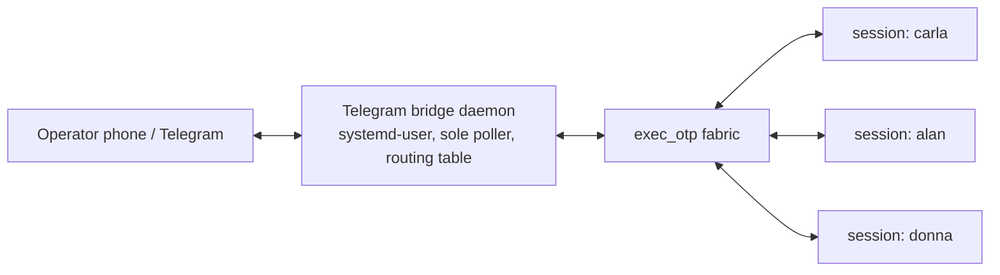

# ADR-0106 — A persistent Telegram bridge daemon replaces per-session bots

- **Status:** proposed
- **Date:** 2026-09-12
- **Amends:** ADR-0067 (one bot per session)
- **Related:** ADR-0068 (shared channel conventions), the exec_otp fabric (`send`)

## Context

ADR-0067 reached the phone via **one Telegram bot per session**, and named its own successor:
a "custom channel server with a routing table (chat_id → session)" was **deferred, not rejected** —
"the correct long-term shape **if bot-per-session friction proves real**... build only after the stock
setup has been lived with."

That friction is now real and observed:

- ADR-0067 chose per-session **tokens** to dodge Telegram's single-poller limit, but the fleet has in
  practice converged on a **shared bot token**. Telegram's Bot API permits exactly **one `getUpdates`
  long-poll per token**, so the concurrent session-pollers **409-collide and knock each other offline** —
  the connection **flaps** fleet-wide (reconnects, then drops the moment the next poller grabs the slot).
- A restart does **not** fix it: a session's MCP reconnects, then drops again on the next collision
  (observed on alan and carla, 2026-09-12). The operator, **remote** (Telegram his only channel), could
  reach no session — the exact 409-broken state ADR-0067 itself named ("single-bot sharing... broken:
  `getUpdates` permits one poller per token, a second gets 409").
- The fragility is **structural**, not something per-session nursing can cure: it is one contended slot,
  and it worsens with the number of pollers on the token.
- Note: **outbound** `sendMessage` does not use the poll slot, so a direct Bot-API send still works even
  while inbound flaps — which is how this ADR's operator updates got through, and which makes the
  daemon's outbound path trivial.

The exec_otp **fabric** (`send`) is meanwhile a reliable, durable, location-transparent message bus that
every session already uses. The trigger ADR-0067 set has fired, and the durable substrate exists.

## Decision

We decided to build ADR-0067's deferred gateway: a **single persistent Telegram bridge daemon** that is
the sole Telegram poller and bridges Telegram ↔ the fabric.

- **One supervised connection.** The daemon runs under systemd-user with auto-restart, holds the single
  Telegram connection (Telegram permits one `getUpdates` poller per token — ADR-0067), and reconnects on
  its own backoff. There is one connection to keep healthy, not N.
- **Inbound by relay-dir file-drop; no bridge session.** The daemon is a plain poller. For each inbound
  message it looks up the target label in a routing table (chat_id → session label) and writes the
  message as a `.md` file into that session's channel relay inbox
  (`~/.cc-channels/<label>/relay/`). The session's already-running `treadmill-events` channel server
  watches that dir (`fs.watch`, at-least-once notify-then-unlink, 60s resweep — `relay-inbox.ts`, task
  ecd6d6eb) and injects the file as a `<channel source="relay">` notification. This is the exact path
  the current per-session Telegram plugin uses to surface inbound. No relay session and no LLM sit in the
  inbound loop, because the targets are native cc-channels sessions that already run the watcher — unlike
  fran-bridge, whose relay session exists only to reach Codex siblings off this substrate (ADR-0102).
- **Outbound by direct Bot API.** A session sends a reply with a direct `sendMessage` call, which does
  not use the poll slot (proven 2026-09-12). Outbound needs no daemon involvement. The phone's "chat
  list = session list" UX (ADR-0067) is preserved by the routing table.
- **Sessions stop running a per-session Telegram MCP.** They no longer poll `getUpdates`, so a session's
  lifecycle is decoupled from the Telegram connection: a session restart no longer touches Telegram, and
  a Telegram blip no longer needs per-session fixing.
- **Target eligibility (verified invariant).** The relay-dir inject works only for a session that runs
  the `treadmill-events` channel server — every session started by `launch-session.sh` does, because the
  launcher appends `--dangerously-load-development-channels server:treadmill-events`. This scopes the
  treadmill CLAUDE.md "cc-relay is retired / delivered nowhere" note: that note holds for **pure-fabric
  agents** that run no watcher; it does not hold for launcher sessions, whose relay dir is actively
  watched. A session that runs no watcher is not a valid Telegram target.

## Alternatives considered

- **Incumbent — one bot per session (ADR-0067).** *Why insufficient:* N independently-fragile
  connections, each needing manual nursing; simultaneous drops leave a remote operator unable to reach
  any session (observed 2026-09-12). This is the exact friction 0067 said would trigger the gateway.
- **Keep per-session bots + a health-check daemon that restarts a session when its Telegram drops.**
  *Rejected:* restarts are heavy and carry the `--resume` back-in-time risk; it treats the symptom
  (a dropped MCP) instead of the root cause (per-session connections), and still scales as N.
- **Remote Control.** *Rejected in ADR-0067* for demonstrated unreliability; unchanged here.
- **One bot multiplexed by the stock plugin.** *Impossible as built* (ADR-0067): the stock channel
  protocol has no session addressing. The daemon supplies exactly the routing layer the stock plugin
  lacks.
- **A bridge Claude session that drains the poller and re-sends over the fabric (the fran-bridge shape).**
  *Rejected for this substrate:* fran-bridge needs a relay session only because its targets are Codex
  siblings off the cc-channels substrate, reached via the harness `SendMessage` tool (which only a Claude
  session can call). Our targets are native cc-channels sessions with a live relay-dir watcher, so a
  plain daemon injects directly. A bridge session would re-introduce an LLM and a session to supervise —
  the exact fragility this ADR removes.

## Consequences

### Good
- One durable, supervised Telegram connection; the fragility stops scaling with session count.
- Sessions decoupled from Telegram lifecycle — restarts and Telegram blips no longer interact.
- Rides the already-reliable fabric for transport; preserves the chat=session phone UX.

### Bad / trade-offs
- A new daemon to build, supervise, and register sessions into (a routing table to maintain as sessions
  start, stop, and get renamed).
- A single point of failure for Telegram (mitigated: systemd auto-restart, and the daemon is small).

### Risks
- A routing bug delivers a message to the wrong session.
- **Falsifier:** after the daemon is live, a Telegram connection drop is **not** auto-recovered within
  its backoff (the operator must again manually nurse it), OR an inbound Telegram message addressed to
  session X is delivered to the wrong session or dropped.

## Diagram

## References

- ADR-0067 (per-session bots; deferred the gateway), ADR-0068 (channel conventions).
- Trigger: 2026-09-12 simultaneous Telegram-MCP drops (carla, alan) with the operator remote.
