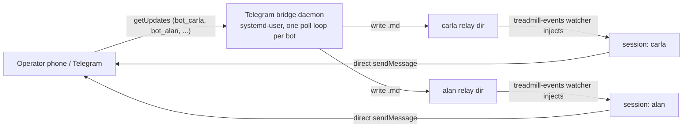

# ADR-0106 — A persistent Telegram bridge daemon replaces per-session bots

- **Status:** proposed
- **Date:** 2026-09-12
- **Amends:** ADR-0067 (one bot per session)
- **Related:** ADR-0068 (shared channel conventions), ADR-0102 (fran-bridge — the relay-session
  precedent this deliberately does not copy), the `treadmill-events` relay-inbox watcher
  (`relay-inbox.ts`, task ecd6d6eb)

## Context

ADR-0067 reached the phone via **one Telegram bot per session**, and named its own successor:
a "custom channel server with a routing table (chat_id → session)" was **deferred, not rejected** —
"the correct long-term shape **if bot-per-session friction proves real**... build only after the stock
setup has been lived with."

That friction is now real and observed. On 2026-09-12 many sessions' Telegram connections dropped at
once; the operator, **remote** (Telegram his only channel), could reach no session.

We ground-truthed the cause rather than accept a first diagnosis (an early "shared token → one
`getUpdates` slot → 409" theory was **wrong**, and verifying it is what corrected the record):

- Each session has a **distinct** per-session bot token (verified 2026-09-12 by comparing the six
  `~/.cc-channels/<label>/telegram.env` tokens — distinct bot ids, long-standing). There is **no** shared
  token and **no** cross-session `getUpdates` 409. A live probe of a session's token returned `ok`, an
  empty poll slot, and a queued update.
- The real fragility is **per-session MCP connection fragility that correlates on a mass restart**. Each
  session runs its own Telegram MCP (the stock plugin) whose `start` runs `bun install` on a **shared**
  plugin dir; a fleet restart races those installs (hand-fixed three times before the launcher's
  serialized pre-install), and any failed MCP connect is then **cached by Claude for ~15 minutes**. So a
  mass restart drops many sessions' Telegram MCPs together and holds them down through the cooldown —
  which is exactly the "reach no session" state the operator hit.
- The fragility **scales with session count**: there are N independently-fragile connections, each tied
  to a live session and each needing manual nursing. This is the "bot-per-session friction" ADR-0067 said
  would trigger the gateway — it just arrives as connection fragility, not as a poll-slot collision.
- Note: **outbound** `sendMessage` is a stateless Bot-API call that needs only the token — no MCP, no
  poll slot. A direct send works even while a session's inbound MCP is down, which is how this ADR's
  operator updates got through and which makes the daemon's outbound path trivial (sessions send direct).

ADR-0067 deferred this gateway "until bot-per-session friction proves real." It has.

## Decision

We decided to build ADR-0067's deferred gateway: a **single persistent, multi-token Telegram bridge
daemon** that is the sole Telegram poller for the whole fleet and injects inbound into each session.

- **One supervised process owning all N bots.** The daemon runs under systemd-user with auto-restart. It
  keeps the per-session bots (ADR-0067's chat-per-sibling UX is unchanged) but is the only process that
  polls them: it runs **one `getUpdates` loop per token**, each supervised with its own backoff, so one
  bot's error never stalls another. There is one process to keep healthy, not N per-session MCPs. It
  reads each token from the **existing** `~/.cc-channels/<label>/telegram.env` (same UID, mode 0600) — no
  new secret-concentration file; the tokens already sit on disk.
- **Inbound by relay-dir file-drop; no bridge session.** For each inbound message the daemon writes a
  `.md` file into the target session's channel relay inbox (`~/.cc-channels/<label>/relay/`). The bot
  identity **is** the routing key: each bot belongs to exactly one session, so the loop's fixed label is
  the target — no chat-to-session table. The session's already-running `treadmill-events` channel server
  watches that dir (`fs.watch`, at-least-once notify-then-unlink, 60s resweep — `relay-inbox.ts`, task
  ecd6d6eb) and injects the file as a `<channel source="relay">` notification — the exact path the stock
  Telegram plugin uses. No relay session and no LLM sit in the inbound loop, because the targets are
  native cc-channels sessions that already run the watcher — unlike fran-bridge, whose relay session
  exists only to reach Codex siblings off this substrate (ADR-0102).
- **A per-bot sender allowlist is mandatory (fail-closed).** Sessions run with permissions bypassed
  (ADR-0067), so an ungated inbound message is direct code execution. Each bot injects only messages from
  its configured allowed chat id(s); a message from any other chat is dropped and logged, never injected.
- **Outbound by direct Bot API.** A session replies with a direct `sendMessage` call, which needs only
  the token — no MCP, no poll slot (proven 2026-09-12). Outbound needs no daemon involvement.
- **Sessions stop running a per-session Telegram MCP.** They no longer poll `getUpdates`, so a session's
  lifecycle is decoupled from the Telegram connection: a session restart no longer touches Telegram, no
  mass-restart install race, and a Telegram blip no longer needs per-session fixing.
- **Target eligibility (verified invariant).** The relay-dir inject works only for a session that runs
  the `treadmill-events` channel server — every session started by `launch-session.sh` does, because the
  launcher appends `--dangerously-load-development-channels server:treadmill-events`. This scopes the
  treadmill CLAUDE.md "cc-relay is retired / delivered nowhere" note: that note holds for **pure-fabric
  agents** that run no watcher; it does not hold for launcher sessions, whose relay dir is actively
  watched. A session that runs no watcher is not a valid Telegram target.

## Alternatives considered

- **Incumbent — one bot per session (ADR-0067).** *Why insufficient:* N independently-fragile
  connections, each needing manual nursing; simultaneous drops leave a remote operator unable to reach
  any session (observed 2026-09-12). This is the exact friction 0067 said would trigger the gateway.
- **Keep per-session bots + a health-check daemon that restarts a session when its Telegram drops.**
  *Rejected:* restarts are heavy and carry the `--resume` back-in-time risk; it treats the symptom
  (a dropped MCP) instead of the root cause (per-session connections), and still scales as N.
- **Remote Control.** *Rejected in ADR-0067* for demonstrated unreliability; unchanged here.
- **One bot multiplexed by the stock plugin.** *Impossible as built* (ADR-0067): the stock channel
  protocol has no session addressing. The daemon supplies exactly the routing layer the stock plugin
  lacks.
- **A bridge Claude session that drains the poller and re-sends over the fabric (the fran-bridge shape).**
  *Rejected for this substrate:* fran-bridge needs a relay session only because its targets are Codex
  siblings off the cc-channels substrate, reached via the harness `SendMessage` tool (which only a Claude
  session can call). Our targets are native cc-channels sessions with a live relay-dir watcher, so a
  plain daemon injects directly. A bridge session would re-introduce an LLM and a session to supervise —
  the exact fragility this ADR removes.

## Consequences

### Good
- One durable, supervised process replaces N fragile per-session MCP pollers; no shared-plugin-dir
  install race, no per-session cached-failure cooldown. Fragility stops scaling with session count.
- Sessions decoupled from the Telegram lifecycle — a session restart no longer drops Telegram.
- Preserves the chat-per-sibling phone UX (per-session bots kept); the daemon just becomes their sole
  poller.

### Bad / trade-offs
- A new daemon to build and supervise, plus a config listing which labels to bridge and each bot's
  allowed chat(s), maintained as sessions start, stop, and get renamed.
- The daemon holds all N bot tokens in one process. It reads them from the existing per-session
  `telegram.env` files (same UID, mode 0600) — no new secret store — but concentrates them at runtime.
- A single point of failure for all Telegram (mitigated: systemd auto-restart; per-token loops are
  independent so one bot's failure is isolated).
- **Inbound delivery is at-least-once, not exactly-once.** The daemon injects then acks, and the channel
  server itself delivers-then-unlinks; a crash in either window redelivers. Duplicates are visible and
  rare; the operator tolerates a repeated message far better than a lost one. The `update_id` dedup
  reduces duplicates but does not eliminate them.

### Risks
- A misconfigured route delivers a message to the wrong or an unwatched session. Mitigated: the bot
  identity is the routing key (not a mutable table); targets are validated at startup as
  launcher-managed (a session-id record exists) so a pure-fabric or unknown label is refused, never
  acked-then-lost; the relay dir is symlink-checked so a configured label cannot resolve into another
  session's dir (same-UID concurrent rewrite remains a disclosed, non-security limit).
- **Falsifier:** after the daemon is live, either (a) a Telegram poll error is **not** auto-recovered
  within the loop's backoff (the operator must again manually nurse it), or (b) an inbound Telegram
  message from an allowed chat to bot X is delivered to a session other than X's, or is **dropped**
  (never injected and never spooled for X). A duplicate delivery is **not** a falsifier — the contract is
  at-least-once.

## Diagram

## References

- ADR-0067 (per-session bots; deferred the gateway), ADR-0068 (channel conventions).
- Trigger: 2026-09-12 simultaneous Telegram-MCP drops (carla, alan) with the operator remote.
