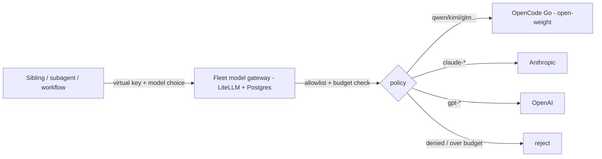

# ADR-0107: Fleet model gateway for mixed-model subagents

- **Status:** accepted (2026-09-12; cross-model review by Fran (multi-round, cleared) + sibling co-sign by Ernie. Gerald's open-weight second cross-model pass fell back per ADR-0105's capability caveat — the open-weight model could not produce a nuanced ADR-design review; it remains a capable CODE/CONFIG-foil reviewer.)
- **Date:** 2026-09-12
- **Related:** ADR-0104 (Gerald / the Responses→Chat shim), ADR-0102 (Fran), ADR-0105 (cross-model review)

## Context

Siblings want to run a subagent or a workflow step on whatever model best fits a
task and have it routed to the proper provider — an open-weight model for one
step, Claude for another, GPT for a third — without standing up a whole
persistent sibling per model. Today we have **agent-level** routing only: a
sibling routes a whole request to Fran (GPT) or Gerald (open-weight) over the
bus. That is coarse (you get that sibling's harness and persona) and it does not
cover ad-hoc per-subagent model choice.

Gerald's LiteLLM shim (ADR-0104) is already a nascent single-purpose gateway — a
LiteLLM proxy that fronts one provider (OpenCode Go) with a fixed key. LiteLLM is
natively multi-provider. A spike (2026-09-12) stood up one LiteLLM instance
fronting three providers and confirmed **model-level routing works**: a request
for `qwen3.8-max` reached OpenCode Go (open-weight), `claude-sonnet-4-5` reached
Anthropic, and `gpt-4.1-mini` was correctly routed to OpenAI (rejected only on an
unfunded key — a billing fact, not a routing failure).

## Decision

We will build a **fleet model gateway**: one LiteLLM proxy exposing every
provider (OpenCode Go open-weight, Anthropic, OpenAI, and more as needed) behind
a single OpenAI-compatible + Responses endpoint. Access is per-caller: each
sibling/subagent authenticates with its own **virtual key**. A key's policy has
three parts, all load-bearing:

1. **Model access by served IDENTITY, not name.** The allowlist is enforced
   against the actual deployment/provider each permitted name resolves to — every
   alias and fallback reachable from an open-weight key must itself be
   open-weight. Empty/wildcard model policy is rejected (an empty allowlist is
   unrestricted in LiteLLM). Verified by UPSTREAM RECEIPTS, not response labels.
2. **A defined budget contract**, not just "a budget": named supported endpoints,
   price mappings for Go aliases, a stated budget window + aggregation, and an
   explicit choice of hard-ceiling (fail-closed) vs admitted-request accounting
   with a bounded, disclosed overshoot. Parent/team budgets aggregate so spawning
   fresh per-subagent keys cannot bypass a sibling's cap.
3. **Inference-only caller authority.** A caller key can call models within its
   policy and NOTHING else — it cannot mint or edit keys, change routes, or raise
   budgets. Key issuance/revocation and route/budget edits require a separate
   admin credential held only by the operator/gateway owner.

Gerald's shim becomes a policy-scoped view of this gateway (an open-weight-only
virtual key), not a separate process. Any harness that speaks OpenAI-compatible or
Responses (Codex, `codex exec` subagents, direct API calls, workflows that accept
a `base_url`) can use it; a Claude-Code sibling — whose native Agent/Workflow
tools are Claude-only — reaches other models via a Codex subagent pointed at the
gateway, or via the bus.

Two conditions make the policy real rather than advisory:

- **The gateway is the SOLE path to providers.** Central allowlists and budgets
  bind only traffic that goes through the gateway. Siblings today hold their own
  provider keys (e.g. an Anthropic key), so any of them could call a provider
  directly, un-allowlisted and unbudgeted. Therefore, once the gateway is live,
  direct provider keys are removed from callers' reach. Until they are, the
  guarantee is explicitly ADVISORY, not enforced — the ADR does not claim
  enforcement while a caller retains a direct key.
- **The DB-backed policy spike is decision-gating, and caller access waits on
  it.** Enforcement rests on the unproven claim that LiteLLM virtual keys 403 (not
  route) an out-of-allowlist model, honor the chosen budget contract (ceiling plus
  the disclosed maximum overshoot, and child→parent aggregation), and confine
  caller authority. That budget contract — including a quantified maximum overshoot
  — must be CHOSEN and written down before the gate can pass. We do NOT open the gateway to real callers config-only — a config-only
  gateway with real callers IS the "single all-provider key, unbounded" state this
  ADR rejects. If the pinned-version foils (below) show virtual keys route instead
  of deny, or budgets/authority do not hold, the design changes rather than ships
  (an ADR-0102-style abort trigger).

## Alternatives considered

- **Incumbent: agent-level bus routing (route to Fran/Gerald).** It exists and
  works, and it is not as coarse as "fixed model" — Gerald already accepts a
  per-message `[[model: …]]` marker (`codex queue --model`). **Why insufficient:**
  it is whole-agent granularity — you get that sibling's harness, persona, and
  single provider; there is no way for a caller to spin its OWN ephemeral subagent
  mixing several providers within one task, and no central per-caller budget across
  those calls. The gap is caller-owned ephemeral mixed-provider execution with an
  aggregate budget, not per-message model choice per se.
- **Per-session provider config (each harness points at each provider itself).**
  **Why rejected:** no central policy or budgets, every session holds every key
  (worse blast radius), and it re-solves routing N times.
- **A config-only gateway (no database).** Multi-provider routing works config-
  only, but per-caller virtual keys, allowlists, and budgets are DB-backed in
  LiteLLM. **Why rejected as the end state:** without per-caller policy the gateway
  is a single all-provider key any caller can use unbounded — the blast radius the
  whole design must control. Config-only is acceptable only as a throwaway spike.

## Consequences

### Good
- Any sibling/subagent picks a model; the gateway routes it to the right provider.
- ONE place to define per-caller policy + budgets and to add a provider or rotate a
  key — enforced (not merely advisory) once the gateway is the sole path and the
  gating spike passes; Gerald's shim is then subsumed.

### Bad / trade-offs
- **The gateway holds every provider key** — the concentration is the point and
  the danger. Per-caller virtual keys + budgets (DB-backed: LiteLLM needs
  Postgres) are therefore load-bearing, not optional, and add a stateful
  component (Postgres + the proxy) to operate and supervise.
- The Responses/Chat wire-format split (ADR-0104) still applies: Codex consumers
  need the gateway's `use_chat_completions_api` bridging for chat-only models.

### Risks
- **Credential isolation is same-UID-bounded, and the gateway ESCALATES this vs
  ADR-0104.** Gerald concentrated one key; the gateway concentrates EVERY provider
  key, readable by any same-UID sibling (siblings run with a bypassed sandbox, so
  "could read the store" is "any sibling can cat the file"). Virtual keys scope
  what the gateway *serves*, not who can read its key store — so the separate-UID
  hard boundary is MORE urgent here than for Gerald, not equal-priority. Until it
  exists, minimize the key set the gateway holds and keep budgets tight; do not
  put the high-value funded Anthropic/OpenAI production keys behind a
  same-UID-readable store.
- **Proxy compromise is not contained by virtual keys.** A caller key limits an
  ordinary caller; it does nothing if the proxy itself (holding all provider
  creds) is compromised — add cross-caller prompt/output/log exposure and
  key-revocation/accounting-recovery to the threat model.
- A gateway outage takes down model access for every caller that depends on it;
  it must be supervised and its readiness gated (the Gerald shim's lessons apply).
- **Falsifier (any one):** (a) a subagent turn is served by an underlying
  deployment/provider outside the calling key's allowlist — including via a
  permitted ALIAS or fallback that resolves to a forbidden provider (checked by
  upstream receipt, not response label); (b) a key's spend VIOLATES ITS CHOSEN
  BUDGET CONTRACT — it exceeds the ceiling by more than the contract's disclosed
  maximum overshoot, or child keys' fresh budgets bypass a parent/team cap; (c)
  a caller-scoped (inference) key succeeds at a management action (mint/edit a key,
  change a route or budget); (d) an INFERENCE request is served without a
  per-caller key (a single shared key) — health/readiness endpoints and the
  operator's admin key are exempt; or (e) a caller reaches a provider directly,
  outside the gateway, while the ADR claims enforcement. Any of these means the
  policy layer is advisory, not enforcing.

## Diagram

## Follow-ups

- **Decision-gating spike (pinned LiteLLM version) — a PREREQUISITE to opening the
  gateway to any real caller or retiring Gerald's shim, not a later nicety.** It
  must prove, by upstream receipts and against the pinned config:
  - *Identity routing:* a key confined to open-weight is refused a Claude model
    directly AND via a permitted alias/fallback that resolves to a forbidden
    provider; an empty/wildcard model policy is rejected.
  - *Budget contract:* the chosen semantics (hard-ceiling vs accounting overshoot)
    hold under concurrent near-limit requests, interrupted streaming, stale/unavailable
    counters, missing model pricing, and a proxy restart after paid-but-unaccounted
    work; and child-key budgets aggregate to a parent/team cap.
  - *Management authority:* an inference-scoped caller key cannot mint/edit keys,
    change routes/budgets, or issue child keys.
  - *Codex/Responses compatibility:* not just routing — streamed tool calls,
    tool-result round-trips, cancellation, usage accounting, and unsupported-param
    behavior (the shim's `drop_params` can silently discard features).
  A failure of any of these changes the design; it does not ship config-only with
  shared credentials.
- Single-source the open-weight allowlist (Ernie's ADR-0104 note): today it lives
  in the auth-guard, the shim config, and deliver-inbound — drift fails closed but
  is a paper-cut.
- Migrate Gerald's shim to a gateway virtual key once the gateway is live.
- The hard (separate-UID/container) isolation boundary — shared with ADR-0104.

## References

- Spike, 2026-09-12: one LiteLLM proxy routed qwen3.8-max→Go, claude-sonnet-4-5→
  Anthropic, gpt-4.1-mini→OpenAI (config-only; per-caller policy not yet spiked).
- ADR-0104 (the shim + same-UID isolation conclusion), ADR-0105 (two-pass review).
