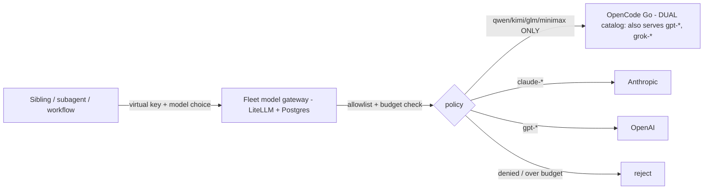

# ADR-0107: Fleet model gateway for mixed-model subagents

- **Status:** accepted (2026-09-12, on the SECOND review round. A first "accepted" was WITHDRAWN — merged before Gerald's cross-model pass, which was BLOCKING with 6 foil-driven findings (two design-changing), all now folded. Cleared by Gerald (open-weight, cross-model — who raised the findings and delivered the best of the three reviews) + Ernie (sibling, re-confirmed) + Fran (cross-model, prior rounds). Correction to the record: the open-weight sibling produced a rigorous, nuanced design review — the apparent delay was a bridge delivery-tracking defect (queue acceptance acked as if it were turn delivery), not the reviewer. See docs/learnings/2026-09-12-bridge-acks-acceptance-not-delivery.md. SPIKE-SCOPE CORRECTION: the recorded 403 proved DIRECT-deny only, not fallback-deny — a router-configured fallback is chosen after auth and bypasses the per-key allowlist unless general_settings.enforce_fallback_model_access is set true (native, defaults OFF). The migration must enable it and re-spike the fallback vector; the alias→provider-identity half stays config-side. See docs/learnings/2026-09-12-fallback-routing-bypasses-direct-allowlist.md.)
- **Date:** 2026-09-12
- **Related:** ADR-0104 (Gerald / the Responses→Chat shim), ADR-0102 (Fran), ADR-0105 (cross-model review)

## Context

Siblings want to run a subagent or a workflow step on whatever model best fits a
task and have it routed to the proper provider — an open-weight model for one
step, Claude for another, GPT for a third — without standing up a whole
persistent sibling per model. Today we have **agent-level** routing only: a
sibling routes a whole request to Fran (GPT) or Gerald (open-weight) over the
bus. That is coarse (you get that sibling's harness and persona) and it does not
cover ad-hoc per-subagent model choice.

Gerald's LiteLLM shim (ADR-0104) is already a nascent single-purpose gateway — a
LiteLLM proxy that fronts one provider (OpenCode Go) with a fixed key. LiteLLM is
natively multi-provider. A spike (2026-09-12) stood up one LiteLLM instance
fronting three providers and confirmed **model-level routing works**: a request
for `qwen3.8-max` reached OpenCode Go (open-weight), `claude-sonnet-4-5` reached
Anthropic, and `gpt-4.1-mini` was correctly routed to OpenAI (rejected only on an
unfunded key — a billing fact, not a routing failure).

## Decision

We will build a **fleet model gateway**: one LiteLLM proxy exposing every
provider (OpenCode Go open-weight, Anthropic, OpenAI, and more as needed) behind
a single OpenAI-compatible + Responses endpoint. Access is per-caller: each
sibling/subagent authenticates with its own **virtual key**. A key's policy has
three parts, all load-bearing:

1. **Model access by served IDENTITY, not name.** The allowlist is enforced
   against the actual deployment each permitted name resolves to — every alias and
   fallback (LiteLLM `router_settings.fallbacks` / `context_window_fallbacks`
   included) reachable from an open-weight key must itself be open-weight.
   Empty/wildcard model policy is rejected (an empty allowlist is unrestricted in
   LiteLLM). Verified by UPSTREAM RECEIPTS, not response labels.
   - **OpenCode Go is a DUAL catalog** (Gerald B1): it serves proprietary models
     (`gpt-*`, `grok-*`) alongside open-weight ones, so "provider == opencode_go"
     is NOT the open-weight predicate. For Go, the identity check must bind the
     model NAME-WITHIN-GO **and** the `api_base`, never provider alone.
   - **This enforcement does NOT exist today** (Gerald B2). Gerald's shipped
     `auth-guard.sh` is NAME-only: it strips the provider tag, validates the bare
     name, and never reads `api_base` or `router_settings`. Executed foils passed
     it with `openai/qwen3.8-max`+`api_base=api.openai.com`, with
     `anthropic/qwen3.8-max`, and with a `router_settings` fallback to Claude. So
     the migration must PORT three NEW checks that do not yet exist: an `api_base`
     allowlist, provider-tag validation, and fallback/alias closure over
     `router_settings`. The ADR must not imply identity enforcement is in place.
2. **A defined budget contract**, not just "a budget": named supported endpoints,
   price mappings for Go aliases, a stated budget window + aggregation, and an
   explicit choice of hard-ceiling (fail-closed) vs admitted-request accounting
   with a bounded, disclosed overshoot. Parent/team budgets aggregate so spawning
   fresh per-subagent keys cannot bypass a sibling's cap.
3. **Inference-only caller authority.** A caller key can call models within its
   policy and NOTHING else — it cannot mint or edit keys, change routes, or raise
   budgets. Key issuance/revocation and route/budget edits require a separate
   admin credential held only by the operator/gateway owner.

Gerald's shim becomes a policy-scoped view of this gateway (an open-weight-only
virtual key), not a separate process. Any harness that speaks OpenAI-compatible or
Responses (Codex, `codex exec` subagents, direct API calls, workflows that accept
a `base_url`) can use it; a Claude-Code sibling — whose native Agent/Workflow
tools are Claude-only — reaches other models via a Codex subagent pointed at the
gateway, or via the bus.

Two conditions make the policy real rather than advisory:

- **The gateway is the SOLE path to providers.** Central allowlists and budgets
  bind only traffic that goes through the gateway. Siblings today hold their own
  provider keys (e.g. an Anthropic key), so any of them could call a provider
  directly, un-allowlisted and unbudgeted. Therefore, once the gateway is live,
  direct provider keys are removed from callers' reach. Until they are, the
  guarantee is explicitly ADVISORY, not enforced — the ADR does not claim
  enforcement while a caller retains a direct key.
- **The DB-backed policy spike is decision-gating, and caller access waits on
  it.** Enforcement rests on the unproven claim that LiteLLM virtual keys 403 (not
  route) an out-of-allowlist model, honor the chosen budget contract (ceiling plus
  the disclosed maximum overshoot, and child→parent aggregation), and confine
  caller authority. That budget contract — including a quantified maximum overshoot
  — must be CHOSEN and written down before the gate can pass. We do NOT open the gateway to real callers config-only — a config-only
  gateway with real callers IS the "single all-provider key, unbounded" state this
  ADR rejects. If the pinned-version foils (below) show virtual keys route instead
  of deny, or budgets/authority do not hold, the design changes rather than ships
  (an ADR-0102-style abort trigger).

## Alternatives considered

- **Incumbent: agent-level bus routing (route to Fran/Gerald).** It exists and
  works, and it is not as coarse as "fixed model" — Gerald already accepts a
  per-message `[[model: …]]` marker (`codex queue --model`). **Why insufficient:**
  it is whole-agent granularity — you get that sibling's harness, persona, and
  single provider; there is no way for a caller to spin its OWN ephemeral subagent
  mixing several providers within one task, and no central per-caller budget across
  those calls. The gap is caller-owned ephemeral mixed-provider execution with an
  aggregate budget, not per-message model choice per se.
- **Per-session provider config (each harness points at each provider itself).**
  **Why rejected:** no central policy or budgets, every session holds every key
  (worse blast radius), and it re-solves routing N times.
- **A config-only gateway (no database).** Multi-provider routing works config-
  only, but per-caller virtual keys, allowlists, and budgets are DB-backed in
  LiteLLM. **Why rejected as the end state:** without per-caller policy the gateway
  is a single all-provider key any caller can use unbounded — the blast radius the
  whole design must control. Config-only is acceptable only as a throwaway spike.

## Consequences

### Good
- Any sibling/subagent picks a model; the gateway routes it to the right provider.
- ONE place to define per-caller policy + budgets and to add a provider or rotate a
  key — enforced (not merely advisory) once the gateway is the sole path and the
  gating spike passes; Gerald's shim is then subsumed.

### Bad / trade-offs
- **The gateway holds every provider key** — the concentration is the point and
  the danger. Per-caller virtual keys + budgets (DB-backed: LiteLLM needs
  Postgres) are therefore load-bearing, not optional, and add a stateful
  component (Postgres + the proxy) to operate and supervise.
- The Responses/Chat wire-format split (ADR-0104) still applies: Codex consumers
  need the gateway's `use_chat_completions_api` bridging for chat-only models, and
  the Go path additionally REQUIRES the `x-opencode-session` header (ADR-0104) —
  see the per-caller-attribution risk below (Gerald B6, N1).

### Risks
- **Prompt persistence is an opt-in TRADE-OFF, not a default (Gerald B4, empirically
  corrected against litellm 1.100.1 — supersedes his earlier "default-on/depends-on"
  framing).** `SpendLogsPayload.messages/.response/.proxy_server_request` are gated
  by `store_prompts_in_spend_logs` (env `STORE_PROMPTS_IN_SPEND_LOGS`), which
  DEFAULTS OFF — enabling the virtual-key DB does NOT itself persist prompt content.
  And the Codex path does NOT depend on spend-log history: `get_all_spend_logs_for_
  previous_response_id` short-circuits when there is no DB, and a caller that sends
  full `input` each turn (as Codex demonstrably does — a DB-less shim runs long
  multi-turn sessions fine) never consults it. The real either/or:
  - **OFF (recommended default):** no prompt content in Postgres (confidentiality),
    BUT a caller that uses `previous_response_id` chaining gets empty history and
    SILENTLY falls back to the new input only — a silent multi-turn-context loss.
  - **ON:** `previous_response_id` chaining works, but every caller's prompt+response
    lands in the same-UID-readable Postgres — then the separate-UID boundary becomes
    a DATA-CONFIDENTIALITY requirement, not just credential hygiene.
  Interim trust model: with persistence OFF (the default) there is no cross-caller
  prompt store; separate-UID isolation becomes a prerequisite only if the operator
  turns persistence ON (e.g. to support `previous_response_id`), or before any
  caller handles content that must be confidential FROM other fleet agents.
- **Static per-deployment `x-opencode-session` collapses per-caller attribution
  (Gerald B6 — design-level).** The header is set per DEPLOYMENT in
  `litellm_params` (a fixed value today); LiteLLM has no per-virtual-key header
  injection path found. So once several siblings share ONE Go deployment behind
  the gateway, every caller presents the same header and Go-side per-caller
  attribution is lost — the opposite of per-caller policy. Resolve by keeping
  per-caller Go deployments (one per sibling, each with its own header) or by
  specifying a per-virtual-key header-injection mechanism before sharing a
  deployment.
- **Credential isolation is same-UID-bounded, and the gateway ESCALATES this vs
  ADR-0104.** Gerald concentrated one key; the gateway concentrates EVERY provider
  key, readable by any same-UID sibling (siblings run with a bypassed sandbox, so
  "could read the store" is "any sibling can cat the file"). Virtual keys scope
  what the gateway *serves*, not who can read its key store — so the separate-UID
  hard boundary is MORE urgent here than for Gerald, not equal-priority. Until it
  exists, minimize the key set the gateway holds and keep budgets tight; do not
  put the high-value funded Anthropic/OpenAI production keys behind a
  same-UID-readable store.
- **Proxy compromise is not contained by virtual keys.** A caller key limits an
  ordinary caller; it does nothing if the proxy itself (holding all provider
  creds) is compromised — add cross-caller prompt/output/log exposure and
  key-revocation/accounting-recovery to the threat model.
- A gateway outage takes down model access for every caller that depends on it;
  it must be supervised and its readiness gated (the Gerald shim's lessons apply).
- **Falsifier (any one):** (a) a subagent turn is served by an underlying
  deployment/provider outside the calling key's allowlist — including via a
  permitted ALIAS or fallback that resolves to a forbidden provider (checked by
  upstream receipt, not response label); (b) a key's spend VIOLATES ITS CHOSEN
  BUDGET CONTRACT — it exceeds the ceiling by more than the contract's disclosed
  maximum overshoot, or child keys' fresh budgets bypass a parent/team cap; (c)
  a caller-scoped (inference) key succeeds at a management action (mint/edit a key,
  change a route or budget); (d) an INFERENCE request is served without a
  per-caller key (a single shared key) — health/readiness endpoints and the
  operator's admin key are exempt; or (e) a caller reaches a provider directly,
  outside the gateway, while the ADR claims enforcement. Any of these means the
  policy layer is advisory, not enforcing.

## Diagram

## Follow-ups

- **Decision-gating spike (pinned LiteLLM version) — a PREREQUISITE to opening the
  gateway to any real caller or retiring Gerald's shim, not a later nicety.** It
  must prove, by upstream receipts and against the pinned config:
  - *Identity routing:* a key confined to open-weight is refused a Claude model
    directly AND via a permitted alias/fallback (`router_settings`) that resolves
    to a forbidden provider; a Go dual-catalog proprietary name (`gpt-*` inside Go)
    is refused; an empty/wildcard model policy is rejected. The RECEIPT mechanism
    is LiteLLM `SpendLogsPayload` (records `model`, `model_id`, `api_base`,
    `custom_llm_provider`) — so spend-logging + Postgres must be ON for the
    receipt to exist, and a scheduled receipt-vs-policy sweep is the DETECTOR that
    makes falsifier (a) catchable (Gerald B3). Without both, the falsifier
    describes a state nothing would ever detect.
  - *Prompt persistence (Gerald B4 — mostly answered):* persistence defaults OFF
    (`store_prompts_in_spend_logs`) and the Codex path does not need spend-log
    history. Remaining spike item: confirm whether the gateway's actual callers use
    `previous_response_id` chaining or send full `input` each turn. If full input
    (as Codex does), run the gateway with persistence OFF — confidentiality AND
    correct multi-turn. Only turn it ON if a caller needs chaining, and then treat
    the DB as a same-UID prompt store (separate-UID prerequisite).
  - *Per-caller Go attribution (Gerald B6):* confirm whether `x-opencode-session`
    can be injected per virtual key; if not, per-caller Go deployments are required.
  - *Budget contract:* the chosen semantics (hard-ceiling vs accounting overshoot)
    hold under concurrent near-limit requests, interrupted streaming, stale/unavailable
    counters, missing model pricing, and a proxy restart after paid-but-unaccounted
    work; and child-key budgets aggregate to a parent/team cap.
  - *Management authority:* an inference-scoped caller key cannot mint/edit keys,
    change routes/budgets, or issue child keys.
  - *Codex/Responses compatibility:* not just routing — streamed tool calls,
    tool-result round-trips, cancellation, usage accounting, and unsupported-param
    behavior (the shim's `drop_params` can silently discard features).
  A failure of any of these changes the design; it does not ship config-only with
  shared credentials.
- **Migration must PORT identity enforcement that does not exist yet (Gerald B2/B5).**
  Gerald's `auth-guard.sh` is name-only; migrating the shim to a gateway virtual key
  requires adding: an `api_base` allowlist, provider-tag validation, and
  fallback/alias closure over `router_settings`. It must ALSO repoint (not drop)
  the auth-guard's `base_url` pin from the shim to the gateway — the guard fails
  closed on the current exact `127.0.0.1:4141` pin, so migration without repointing
  bricks Gerald's boot; keep the pin, it is the check that stops an arbitrary
  endpoint.
- Single-source the open-weight allowlist (Ernie's ADR-0104 note + Gerald N4): it
  lives in FIVE sites today — `auth-guard.sh`, `shim/config.yaml`,
  `deliver-inbound.mjs`, `session/AGENTS.md`, and `codex/isolated-home-config.toml`
  — drift fails closed but is a paper-cut.
- The hard (separate-UID/container) isolation boundary — shared with ADR-0104, and
  ELEVATED here by Gerald B4 (the DB is a prompt-content store, so isolation is a
  data-confidentiality requirement, not just credential hygiene).

## References

- Spike, 2026-09-12 (routing): one LiteLLM proxy routed qwen3.8-max→Go,
  claude-sonnet-4-5→Anthropic, gpt-4.1-mini→OpenAI (config-only).
- **Spike, 2026-09-12 (DB-backed per-caller policy — the decision-gating one, RUN;
  LiteLLM 1.100.1 + Postgres virtual keys). Core gate PASSED:**
  - *Allowlist ENFORCED:* an open-weight-only key (`models:["qwen3.8-max"]`) served
    qwen but got **HTTP 403** on `claude-sonnet-4-5` ("key not allowed to access
    model"). Virtual keys DENY out-of-allowlist models — not route them. The
    load-bearing unknown is resolved.
  - *Management authority ENFORCED:* minting or updating a key with an inference
    key returned **HTTP 401** ("Only proxy admin can generate/update keys").
  - *Budget:* ENFORCES with a per-model price mapping (**HTTP 429** past ceiling),
    but is VACUOUS without one — `qwen3.8-max` is absent from LiteLLM's cost map,
    so spend stayed 0 and the budget never triggered until `input/output_cost_per_
    token` was set on the Go alias (confirms Fran B2: Go aliases need price
    mappings). It is admitted-request accounting with a BOUNDED OVERSHOOT (one call
    exceeded the ceiling before the next was refused), matching the disclosed-
    overshoot contract, NOT a hard pre-call ceiling.
  - *Not yet spiked (remaining, per the follow-ups):* alias/fallback →
    forbidden-provider identity binding (the config-side guard checks, since the
    runtime virtual-key allowlist is name-based); concurrent/streaming budget
    edges; and confirming the gateway's callers use full `input` vs
    `previous_response_id` (persistence stays OFF if full input).
  Conclusion: per-caller allowlist + management-authority enforcement are real in
  LiteLLM DB mode; opening the gateway to callers additionally requires Go price
  mappings (for budgets) and the migration guard checks (B2/B5).
- ADR-0104 (the shim + same-UID isolation conclusion), ADR-0105 (two-pass review).
