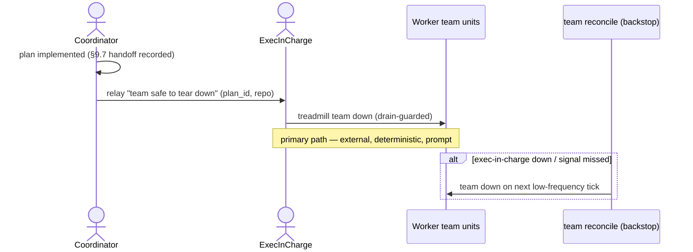

# ADR-0112: Event-driven team teardown by the exec-in-charge; reconcile is a backstop

- **Status:** accepted
- **Date:** 2026-09-14
- **Amends:** ADR-0109 (ephemeral, repo-mode-driven team lifecycle)
- **Related:** ADR-0110 (feature-branch integration — the `plan.handoff_pr_opened` done-signal), ADR-0087 (team execution model), exec-in-charge skill

## Context

ADR-0109 made teams ephemeral and defined a "team lifecycle manager." The v1
implementation realized teardown as a periodic `team reconcile` (a level-triggered
loop on a 2-minute systemd timer) that tears a team down once its drain-guard is
clean and it has been idle beyond a grace (defaulted to 6 hours). Two facts make
that the wrong PRIMARY mechanism for teardown:

- **"Done" is deterministic.** The coordinator records `plan.handoff_pr_opened`
  (ADR-0110) at the exact instant a feature-branch plan is implemented; a terminal
  failure is equally knowable. No polling is needed to *detect* done.
- **A polling teardown keyed on a 6-hour idle grace keeps a finished team up for
  hours** — closer to the 25-idle-teams incident ADR-0109 exists to prevent than it
  should be.

The one hard constraint is why teardown cannot simply be "the coordinator tears
itself down": the coordinator is a *member* of the team, so stopping the team's
units kills the coordinator mid-teardown. Teardown of the whole team must be
performed by an actor OUTSIDE the team.

The **exec-in-charge** — the submitting orchestrator (`plans.created_by`) — is
exactly that actor: external to the worker team, already event-subscribed, and
already the executive responsible for driving the plan to done (the exec-in-charge
skill). It can run `treadmill team down` on the team without self-killing.

## Decision

We made team teardown **event-driven and owned by the exec-in-charge**, with the
reconcile demoted to a backstop (operator-directed, 2026-09-14):

- The coordinator, on reaching "implemented" (§9.7: handoff opened + recorded +
  surfaced) or on a terminal-failure escalation, **relays a "team safe to tear
  down" signal to `plans.created_by`** over the same channel §10 escalations use.
- The **exec-in-charge tears the team down** in response — running `treadmill team
  down <repo>`, which is drain-guarded, so it is safe (a late-arriving plan makes
  the drain not-clean and the teardown refuses). This is the PRIMARY teardown path:
  external actor, deterministic, prompt.
- The **`team reconcile` timer is the BACKSTOP only** — a low-frequency safety net
  (not a 2-minute primary loop) that tears down a team the responsible agent did not
  (the exec-in-charge was down, busy, or the coordinator crashed before signaling),
  and that revives a down team with pending work (a role no down team can perform
  for itself). Its teardown grace is shortened so even the backstop does not keep a
  finished team idle for hours.

Standup and crash-revival remain the reconcile's job (a down team cannot act on its
own behalf); this ADR changes only the PRIMARY teardown path.

## Alternatives considered

- **Incumbent: the `team reconcile` timer as the primary teardown mechanism (v1).**
  Why insufficient: it polls for a state the coordinator already knows deterministically,
  and its idle-grace keeps a finished team up for hours — latency and waste for an
  event that is precisely observable.
- **Coordinator tears down its own team.** Rejected: the coordinator is a member of
  the team; stopping the team's units kills it mid-teardown. An external actor is
  mandatory.
- **Event-driven teardown with NO backstop.** Rejected: the exec-in-charge is a
  Claude session — it can be busy, miss the signal, or be down. Teardown that depends
  only on it silently recreates the idle-team problem. The reconcile backstop is the
  mechanical safety net behind the responsible party.

## Consequences

### Good
- Finished teams tear down promptly on the deterministic done-signal, not after a
  multi-hour idle timer — the resource goal, achieved without polling latency.
- The responsible party (the exec-in-charge that commissioned the plan) owns the
  outcome end to end, consistent with the exec-in-charge skill.

### Bad / trade-offs
- Teardown now depends on a live, correctly-behaving exec-in-charge for the fast
  path; the backstop covers its absence but at the backstop's slower cadence.
- Two actors can now initiate teardown (exec-in-charge + backstop reconcile); both go
  through the idempotent, drain-guarded `team down`, so a double-fire is safe.

### Risks
- **Falsifier:** a plan reaches `plan.handoff_pr_opened` with its `created_by`
  exec-in-charge alive, and the team's units are still `active` more than a few
  minutes later (before the backstop cadence) — the event-driven teardown did not
  fire. Equally: idle finished teams accumulate again despite a live exec-in-charge.

## Diagram

## References

- ADR-0109 (the lifecycle this amends), ADR-0110 (the `plan.handoff_pr_opened`
  done-signal), the exec-in-charge skill, coordinator template §9.7 + §10.
