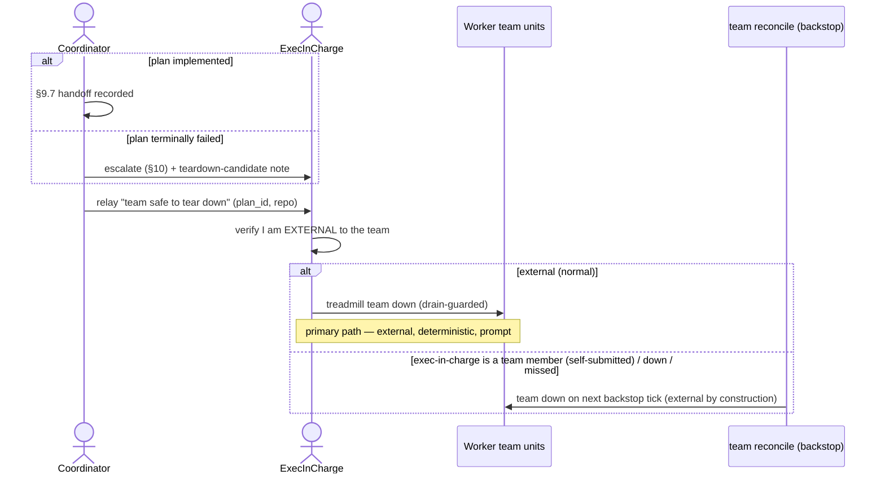

# ADR-0112: Event-driven team teardown by the exec-in-charge; reconcile is a backstop

- **Status:** accepted
- **Date:** 2026-09-14
- **Amends:** ADR-0109 (ephemeral, repo-mode-driven team lifecycle)
- **Related:** ADR-0110 (feature-branch integration — the `plan.handoff_pr_opened` done-signal), ADR-0087 (team execution model), exec-in-charge skill

## Context

ADR-0109 made teams ephemeral and defined a "team lifecycle manager." The v1
implementation realized teardown as a periodic `team reconcile` (a level-triggered
loop on a 2-minute systemd timer) that tears a team down once its drain-guard is
clean and it has been idle beyond a grace (defaulted to 6 hours). Two facts make
that the wrong PRIMARY mechanism for teardown:

- **"Done" is deterministic.** The coordinator records `plan.handoff_pr_opened`
  (ADR-0110) at the exact instant a feature-branch plan is implemented; a terminal
  failure is equally knowable. No polling is needed to *detect* done.
- **A polling teardown keyed on a 6-hour idle grace keeps a finished team up for
  hours** — closer to the 25-idle-teams incident ADR-0109 exists to prevent than it
  should be.

The one hard constraint is why teardown cannot simply be "the coordinator tears
itself down": the coordinator is a *member* of the team, so stopping the team's
units kills the coordinator mid-teardown. Teardown of the whole team must be
performed by an actor OUTSIDE the team.

The **exec-in-charge** — the submitting orchestrator (`plans.created_by`) — is
exactly that actor: external to the worker team, already event-subscribed, and
already the executive responsible for driving the plan to done (the exec-in-charge
skill). It can run `treadmill team down` on the team without self-killing.

## Decision

We made team teardown **event-driven and owned by the exec-in-charge**, with the
reconcile demoted to a backstop (operator-directed, 2026-09-14):

- The coordinator, on reaching "implemented" (§9.7: handoff opened + recorded +
  surfaced) or on a terminal-failure escalation, **relays a "team safe to tear
  down" signal to `plans.created_by`** over the same channel §10 escalations use.
- **The teardown actor MUST be external to the team it tears down** (the load-bearing
  invariant — this is teardown, not detection). `plans.created_by` is normally the
  submitting orchestrator (`treadmill-alan`, `-bert`, …), which is never a team
  member, so it is the external actor. But `created_by` is NOT guaranteed external: a
  coordinator that self-submits follow-up work is `created_by` of its own team's plan.
  So the actor VERIFIES externality before acting: if its own label is a member of
  the target team (`coordinator-<slug>` or `worker-<slug>-*`), it must NOT run `team
  down` (that is the self-kill the incumbent alternative was rejected for) — it leaves
  teardown to the backstop, which is external by construction (a systemd-timer
  process, not a team session).
- The **external exec-in-charge tears the team down** in response — running
  `treadmill team down <repo>`, which is drain-guarded, so a team that is not actually
  done is refused. This is the PRIMARY teardown path: external actor, deterministic,
  prompt. The drain-check and unit shutdown inside `team down` are NOT one atomic
  transaction, so a plan.submitted that lands in the gap can leave a just-registered
  task on a team whose units are stopping. This window is narrow (the coordinator is
  itself being stopped, so it dispatches at most the one racing task) and, critically,
  it is NOT a permanent strand: the backstop revives any team that has work but no
  live unit (below). The residual exposure is a worker's UNCOMMITTED work during the
  ~seconds shutdown, bounded by the same commit/push-before-terminal durability the
  ADR-0109 parked-on-human path already requires. `team down` re-evaluates the drain
  as late as possible before issuing the stop, to keep the window minimal.
- The **`team reconcile` timer is the BACKSTOP only** — a low-frequency safety net
  (not a 2-minute primary loop) that tears down a team the responsible agent did not
  (the exec-in-charge was down, busy, or the coordinator crashed before signaling),
  and that revives a down team with pending work (a role no down team can perform
  for itself). Its teardown grace is shortened so even the backstop does not keep a
  finished team idle for hours.

Standup and crash-revival remain the reconcile's job (a down team cannot act on its
own behalf); this ADR changes only the PRIMARY teardown path.

## Alternatives considered

- **Incumbent: the `team reconcile` timer as the primary teardown mechanism (v1).**
  Why insufficient: it polls for a state the coordinator already knows deterministically,
  and its idle-grace keeps a finished team up for hours — latency and waste for an
  event that is precisely observable.
- **Coordinator tears down its own team.** Rejected: the coordinator is a member of
  the team; stopping the team's units kills it mid-teardown. An external actor is
  mandatory.
- **Event-driven teardown with NO backstop.** Rejected: the exec-in-charge is a
  Claude session — it can be busy, miss the signal, or be down. Teardown that depends
  only on it silently recreates the idle-team problem. The reconcile backstop is the
  mechanical safety net behind the responsible party.

## Consequences

### Good
- Finished teams tear down promptly on the deterministic done-signal, not after a
  multi-hour idle timer — the resource goal, achieved without polling latency.
- The responsible party (the exec-in-charge that commissioned the plan) owns the
  outcome end to end, consistent with the exec-in-charge skill.

### Bad / trade-offs
- Teardown now depends on a live, EXTERNAL, correctly-behaving exec-in-charge for the
  fast path; the backstop covers its absence (down, busy, or non-external
  `created_by`) but at the backstop's slower cadence.
- Two actors can now initiate teardown (exec-in-charge + backstop reconcile). A
  double-fire is safe because `team down` is drain-guarded AND a no-op on an
  already-down team (`systemctl disable --now` on an inactive unit is a no-op; the
  drain-guard passes). If a new plan arrived between the two fires, the drain-guard
  refuses the second — the guard, not the actor count, is the safety.
- The `team down` drain-check and shutdown are not one atomic transaction (see the
  Decision's TOCTOU note): a plan.submitted in the gap is not permanently stranded
  (the backstop revives it) but a worker's uncommitted work in the shutdown window is
  exposed — mitigated by commit/push-before-terminal durability, not eliminated.
- The primary relay is one-shot: on a multi-plan team, plan A's teardown signal is
  refused while plan B is in flight and is not re-queued. Teardown re-fires on plan
  B's own completion (its §9.7 signal) or, failing that, the backstop reaps it — so a
  multi-plan team leans more on plan-B's signal and the backstop.

### Risks
- **Falsifier:** a plan reaches `plan.handoff_pr_opened`; the team has NO other
  in-flight work (its drain is clean, so it is teardown-ELIGIBLE); its `created_by`
  exec-in-charge is external to the team and idle (not mid-task) — yet the team's
  units are still `active` **10 minutes** later, well inside the backstop's **30-minute**
  grace so the backstop has not yet fired. That is the event-driven primary path
  failing to fire. Scope matters: a team kept up because a late plan left work
  (drain not-clean) is the drain-guard working CORRECTLY, not a falsifier hit; and an
  exec-in-charge that is alive-but-busy is covered by the backstop, not a failure of
  the design. Equally falsifying: idle finished teams accumulate again across many
  plans despite live external exec-in-charge sessions.

## Diagram

## Follow-ups

- **Durable server-routed done-signal (robustness upgrade).** The primary trigger is
  today the coordinator's soft relay to `created_by` (agent-initiated; the backstop
  covers a missed relay). To make the fast path prompt-BY-CONSTRUCTION rather than
  best-effort, add `created_by` to the `plan.handoff_pr_opened` payload and a
  server-side relay-drop to `~/.cc-channels/<created_by>/relay/` on that event
  (mirroring the task-relay pattern, e.g. `ArchitectEmitFailure`). Then teardown does
  not depend on the coordinator remembering to also send a separate relay. Deferred
  because the soft relay + backstop already deliver safely.

## References

- ADR-0109 (the lifecycle this amends), ADR-0110 (the `plan.handoff_pr_opened`
  done-signal), the exec-in-charge skill, coordinator template §9.7 + §10.
