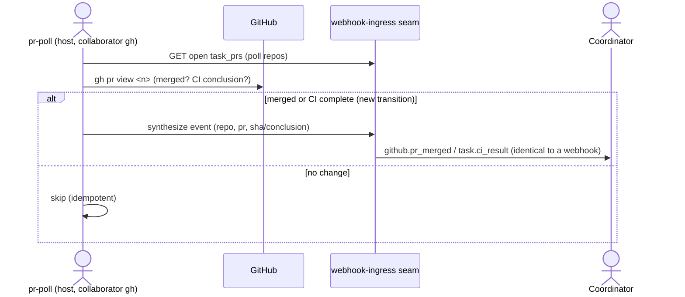

# ADR-0113: PR-state polling for repos without a webhook / App install

- **Status:** proposed
- **Date:** 2026-09-14
- **Related:** ADR-0049 (GitHub App + installation tokens), ADR-0013/0014 (task_prs + commit_sha), ADR-0090 (ci_observer), ADR-0110/0112 (feature-branch teams)

## Context

A per-repo team learns of PR CI results and merges from GitHub events: the App's
webhook delivers `pull_request`/`check_run` deliveries, the API normalizes them to
`github.pr_merged` / `task.ci_result`, and the coordinator's §3.5/§3.3 handlers act
(mark the task done, unblock `depends_on: task.<id>.pr_merged` dependents).

That path requires the Treadmill GitHub App to be installed on the repo — the App has
one webhook that fires for every installed repo, so no per-repo webhook admin is
needed. But some repos we work on give us only COLLABORATOR (push/read) access via a
per-account credential (e.g. `joelepper-netlify`), with no rights to install the App
or add a webhook (confirmed 2026-09-14 for `netlify/agent-runner-orchestrator`). On
such a repo NO GitHub event ever reaches Treadmill: the coordinator never sees CI
complete or a PR merge, so tasks never complete and dependents never unblock — the
plan stalls. Feature-branch mode (ADR-0110) softens only part of it (the coordinator
integrates by its own `git push`, so it knows it acted), but the `github.pr_merged`
event that `depends_on` edges resolve on still never fires, and CI results never
arrive at all.

## Decision

We add a **PR-state polling reconciler** for repos flagged `event_source = poll`: a
host-side, timer-driven pass that reads the state of the repo's OPEN `task_prs` via
the GitHub READ API (using the repo's own collaborator credential — the access we DO
have) and SYNTHESIZES the same events the webhook would have produced, routed through
the SHARED webhook-ingress seam so they are byte-identical to real deliveries
(task_id resolved from `(repo, pr_number)`, `events.commit_sha` populated, persisted,
and published to the coordinator). It is level-triggered and idempotent — it emits an
event only on an observed state transition and re-emits nothing already recorded. The
coordinator pipeline downstream is UNCHANGED; it cannot tell a polled event from a
webhook one.

Concretely: for each open `task_prs` row on a `poll` repo, poll the PR's `merged`
state and its check-suite conclusion; on merge → synthesize `github.pr_merged` (with
the merge sha); on a completed suite → synthesize the `task.ci_result` the
`ci_observer` would have emitted. PR-OPEN is already relay-driven (the worker reports
the PR to the coordinator, which registers `task_prs`), so it needs no polling.

## Alternatives considered

- **Incumbent: the GitHub App webhook (ADR-0049).** Why insufficient: it requires the
  App installed on the repo; on a collaborator-only repo we cannot install it or add a
  webhook, so no event path exists.
- **Per-repo webhook.** Rejected: needs repo-admin we don't have on these repos.
- **Manual `POST /api/v1/events` of a `github.pr_merged`.** Rejected as the mechanism:
  the manual event surface does not run the webhook seam's `(repo, pr_number)`→task_id
  resolution or the ADR-0014 `commit_sha`-column extraction, so the drain-guard's
  merge-sha lookup and the task_status view would misread it. The poller must go
  through `persist_and_resolve_webhook_event`, not the manual surface.
- **Do nothing (no support).** Rejected: the plan stalls silently — the exact failure
  the dogfood surfaced.

## Consequences

### Good
- Teams run on collaborator-only repos (most Netlify/client repos), not just
  App-installed ones — a large access class unblocked.
- Downstream is untouched: synthesized events are identical to webhook events, so the
  coordinator, `ci_observer` idempotency, and `depends_on` resolution all work as-is.

### Bad / trade-offs
- Latency: merge/CI is observed on the poll cadence, not pushed instantly.
- GitHub read rate limits scale with (open PRs × cadence); the poll set is bounded to
  OPEN `task_prs`, and the cadence is tunable.
- Credential handling is per-repo/per-account (the poller authenticates as the repo's
  collaborator account, e.g. `gh --user joelepper-netlify`), not the App token — so a
  `poll` repo must record which account credential reads it.

### Risks
- **Falsifier:** a PR on an `event_source=poll` repo is merged (or its CI completes)
  and no corresponding `github.pr_merged` / `task.ci_result` event appears in the
  events table within a poll cadence — so its task never completes and its dependents
  never unblock.

## Diagram

## Follow-ups

- Auto-detect `event_source`: default `poll` when the App is not installed on the
  repo (probe the installation), instead of a manual per-repo flag.
- Back-fill: on first poll of a repo, reconcile PRs closed while polling was off.

## References

- `services/api/treadmill_api/webhooks/persist.py` (`persist_and_resolve_webhook_event`),
  `ci_observer.py`, `routers/team_configs.py` (per-repo config), the reconcile watcher
  (ADR-0112) as the level-triggered-poller precedent.
