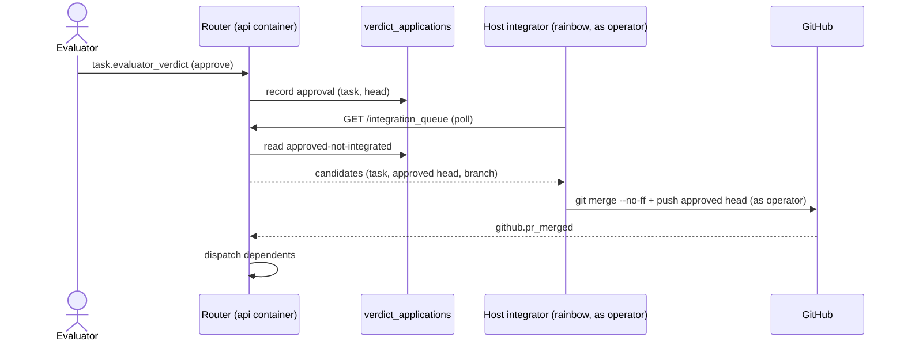

# ADR-0119: Router integration executes on the rainbow host as the operator, not in the API container

- **Status:** proposed
- **Date:** 2026-09-16
- **Amends:** ADR-0118 (the coordinator is a router) — it moved coordination into server code but left the integration EXECUTION locus and identity unspecified; this pins them.
- **Related:** ADR-0110 (feature-branch integration), ADR-0049 (GitHub App identity `treadmill[bot]`), ADR-0016 (dev-local topology — the API runs as a container).

## Context

ADR-0118 moved the coordinator's mechanical work — dispatch, dependency resolution, and now the approve→integration decision — into server code that runs inside the `treadmill-api` process. On rainbow (our single host) that process is a Docker container (ADR-0016): it has the DB, the `treadmill[bot]` GitHub App token (ADR-0049), and `~/.cc-channels` mounted, but **no `git` binary, no `gh`, and none of the operator's git credentials**. The fleet's Claude sessions (the old agent coordinator among them) run directly on the rainbow host, using the operator's ambient `~/.ssh` / `gh auth`.

Two forces make the naive "the router merges in-process" reading unworkable. First, the API container physically cannot run the local-git merge (`integration_merger.integrate_task`) — no git, no working-clone volume, no push credential. Second, and decisive: the merge IDENTITY matters. The operator states it as a hard constraint: *"for many of my professional obligations we have to use my direct gh user instead"* of the bot. Merging as `treadmill[bot]` (the only identity the container holds) is the wrong actor for those repos. The old agent coordinator already merged as the operator — because it ran on the host with the operator's ambient credentials — so honoring the constraint means preserving that execution locus, not inventing a new one.

## Decision

Because integration must be attributed to the operator's gh identity (a hard requirement — see Context) and the api container physically cannot run git nor hold that identity, we decided that the router SPLITS integration into a decision half and an execution half.

- The **api container decides** — it records each approval as the durable `verdict_applications` work-list (ADR-0118) and exposes the approved-but-not-integrated set through the API, applying the ADR-0118/#420 candidate selection (latest approved head per task, stuck-approval exclusion). The host integrator READS this selection over the API; it does not re-implement the query, so those fixes cannot drift.
- A deterministic (non-agent) **host-side integrator** — a systemd unit on the rainbow host running as the operator's gh identity — polls that work-list over the API (REST, so it holds no DB credentials) and EXECUTES the merge with `integration_merger.integrate_task` (local `git merge --no-ff` + push) as the operator.

The integrator authenticates NON-INTERACTIVELY: the interactive fleet sessions use the operator's ambient `gh` keychain, but a headless unit cannot, so it needs a provisioned long-lived operator credential (a PAT or deploy key) readable only by the unit — a named security surface the operator provisions. The api container never performs a git push or a PR merge; integration is never attributed to `treadmill[bot]`.

The trust flow is explicit: the **api (bot, container) DECIDES; the host (operator) EXECUTES on the api's say-so.** So the api's approval-recording integrity is load-bearing for the operator's identity being used to merge — a bug or compromise in the approval path would merge as the operator. We accept this because an approval is recorded only from a committed evaluator verdict (a `task.evaluator_verdict` event applied through the idempotent `verdict_applications` claim), not from any weaker signal.

## Alternatives considered

- **Incumbent: the agent coordinator merged host-side as the operator.** It ran on the rainbow host, used the operator's ambient `git`/`gh`, and did the feature-branch `git merge --no-ff` + push itself (ADR-0110). **Why it does not settle this on its own:** the incumbent is not the *reason* for the decision — the operator identity constraint + the container credential boundary are. But the incumbent CORROBORATES that the execution LOCUS was never the problem: ADR-0118's wedge and prose defects were DECISION problems, not execution ones (the git merge was mechanical shell that worked). So we keep that locus + identity and move only the DECISION into code — the move stops at the decision boundary and must not drag git execution into the credential-less container. We lead with the constraint, not the incumbent, precisely so this reads as constraint-driven, not preference.
- **Router merges in-process via the App token (`PUT /pulls/{n}/merge`).** Rejected: merges as `treadmill[bot]`, the wrong identity for the operator's obligations; also depends on an unverified `pull_requests:write` grant.
- **Provision the operator's personal credentials into the API container.** Rejected: puts the operator's gh identity inside a long-lived server process — a large, standing attack surface — to save a small host process we can run instead.
- **Install git + a push credential in the API image and merge from the container.** Rejected: still the wrong identity (container-held creds, not the operator's ambient session), plus a writable clone volume and a new credential path — more surface for no benefit over the host integrator.

## Consequences

### Good
- Integration is attributed to the operator's gh user, satisfying the professional-obligation constraint.
- No operator credentials in the API container; no bot-identity merges; no App-scope grant needed.
- Reuses `integration_merger.integrate_task` / `SubprocessGitRunner` unchanged — the local-git merger runs where git and the operator's creds already are.
- The decision/execution split stays clean: the container owns state and the queue; the host owns the credentialed act.

### Bad / trade-offs
- A new standing host component (a systemd unit on rainbow, like the channel units) to build, run, and monitor.
- A long-lived operator credential (PAT/deploy key) provisioned on rainbow for the headless unit — a security surface to name and manage that the interactive sessions did not need.
- Integration is now asynchronous from the approval (the integrator polls the work-list), not in the same call — acceptable, and the same shape as the reconcile sweep.
- The api's approval-recording integrity becomes load-bearing for the operator's identity being used to merge (see the trust flow in Decision).
- Two loci to reason about for one logical operation.

### Risks
- The integrator is a single host process, which is acceptable AND is its own reconcile-style backstop: the durable `verdict_applications` work-list + re-polling on restart is the re-drive pattern, host-side. Impl must make it robust — `Restart=always`, PER-APPROVAL error containment (a poison approval must not crash-loop the unit and stall the queue, mirroring the dispatch consumer's `handle()` contain-and-continue), and a work-list-depth alert so a wedged integrator is visible.
- **Falsifier (primary):** an integration merge commit on a `joes-agents/*` branch whose git author is `treadmill[bot]` rather than the operator identity — an inspectable artifact (commit author metadata) showing integration ran with the wrong identity.
- **Falsifier (precondition, config-inspectable):** the `treadmill-api` image contains a `git`/`gh` binary, OR a git push credential is mounted into the api container — either means integration is being set up to execute in the container, against this decision, and is checkable from the Dockerfile/mounts before any bad commit lands.

## Diagram

## References

- ADR-0118 (router), ADR-0110 (feature-branch integration), ADR-0049 (`treadmill[bot]`), ADR-0016 (containerized API).
- `services/api/treadmill_api/coordination/integration_merger.py`, `git_runner.py`, `dispatch_consumer.py` (the `verdict_applications` work-list + `integration_sweep`).
- Operator constraint, 2026-09-16: "for many of my professional obligations we have to use my direct gh user instead."
