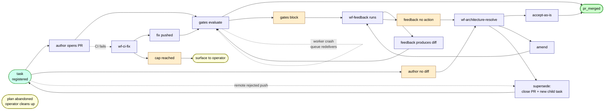

# Dead-end catalog — terminal states that aren't pr_merged

Names every terminal state where a task can come to rest without producing a merged PR. The **slug** is the conversational handle for the class. The **count** column reflects the 2026-05-19 audit across open plans. The **remediation** column reflects the path forward after the architect-widening discussed 2026-05-19 (forthcoming ADR-0049 — see the [aspirational architecture section](#aspirational-architecture-post-adr-0049) below).

Some classes that appeared in the v1 of this catalog have been **reclassified**:
- The v1 entries `feedback-no-action-no-gate` and `author-no-changes-impasse` were two views of the same underlying failure (author produces no diff). Folded into a single class: **`author-no-diff`**. The wf-feedback dispatch path that produced "feedback-no-action-no-gate" is itself wrong-shaped — when no PR exists, there's nothing for wf-feedback to remediate. The right route is architect-on-plan.
- `arch-uncertain-surfaced` has been **removed**. The `uncertain` verdict is being removed from the architect schema; the class can't exist going forward.
- `supersede-not-implemented` has been **removed**. The `supersede` verdict is being repurposed (see [Verdict-enum changes](#verdict-enum-changes-incoming) below); once implemented, the verdict is no longer terminal.

## Catalog

| Slug | Origin | Count | Description | Remediation (post-0049) |
|---|---|---|---|---|
| `author-no-diff` | wf-author | 11 | Author concluded there's nothing to commit. Could be because the work already shipped under a different PR, because the task spec is ambiguous, or because the author is blocked on a dependency. Today this routes to wf-feedback (wrong-shaped — feedback's job is to look at a PR's failure signal, and there's no PR). | Author no-diff routes to architect-on-plan instead of wf-feedback. Architect reads task text + branch state + upstream task reasoning and emits one of: `accept-as-is` (no, the work IS done — close task as completed), `amend` (give author a hint and iterate), or `supersede` (rewrite task text + restart fresh on new branch). |
| `feedback-cap-reached` | wf-feedback | observed | wf-feedback dispatched 5 times (FEEDBACK_MAX_ATTEMPTS). Further triggers no-op. | The cap stops being a terminal once architect-on-plan is wired. The first time wf-feedback would re-dispatch at the cap, architect-on-plan fires instead. |
| `arch-cap-reached` | wf-architecture-resolve | possible | wf-architecture-resolve dispatched 5 times. Further triggers no-op. | Architect's three escalation levels (iterate, amend, supersede) mean a cap-hit reflects "all three escalations exhausted." Surface to operator at this point. |
| `validate-crash-no-retry` | wf-validate | possible | wf-validate worker died (step.failed with no decision). | **Not actually a terminal — queue hygiene bug.** SQS should redeliver if we don't ack on uncaught exception. Once verified the worker correctly does NOT ack-on-crash, this class disappears. Adding a regression test rather than an architectural fix. |
| `review-crash-no-retry` | wf-review | possible | Sibling of validate-crash-no-retry. | Same as above — queue hygiene, not architecture. |
| `ci-fix-cap-reached` | wf-ci-fix | 2 | wf-ci-fix dispatched 3 times. PR has red CI; gate stays blocked. | **Surface to operator.** Repeated CI failures need human intervention. Add an explicit "needs operator" event/notification surface; the class itself remains terminal-by-design. |
| `ci-fix-gave-up` | wf-ci-fix | included in 2 | wf-ci-fix action step completed with `decision=fail`. | Same as above — surface to operator. |
| `pr-conflict-unresolved` | conflict | 0 in audit | PR `mergeable=false, mergeable_state=dirty`; wf-conflict couldn't resolve within cap. | Surface to operator (same shape as ci-fix). |
| `pr-remote-rejected` | wf-author push | 1 | `git push` rejected by GitHub. | Trigger `supersede` — close the rejected PR, create a child task on a fresh branch, run wf-author fresh. The remote rejection is the trigger; the supersede affordance does the work. |
| `task-orphaned-by-plan-abandon` | upstream | possible | Plan abandoned but tasks not cancelled. | **Operator's responsibility.** No programmatic remediation. |

## State graph (post-0049)

Three categories of how the catalog resolves:
- **Merged** — `accept-as-is` overrides gates, or the loop genuinely converges.
- **Operator-surfaced** — ci-fix exhaustion, pr-conflict-unresolved, abandoned plans, arch-cap-reached. These are inherently operator-decision states; the system surfaces them clearly rather than spinning forever.
- **Restart-fresh** — `supersede` is the affordance. Triggered by author-no-diff (after architect arbitrates) or by remote rejection.

## Verdict-enum changes incoming

The repurposed `wf-architecture-resolve` verdict enum (incoming, to be specified in ADR-0049):

| Verdict | Semantics | Implementation |
|---|---|---|
| `accept-as-is` | Override the blocking gate; merge if CI is good. | Existing — `review.override` + `validate.override` events. No change. |
| `amend` | Naive ralph loop. Architect emits remediation; wf-feedback runs with it as guidance; iteration continues. | Existing — `maybe_dispatch_feedback_on_architect_amend`. No change. |
| `supersede` | Plan wasn't up to snuff. Close the PR. Create a child task with rewritten description + `parent_task_id` pointing back. New wf-author run dispatches against the new task. | **New.** Task text remains immutable per row; the rewrite is a fresh task row. The architect can read upstream task reasoning (a handoff/summary from the original task's failed runs) to inform what to change. |
| ~~`uncertain`~~ | (removed) | Remove from `events/architect_verdict.py:27` Literal, `starters.py:746` prompt template, and the 3 referencing tests. |

## Two ways to read this catalog

**By symptom (operator's view):**
- "Task has no PR, never will" → `author-no-diff` (architect-on-plan will route it)
- "Task has a PR but it's stuck on a gate" → `arch-cap-reached` (after escalations) → surface to operator
- "Task has a PR but CI is red" → `ci-fix-cap-reached` / `ci-fix-gave-up` → surface to operator
- "Push got rejected" → `pr-remote-rejected` → `supersede` (close PR, fresh branch)
- "Plan got abandoned" → `task-orphaned-by-plan-abandon` → operator cleans up

**By remediation strategy (system's view):**
- **Architect arbitrates and possibly supersedes** → `author-no-diff`, `feedback-cap-reached`
- **Surface to operator** → `ci-fix-*`, `pr-conflict-unresolved`, `arch-cap-reached`
- **Queue hygiene fix (not architectural)** → `validate-crash-no-retry`, `review-crash-no-retry`
- **Out of scope** → `task-orphaned-by-plan-abandon`

## Aspirational architecture (post-ADR-0049)

The architect's responsibilities widen from "arbitrate the override channel" to "decide how to recover from any non-mergeable terminal." Three escalation levels, in order of preference:

1. **Naive ralph loop** — architect emits `amend`; wf-feedback runs with the architect's remediation; the loop continues. (Existing behavior; nothing new.)
2. **Tweak task text + restart fresh** — architect emits `supersede`; the system closes the existing PR, creates a child task with the rewritten description (+ `parent_task_id`), and dispatches a fresh wf-author run on a new branch. (New behavior; this is what the ADR will specify.)
3. **(Collapsed into level 2.)** A previous draft separated "tweak task text only" from "tweak + fresh branch." Decided not to keep this distinct: if we're tweaking the task text the prior branch is likely working against a now-wrong spec, so always cut fresh. Side benefit: lets the task text be immutable per row (new row + new text on supersede).

**Architect's input for the `supersede` decision** needs to include the upstream task's reasoning — at minimum a handoff/summary statement from the original task's failed runs (analyzer + action + feedback outputs). Exact shape is a question for the ADR.

**What triggers architect-on-plan:**
- wf-author terminal: `step.failed` due to CodeAuthorError "no changes to commit" → architect routes directly (today wrongly routes to wf-feedback)
- wf-feedback terminal: `decision=responded-without-change` with NO open PR → architect routes (today silently terminates)
- wf-feedback at cap → architect routes (today silently terminates)
- Remote rejection on push → architect routes; supersede is almost always the right answer
