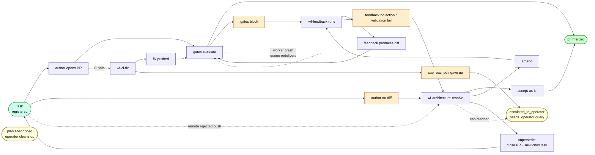

# Dead-end catalog — terminal states that aren't pr_merged

Names every terminal state where a task can come to rest without producing a merged PR. The **slug** is the conversational handle for the class. The **count** column reflects the 2026-05-19 audit across open plans. The **status** column reflects what is now wired (the architect-widening landed as **ADR-0048**, accepted 2026-05-19; a follow-on dead-end audit on 2026-05-20 closed the remaining silent terminals). As of 2026-05-20 **every terminal either dispatches a productive next workflow or surfaces to the operator** — there are no known silent dead-ends.

Some classes from v1 of this catalog were **reclassified**:
- The v1 entries `feedback-no-action-no-gate` and `author-no-changes-impasse` were two views of the same failure (author produces no diff). Folded into **`author-no-diff`**. The wf-feedback dispatch path that produced "feedback-no-action-no-gate" was wrong-shaped — when no PR exists there is nothing for wf-feedback to remediate — and was removed in favour of architect-on-plan.
- `arch-uncertain-surfaced` — **removed**. The `uncertain` verdict was removed from the architect schema (PR #179); the class can't exist.
- `supersede-not-implemented` — **removed**. `supersede` is implemented (PR #181); the verdict is no longer terminal.

## Catalog

| Slug | Origin | Count | Description | Status |
|---|---|---|---|---|
| `author-no-diff` | wf-author | 11 | Author concluded there's nothing to commit (work already shipped elsewhere, ambiguous spec, or a dependency block). Routes to `wf-architecture-resolve`, which reads task text + branch state + upstream reasoning and emits `accept-as-is` / `amend` / `supersede`. | **Shipped** — `maybe_dispatch_architect_on_author_no_diff` (PR #187). |
| `feedback-author-validation-failed-no-push` | wf-feedback | 4 (2026-05-19 retry batch) | wf-feedback's `code` disposition (`runner_dispositions/code.py:199`) runs the task's deterministic author-side validations after committing locally but BEFORE pushing. On any `verdict:"fail"` it returns `decision="fail"` with a `validation_results` payload and never pushes. With no PR there's no gate signal, so the deadlock path doesn't fire. | **Shipped** — `maybe_dispatch_architect_on_feedback_validation_fail` (PR #198): no-PR + `validation_results` fail → `wf-architecture-resolve`. |
| `feedback-no-progress-no-pr` | wf-feedback | (2026-05-20 audit, SDE-1) | wf-feedback completes `responded-without-change` or a bare `fail` (no `validation_results`) on a task with no open PR and no gate — e.g. the retry-CLI path. Previously terminated silently. | **Shipped** — `maybe_dispatch_architect_on_feedback_no_progress` (PR #203). Sibling of the validation-fail trigger; routes to `wf-architecture-resolve`. |
| `feedback-cap-reached` | wf-feedback | observed | wf-feedback dispatched 5× (`FEEDBACK_MAX_ATTEMPTS`). | Largely obviated: the no-PR cases now reach the architect before re-dispatching feedback. A PR-bearing feedback loop at cap still ends via the deadlock→arch path, whose cap surfaces to operator (below). |
| `arch-cap-reached` | wf-architecture-resolve | possible | wf-architecture-resolve dispatched 5× (`ARCHITECTURE_RESOLVE_MAX_ATTEMPTS`) — all escalations exhausted. | **Shipped** — emits `task.escalated_to_operator` (PR #184), now from **all** cap sites including the wf-author no-diff / remote-rejection sites (PR #202, SDE-5). Surface: `GET /api/v1/tasks?status=needs_operator`. |
| `validate-crash-no-retry` | wf-validate | possible | wf-validate worker died (step.failed, no decision). | **Not a terminal** — SQS redelivers (the worker does not ack on uncaught exception; `runner.py`), DLQ after `maxReceiveCount`. Verified by the 2026-05-20 audit. Queue hygiene, not architecture. |
| `review-crash-no-retry` | wf-review | possible | Sibling of validate-crash-no-retry. | Same — SQS redelivery. |
| `ci-fix-cap-reached` | wf-ci-fix | 2 | wf-ci-fix dispatched 3× (`CI_FIX_MAX_ATTEMPTS`); PR has red CI, gate stays blocked. | **Shipped** — escalates to operator in the cap path (PR #202, SDE-3). Class remains terminal-by-design; CI red needs a human. |
| `ci-fix-gave-up` | wf-ci-fix | included in 2 | wf-ci-fix action step completed with `decision=fail`. | **Shipped** — `maybe_escalate_operator_on_terminal_give_up` emits `escalated_to_operator` (PR #202, SDE-2). |
| `pr-conflict-unresolved` | conflict | 0 in audit | PR `mergeable=false`; wf-conflict couldn't resolve within its 3-attempt cap (or gave up). | **Shipped** — cap path + give-up handler escalate to operator (PR #202, SDE-4). |
| `doc-amend-cap-reached` | wf-doc-amend | (2026-05-20 audit, SDE-6) | A docs-current-with-pr gate failure routed to wf-doc-amend that hit its 5-attempt cap (or gave up), leaving the docs gate failed → PR blocked. | **Shipped** — cap path + give-up handler escalate to operator (PR #202). (The rule-tuning doc-amend path produces a separate proposal PR and is not gate-blocking, so it does not escalate.) |
| `pr-remote-rejected` | wf-author push | 1 | `git push` rejected by GitHub (branch protection, stale lease, etc.). | **Shipped** — routes to `wf-architecture-resolve` (PR #189); the architect almost always verdicts `supersede` (PR #181) to start fresh on a new branch. |
| `task-orphaned-by-plan-abandon` | upstream | possible | Plan abandoned but tasks not cancelled. | **Operator's responsibility** — no programmatic remediation. |

## State graph

Three categories of how the catalog resolves:
- **Merged** — `accept-as-is` overrides gates, or the loop genuinely converges.
- **Operator-surfaced** — ci-fix / conflict / doc-amend exhaustion and arch-cap-reached all emit `task.escalated_to_operator`; plan abandonment is operator-owned. These are inherently operator-decision states; the system surfaces them via `GET /tasks?status=needs_operator` rather than spinning or dying silently.
- **Restart-fresh** — `supersede` closes the PR and cuts a fresh child task; triggered by author-no-diff (after the architect arbitrates) or by remote rejection.

## Verdict enum (`wf-architecture-resolve`)

Per ADR-0048:

| Verdict | Semantics | Implementation |
|---|---|---|
| `accept-as-is` | Override the blocking gate; merge if CI is good. | `review.override` + `validate.override` events. |
| `amend` | Naive ralph loop. Architect emits remediation; wf-feedback runs with it as guidance. | `maybe_dispatch_feedback_on_architect_amend`; remediation reaches feedback via `source_step_id` (PR #190). |
| `supersede` | Spec wasn't up to snuff. Close the PR; create a child task with rewritten description + `parent_task_id`; dispatch a fresh wf-author run. | **Shipped (PR #181).** Task text is immutable per row; the rewrite is a fresh row. |
| ~~`uncertain`~~ | (removed) | **Removed (PR #179)** — gone from the `architect_verdict.py:39` Literal, the role-architect prompt, and the referencing tests. |

## Two ways to read this catalog

**By symptom (operator's view):**
- "Task has no PR, never will" → `author-no-diff` / `feedback-no-progress-no-pr` → architect-on-plan
- "Task has a PR but it's stuck on a gate after all escalations" → `arch-cap-reached` → operator
- "Task has a PR but CI is red" → `ci-fix-cap-reached` / `ci-fix-gave-up` → operator
- "Docs gate won't clear" → `doc-amend-cap-reached` → operator
- "Push got rejected" → `pr-remote-rejected` → architect → `supersede`
- "Plan got abandoned" → `task-orphaned-by-plan-abandon` → operator

**By remediation strategy (system's view):**
- **Architect arbitrates / supersedes** → `author-no-diff`, `feedback-author-validation-failed-no-push`, `feedback-no-progress-no-pr`, `pr-remote-rejected`
- **Surface to operator** → `arch-cap-reached`, `ci-fix-*`, `pr-conflict-unresolved`, `doc-amend-cap-reached`
- **Queue hygiene (not architectural)** → `validate-crash-no-retry`, `review-crash-no-retry`
- **Out of scope** → `task-orphaned-by-plan-abandon`

## Architect-on-plan triggers (all shipped)

The architect's responsibilities widened (ADR-0048) from "arbitrate the override channel" to "decide how to recover from a non-mergeable terminal," with three escalation levels: `amend` (ralph loop), `supersede` (rewrite spec + fresh branch), and `accept-as-is` (override the gate). What routes a terminal to `wf-architecture-resolve`:

- wf-author `step.failed` with CodeAuthorError "no changes to commit" → PR #187
- wf-author push remote-rejected → PR #189 (→ supersede)
- wf-feedback `decision=fail` + `validation_results` on a no-PR task → PR #198
- wf-feedback `responded-without-change` / bare `fail` on a no-PR task → PR #203
- wf-feedback `amend` from the architect → existing (`maybe_dispatch_feedback_on_architect_amend`)

When `wf-architecture-resolve` itself hits its 5-attempt cap, automated recovery is exhausted and the task escalates to the operator (PR #184 + PR #202).
