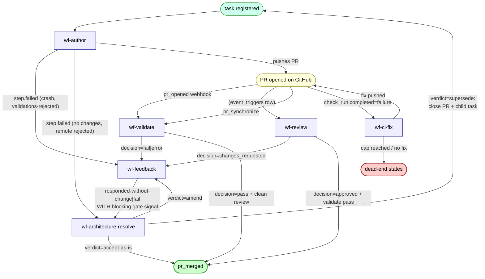

# Task flow — overview

How a task moves through Treadmill's workflows from registration to a terminal state. This is the orientation diagram: every box is one workflow, every arrow is a dispatch. The detail of what each workflow does internally lives in its own sibling diagram.

Sibling diagrams:
- [wf-author detail](./task-flow-wf-author.md)
- [wf-validate detail](./task-flow-wf-validate.md)
- [wf-review detail](./task-flow-wf-review.md)
- [wf-feedback detail](./task-flow-wf-feedback.md)
- [wf-architecture-resolve detail](./task-flow-wf-architecture-resolve.md)
- [wf-ci-fix detail](./task-flow-wf-ci-fix.md)
- [**Dead-end catalog**](./task-flow-dead-ends.md) — every terminal state that isn't `pr_merged`, named so we can talk about it specifically

The arrows reflect actual `triggers.py` / `consumer.py` dispatch points as of `main` 2026-05-19 (PR #177 merged).

## What this diagram is showing (post-0049)

- **wf-author** is the only workflow that can open a PR. Every other workflow operates on an existing PR or terminates.
- Every gate-bearing workflow (`wf-validate`, `wf-review`) has two arrows: one to `pr_merged` (clean path) and one to `wf-feedback` (the recovery loop).
- `wf-author` failures route by failure shape: crashes / validations-rejected go to `wf-feedback`; no-diff and remote-rejected go directly to `wf-architecture-resolve` since there's no PR to give feedback on.
- `wf-architecture-resolve` has three live verdicts: `accept-as-is` (override the gate), `amend` (loop with new guidance), `supersede` (close PR + create child task + restart fresh). `uncertain` is being removed.
- `supersede` loops back to **task registered** — the child task is a fresh row with rewritten description and `parent_task_id` pointing to the original. Task text is immutable per row.

## What this diagram is NOT showing

Today the dispatch from wf-author `step.failed (no-changes)` actually routes to wf-feedback, not wf-architecture-resolve. That's the change ADR-0049 will land. The diagram reflects the target state.

## What this diagram is NOT showing

- Caps (`FEEDBACK_MAX_ATTEMPTS=5`, `CI_FIX_MAX_ATTEMPTS=3`, etc.). Cap-hit is a dead-end class; see [dead-end catalog](./task-flow-dead-ends.md).
- The `wf-doc-amend` / `wf-conflict` / `wf-plan` workflows. They exist but are not yet observed as load-bearing in the auto-merge path. Will add when they become relevant.
- Per-workflow step structure (analyzer → action, triage → resolve, etc.). See per-workflow sibling diagrams.
- Webhook event types (`pr_review_submitted`, `check_run.completed`). The diagram aggregates these into "PR opened on GitHub" for readability.
