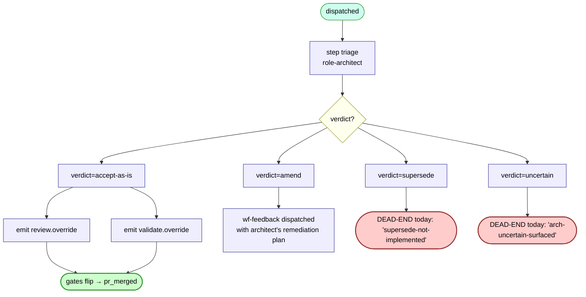

# wf-architecture-resolve — internal flow

The arbitration workflow. Today dispatched when the ralph loop deadlocks (per ADR-0038). Under [ADR-0049 (forthcoming)](#what-changes-under-adr-0049) its remit widens to "decide how to recover from any non-mergeable terminal" — including author-no-diff and remote-rejection cases that today don't reach it.

## Current diagram



## Verdict semantics (current)

Per `events/architect_verdict.py`:
```python
verdict: Literal["amend", "supersede", "accept-as-is", "uncertain"]
```

| Verdict | What it means | What fires |
|---|---|---|
| `accept-as-is` | The blocking gate is wrong; merge anyway | `review.override` and/or `validate.override` events → gate flips in mergeability VIEW → auto-merge proceeds |
| `amend` | The work needs more changes; here's what | `wf-feedback` dispatched with architect's remediation plan as payload |
| `supersede` | This task is wrong-shaped; replace with a different task | **No automatic dispatch yet — terminal** |
| `uncertain` | Architect can't decide | **No automatic dispatch — terminal** |

## What changes under ADR-0049

The verdict enum is collapsing to three values; `uncertain` is being removed; `supersede` is being repurposed:

| Verdict | New semantics | What fires |
|---|---|---|
| `accept-as-is` | (unchanged) | `review.override` / `validate.override` — existing emitters |
| `amend` | (unchanged) | wf-feedback dispatched with remediation — existing path |
| `supersede` | **Repurposed:** plan wasn't up to snuff; close the PR, create a child task with rewritten description (+ `parent_task_id`), dispatch fresh wf-author against the new task. Task text is immutable per row; the rewrite is a new task row. | New trigger function — to be specified in ADR-0049 |
| ~~`uncertain`~~ | (removed) | Remove from `events/architect_verdict.py:27` Literal, `starters.py:746` prompt, 3 referencing tests |

The architect's three escalation levels in order of preference: (1) naive ralph loop = `amend`, (2/3 collapsed) tweak task text + restart fresh = `supersede`. The override path (`accept-as-is`) is orthogonal — it's for "the gate is wrong," not for "the task is wrong."

## Triggers — when wf-architecture-resolve fires (post-0049)

Today, only one path fires architect: `maybe_dispatch_arbitration_on_deadlock` (wf-feedback completed with a blocking gate signal). After ADR-0049, additional triggers:

- **Author-no-diff:** wf-author `step.failed` from `CodeAuthorError("no changes")` routes to wf-architecture-resolve instead of wf-feedback. (See `author-no-diff` in the [dead-end catalog](./task-flow-dead-ends.md).)
- **Remote-rejected push:** wf-author `step.failed` from a `git push` rejection routes to wf-architecture-resolve. Architect will almost always emit `supersede` here.
- **Cap-approached on wf-feedback:** before the cap actually fires, dispatch architect-on-plan so it can decide whether to keep iterating, amend with new guidance, or supersede.

## Cap

`wf-architecture-resolve` has a cap of 5 dispatches per task (per ADR-0029 Q29.e). When exceeded after the three escalation levels are exhausted, surface to operator (see `arch-cap-reached` in the [dead-end catalog](./task-flow-dead-ends.md)).
