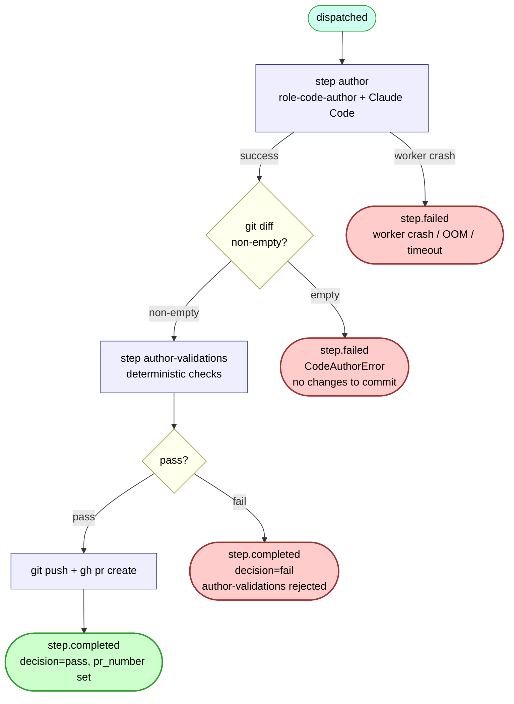

# wf-author — internal flow

The only workflow that can open a PR. Owns the worker → git → GitHub seam.



## What dispatches downstream (current)

| wf-author terminal | What fires next | Where |
|---|---|---|
| `step.completed` (PR pushed) | `wf-validate` + `wf-review` via `pr_opened` webhook | `triggers.evaluate_triggers` |
| `step.completed` decision=fail | `wf-feedback` (ADR-0037) | `maybe_dispatch_feedback_on_terminal_failure(workflow_id='wf-author', fail_decision='fail')` |
| `step.failed` (crash) | `wf-feedback` (ADR-0037 silent-death fix) | `maybe_dispatch_feedback_on_step_failed` |
| `step.failed` from `CodeAuthorError("no changes")` | `wf-feedback` via the silent-death path above — **wrong-shaped** (see below) | same trigger; the empty-diff hard-fail looks identical to a crash from triggers.py's perspective |

## What changes under ADR-0049

The `step.failed` from `CodeAuthorError("no changes")` should NOT dispatch wf-feedback. wf-feedback's job is to look at a PR's failure signal and remediate, but when the author produced no diff there is no PR to look at. The correct route is **wf-architecture-resolve** directly — architect reads the task spec, the (possibly empty) branch state, and the upstream task reasoning, then picks: `accept-as-is` (work is already done elsewhere), `amend` (here's a hint for the next author iteration), or `supersede` (rewrite the task text + restart fresh on a new branch). See [task-flow-dead-ends.md](./task-flow-dead-ends.md) for the catalog entry `author-no-diff`.

The other two `step.failed` cases — worker crash and author-validations-rejected — continue to route to wf-feedback as today.

## Where the "no diff" impasse originates

`workers/agent/.../runner_dispositions/code.py`:

```python
if not has_staged_changes(...):
    if workflow_id in _SOFT_EMPTY_DIFF_WORKFLOWS:  # {"wf-feedback"} only
        return StepOutput(decision="responded-without-change", ...)
    raise CodeAuthorError("Claude Code produced no changes to commit")
```

So:
- **wf-author** + empty diff → **hard fail** (CodeAuthorError → step.failed)
- **wf-feedback** + empty diff → **soft outcome** (decision="responded-without-change")

This asymmetry is intentional (per the docstring in `code.py`) but is the seed of the impasse class. The author hard-fails with no structured reason; downstream consumers see only "step.failed with no decision" — same surface as a worker crash. Whether the failure is "no work to do" vs "haiku errored" is not preserved.

## Open question this diagram surfaces

The `step.failed` arc collapses three operationally-distinct outcomes into one signal:
1. Worker crash / OOM (transient, retry helps)
2. Author validations rejected the change (deterministic, retry won't help without spec change)
3. CodeAuthorError "no changes to commit" (impasse, retry produces same outcome)

Downstream, `maybe_dispatch_feedback_on_step_failed` treats all three identically. The retry CLI's `infer_retry_workflow` also treats them identically. This is the classifier problem.
