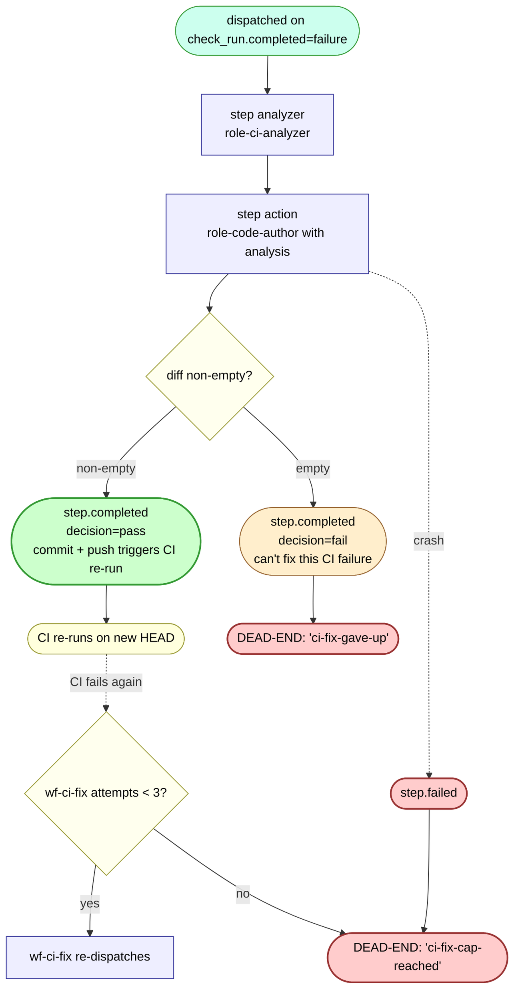

# wf-ci-fix — internal flow

The CI-failure recovery workflow. Dispatched on `check_run.completed=failure` webhook events when CI fails on a PR.

## Cap

`wf-ci-fix` is capped at 3 attempts per task (`CI_FIX_MAX_ATTEMPTS=3`). Once the cap is hit, no further attempts are made even if CI continues to fail. The PR sits with red CI; auto-merge gate stays blocked.

## What dispatches downstream

| wf-ci-fix terminal | What fires next |
|---|---|
| `step.completed` decision=pass with diff | nothing automatic; the push triggers a CI re-run, which on completion may dispatch a fresh wf-ci-fix via the github webhook path |
| `step.completed` decision=fail (analyzer/action gave up) | **nothing** |
| `step.failed` (crash) | **nothing** — no step.failed wiring for wf-ci-fix |

## Note on the dead-end classes

Both `ci-fix-cap-reached` and `ci-fix-gave-up` are PRs where the diff is otherwise mergeable but CI is red. Today these surface only as operator-detectable state (the PR shows red CI; mergeability VIEW shows `ci_conclusion='failure'`). No notification fires. The 2026-05-19 audit found 2 tasks in this terminal state (both from old hands-free-driving plans — possibly abandonable).
