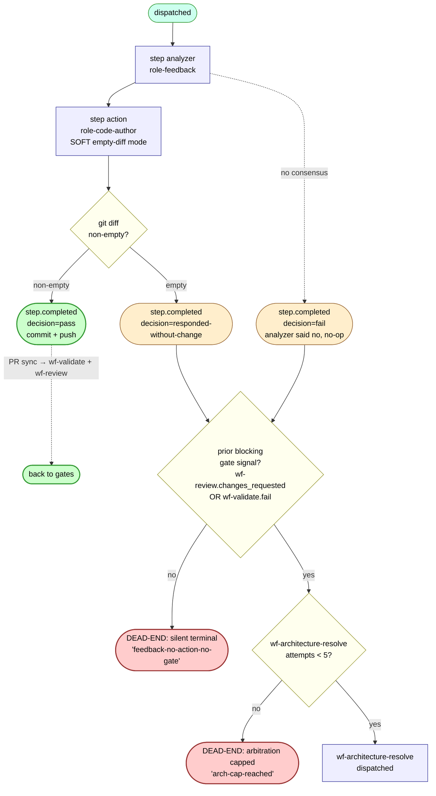

# wf-feedback — internal flow

The recovery workflow. Runs when something upstream went wrong; decides whether to act or punt. The most important workflow for the dead-end analysis because three of the four named impasses originate here.



## Two-step structure

1. **analyzer** — role-feedback examines the prior failure (validate fail, review changes-requested, CI fail, author crash) and produces a remediation plan as text.
2. **action** — role-code-author with the analyzer's plan as guidance. Permitted to soft-complete with no diff if it decides nothing should change.

## What dispatches downstream

| wf-feedback terminal | What fires next | Predicate |
|---|---|---|
| `step.completed` decision=pass with diff | `wf-validate` + `wf-review` via `pr_synchronize` webhook | Standard PR-sync triggers |
| `step.completed` decision=responded-without-change | `wf-architecture-resolve` if blocking gate exists | `maybe_dispatch_arbitration_on_deadlock` |
| `step.completed` decision=fail | `wf-architecture-resolve` if blocking gate exists | Same as above (widened 2026-05-15) |
| Either of the above, **no blocking gate** | **nothing** | Silent termination — see dead-end catalog |
| Either of the above, **arbitration cap hit** | **nothing** | Silent termination — see dead-end catalog |

## The "blocking gate signal" predicate

From `triggers.maybe_dispatch_arbitration_on_deadlock`:

```python
# Architect only arbitrates when there's a deadlock to resolve. A deadlock
# requires both:
#   * wf-feedback completed with responded-without-change OR fail
#   * AND prior blocking gate signal: wf-review.changes_requested OR wf-validate.fail
for gate_workflow_id, blocking_decision in (
    ("wf-review", "changes_requested"),
    ("wf-validate", "fail"),
):
    # look for matching step.completed in this task's history...
```

If **no prior blocking gate signal exists** (typical when wf-feedback ran because wf-author had no PR to gate), arbitration does not fire. The chain terminates silently.

## Why this is the largest dead-end class

The 2026-05-19 audit found 12 tasks in this terminal state:

- Author tried, hard-failed with "no changes to commit"
- ADR-0037 dispatched wf-feedback
- Feedback soft-completed with responded-without-change
- No PR ever existed → no wf-review run → no `changes_requested` signal
- No wf-validate run → no `fail` signal
- Arbitration predicate sees no blocking gate → no dispatch
- Chain terminates with no notification, no PR, no audit beyond the workflow_run_steps rows

## What changes under ADR-0049

The "wf-feedback dispatched on author no-diff" path is being removed. wf-feedback's job is to look at a PR's failure signal and remediate; it has no useful work to do when there's no PR. The corrected route is for author-no-diff to dispatch wf-architecture-resolve directly. See [task-flow-dead-ends.md](./task-flow-dead-ends.md) for the consolidated `author-no-diff` class.

After 0049, wf-feedback's invocation surface is strictly:
- wf-review decision=changes_requested
- wf-validate decision=fail / error
- wf-author step.failed *not* from CodeAuthorError-no-changes (i.e., genuine crash or validations-rejected)
- Architect amend (existing — wf-feedback runs with architect's guidance)

The "responded-without-change with no blocking gate" silent-terminal goes away because the dispatch shape that produced it is no longer permitted.
