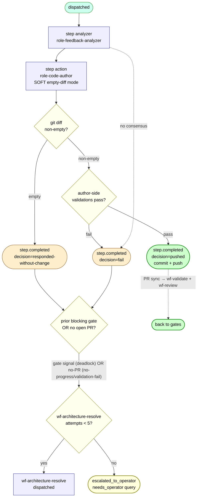

# wf-feedback — internal flow

The recovery workflow. Runs when something upstream went wrong; decides whether to act or punt. Historically the largest source of silent dead-ends — all of which are now closed (see the status note at the bottom and [task-flow-dead-ends.md](./task-flow-dead-ends.md)).



## Two-step structure

1. **analyzer** — `role-feedback-analyzer` examines the prior failure (validate fail, review changes-requested, CI fail, author crash) and produces a remediation plan as text.
2. **action** — `role-code-author` with the analyzer's plan as guidance. Runs the task's deterministic author-side validations (`runner_dispositions/code.py::_run_author_validations`, ~`code.py:199`) after committing locally and *before* pushing. Permitted to soft-complete with no diff if it decides nothing should change.

## What dispatches downstream

| wf-feedback terminal | What fires next | Predicate / trigger |
|---|---|---|
| `step.completed` decision=`pushed` (diff committed + pushed) | `wf-validate` + `wf-review` via the `pr_synchronize` webhook | Standard PR-sync triggers |
| decision=`responded-without-change` / `fail`, **blocking gate signal present** | `wf-architecture-resolve` | `maybe_dispatch_arbitration_on_deadlock` |
| decision=`fail` with `validation_results` fail entry, **no open PR** | `wf-architecture-resolve` | `maybe_dispatch_architect_on_feedback_validation_fail` (PR #198) |
| decision=`responded-without-change` / bare `fail`, **no open PR**, no gate | `wf-architecture-resolve` | `maybe_dispatch_architect_on_feedback_no_progress` (PR #203, SDE-1) |
| any of the architect routes, **arbitration cap (5) hit** | `task.escalated_to_operator` → `GET /tasks?status=needs_operator` | `_emit_arch_cap_reached` |

Every wf-feedback terminal now routes somewhere — there is no silent termination.

## The "blocking gate signal" predicate

From `triggers.maybe_dispatch_arbitration_on_deadlock`:

```python
# Architect arbitrates a deadlock when BOTH hold:
#   * wf-feedback completed with responded-without-change OR fail
#   * AND prior blocking gate signal: wf-review.changes_requested OR wf-validate.fail
for gate_workflow_id, blocking_decision in (
    ("wf-review", "changes_requested"),
    ("wf-validate", "fail"),
):
    # look for matching step.completed in this task's history...
```

When **no blocking gate signal exists** (typical when wf-feedback ran on a task that never had a PR — e.g. the retry-CLI path), the deadlock trigger short-circuits, and the no-PR case is claimed by the validation-fail / no-progress triggers instead (both require `task.open_pr_count == 0`, so they don't collide with the gate-bearing deadlock path).

## History: the "feedback no-PR" dead-end class (now closed)

The 2026-05-19 audit found tasks resting in a silent terminal: a wf-feedback run on a task with **no PR and no gate signal** that completed with `responded-without-change` or `fail` and dispatched nothing. Origin: author no-diff used to dispatch wf-feedback (wrong-shaped — feedback remediates a PR's failure signal, and there was no PR), and the retry CLI re-dispatched wf-feedback on PR-less tasks.

Closed by three changes, all merged or in flight:
- **Author no-diff no longer dispatches wf-feedback** — it routes straight to `wf-architecture-resolve` (`maybe_dispatch_architect_on_author_no_diff`, PR #187). So the dispatch shape that produced most of these no longer occurs.
- **`feedback-author-validation-failed-no-push`** (a diff was produced but author-side validation rejected it before push) → `maybe_dispatch_architect_on_feedback_validation_fail` (PR #198).
- **`responded-without-change` / bare `fail` on a no-PR task** → `maybe_dispatch_architect_on_feedback_no_progress` (PR #203, SDE-1).

After these, wf-feedback's *productive* invocation surface is: wf-review `changes_requested`, wf-validate `fail`/`error`, wf-author `step.failed` that is a genuine crash (not no-changes — that's the architect's), and architect `amend`. Anything else routes to the architect or, at cap, to the operator.

## Architect intervention on validation-fail (shipped: ADR-0048 / PR #198)

When the action step commits a diff that author-side validation rejects (`decision="fail"` with a `validation_results` fail entry) on a task with no open PR, the chain routes to `wf-architecture-resolve`. The architect gets the task spec + validation scripts + failure rationales (via `source_step_id`, PR #190) and applies one of its three verdicts:

| Verdict | When | Effect |
|---|---|---|
| `accept-as-is` | The validation script is wrong (over-strict, or satisfied semantically not literally). | Emit `validate.override` to flip the validate_decision; surface a script-tuning suggestion via `validator_tuning` (ADR-0040). |
| `amend` | The diff is incomplete; the script is right. | Emit remediation with file:line specificity; the next feedback iteration reads it via `source_step_id` (PR #190). |
| `supersede` | The task spec and the script disagree about "done". | Rewrite the task spec; create a child task; restart fresh (PR #181). |

> **Diff-handling note** (`runner_dispositions/code.py`): on validation failure the disposition has already `git commit`-ed locally but skips the push, so the commit lives only in the torn-down worker repo. From the architect's view the diff is effectively discarded — only `validation_results.log_excerpt` and the worker `summary` survive in the step output.
