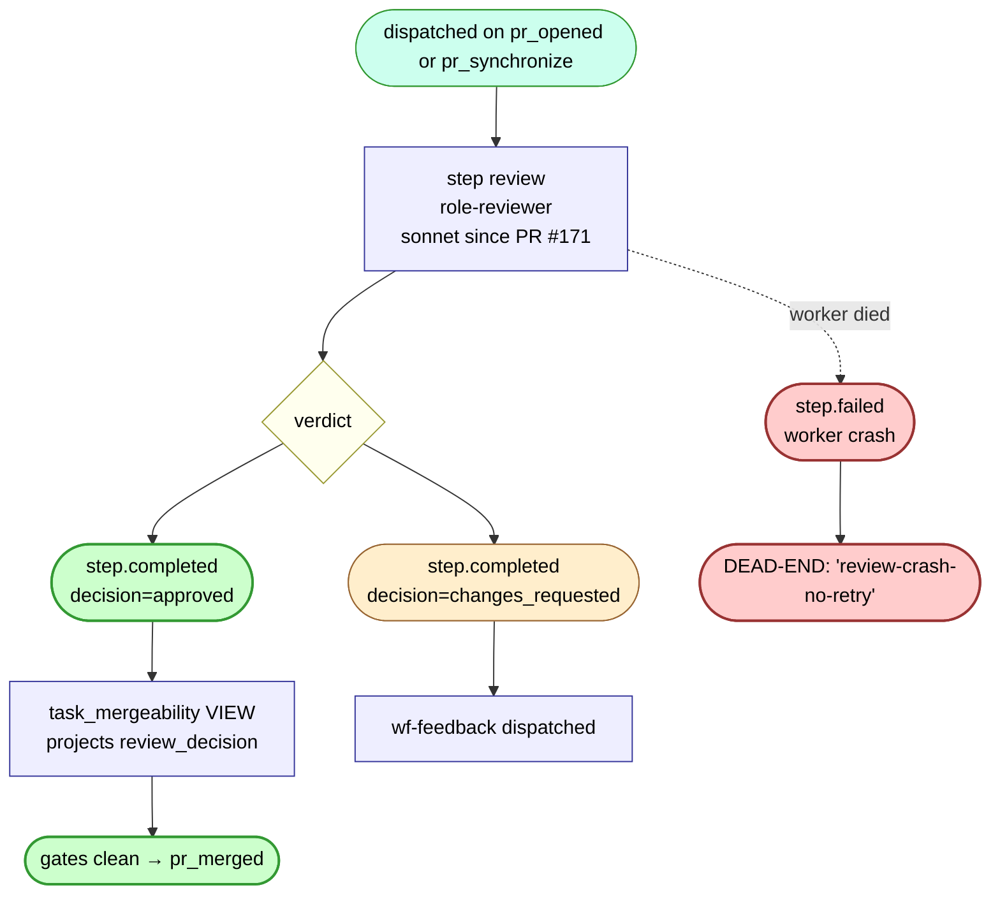

# wf-review — internal flow

The LLM review gate. Runs alongside wf-validate on `pr_opened`/`pr_synchronize`. Verdict feeds the `task_mergeability` VIEW's `review_decision` projection.

## Decisions

Per the role-reviewer prompt (bumped to sonnet in PR #171):
- `approved` — diff looks correct. VIEW projects `review_decision='approved'`; auto-merge gate clears.
- `changes_requested` — diff needs work. Dispatches wf-feedback.

(`commented` was a prior state that has been removed — sonnet reviewer is told to pick one of the two terminal verdicts.)

## What dispatches downstream

| wf-review terminal | What fires next |
|---|---|
| `step.completed` decision=approved | nothing; auto-merge predicate picks it up via mergeability VIEW |
| `step.completed` decision=changes_requested | `wf-feedback` (ADR-0029 / task #108 path 1) |
| `step.failed` (no decision) | **nothing** — same scoping as wf-validate; only wf-author has the step.failed → feedback wiring |

## Note on the `review.override` interaction

When `wf-architecture-resolve` emits `verdict=accept-as-is`, the override event flips the mergeability VIEW's `review_decision` projection to `approved` **without** wf-review having to re-run. This is how ADR-0038's deadlock arbitration unblocks merges where the human-ish reviewer (LLM) and the author disagree.
