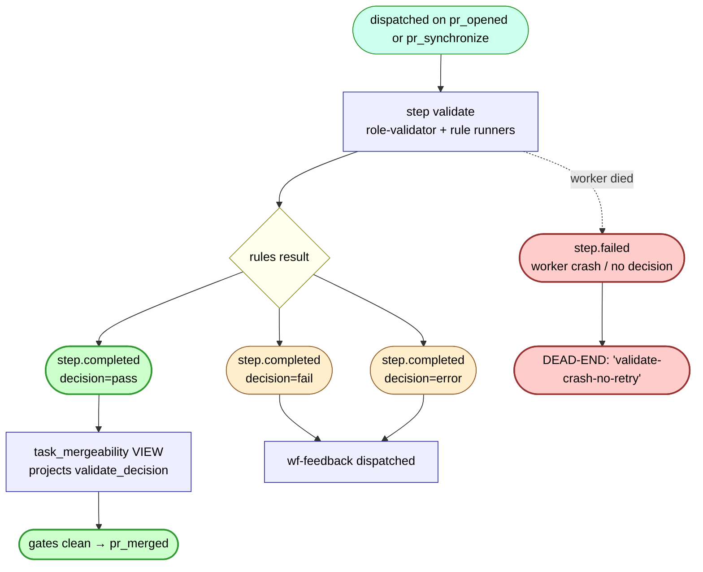

# wf-validate — internal flow

The deterministic-checks gate. Runs after a PR is opened or synchronized. Verdict feeds the `task_mergeability` VIEW's `validate_decision` projection.

## Decisions

- `pass` — all rule runners agree. Mergeability VIEW projects `validate_decision='pass'`; auto-merge gate clears.
- `fail` — at least one rule failed. Dispatches wf-feedback.
- `error` — runtime crashed (rule code threw exception). Per ADR-0039, this is **not** a merge-blocker — the validator's own error doesn't gate the merge. But it does dispatch wf-feedback so we learn from it.

## What dispatches downstream

| wf-validate terminal | What fires next |
|---|---|
| `step.completed` decision=pass | nothing; auto-merge predicate picks it up via the mergeability VIEW |
| `step.completed` decision=fail | `wf-feedback` (ADR-0029) |
| `step.completed` decision=error | `wf-feedback` (ADR-0029) |
| `step.failed` (no decision payload) | **nothing** — there's no `maybe_dispatch_feedback_on_step_failed` analog for wf-validate; only wf-author has that |

## Open question this diagram surfaces

`maybe_dispatch_feedback_on_step_failed` is scoped to `workflow_id="wf-author"` only. If a wf-validate worker crashes (silent death rather than completed-with-error), nothing fires. The PR sits with no validate verdict; the mergeability VIEW shows `validate_decision=NULL`; auto-merge never proceeds. Operator-detectable but not auto-recovered.

This was an intentional scoping choice when ADR-0037 was widened to step.failed (PR #152) — the docstring says "extending to other workflows is a one-line change in the caller." Worth deciding whether this should be the default.
