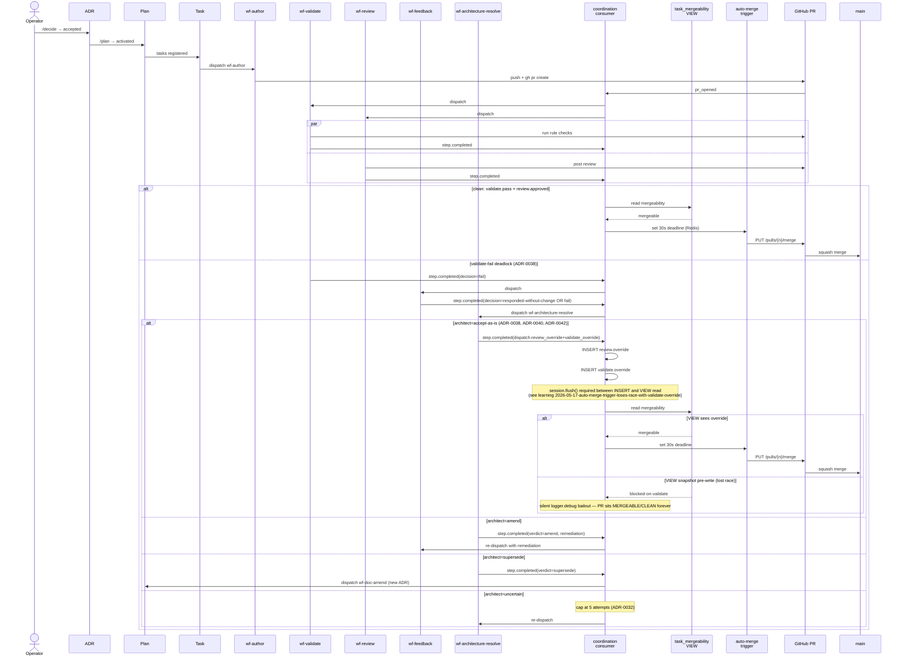

# Task lifecycle: ADR → merged main

End-to-end render of how a unit of work moves through Treadmill, from an accepted ADR to a squash-merged commit on `main`. The diagram is a composition of the decisions captured in:

- [ADR-0031](../adrs/0031-auto-merge-as-completion-trigger.md) — auto-merge as completion trigger
- [ADR-0032](../adrs/0032-role-architect-and-documentarian.md) — role-architect verdicts
- [ADR-0038](../adrs/0038-ralph-loop-deadlock-arbitration.md) — deadlock arbitration via architect
- [ADR-0040](../adrs/0040-architect-tunes-validator-on-accept-as-is.md) — architect tunes validator on accept-as-is
- [ADR-0042](../adrs/0042-validate-override-channel.md) — `validate.override` channel

The diagram is the contract these ADRs compose into. If implementation diverges from the diagram, either the implementation is wrong or one of the ADRs needs amending.

## Conformance notes

- The architect's three reversal verdicts (`accept-as-is`, `amend`, `supersede`) each route to a different downstream workflow. `uncertain` re-enters arbitration up to a per-task cap (ADR-0032).
- The `validate.override` and `review.override` event pair is the *only* mechanism by which the architect's authority crosses from internal state to GitHub-side mergeability. The bridge is event-projection-driven, not direct API.
- The flush requirement between override INSERT and mergeability VIEW SELECT is implementation-level invariant. Violating it produces the silent-stall failure mode observed on PRs #132 and #133 (2026-05-17).
