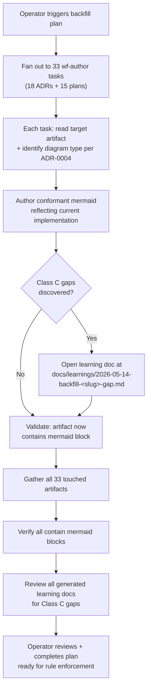

# Plan: ADR-0030 — recursive diagram backfill

Author mermaid diagrams for all ADRs and plans lacking them, per ADR-0004 and ADR-0030.

## Goal

Backfill missing mermaid diagrams across 33 ADR and plan artifacts, closing the conformance gap in the diagram-as-contract discipline.

## Success criteria

- All 33 artifacts (18 ADRs + 15 plans) in `docs/adrs/*.md` and `docs/plans/*.md` contain a ```` ```mermaid ```` block.
- Each diagram conforms to ADR-0004's six criteria and reflects current implementation reality per ADR-0030 §4.
- Any Class C (sub-optimal) gaps discovered during backfill spawn a learning doc at `docs/learnings/2026-05-14-backfill-<slug>-gap.md`.

## Constraints / scope

### In scope

Backfilling diagrams for these 33 artifacts:

**ADRs (18):**
- 0012-uniform-step-output-envelope
- 0013-per-commit-mergeability-view
- 0014-commit-sha-plumbing-and-pr-synchronize-event
- 0015-multi-step-workflows-and-role-reuse
- 0016-dev-local-deployment-topology
- 0017-github-webhook-ingestion-via-api-gateway-lambda-sqs
- 0018-autoscaler-in-dev-local-mode
- 0019-host-side-credential-injection-for-containers
- 0020-observability-via-opentelemetry-and-grafana
- 0021-plan-merge-to-main-as-submission-trigger
- 0022-role-output-kinds
- 0023-api-credentials-long-lived-iam-user
- 0024-local-mode-auto-redeploy-on-merge
- 0025-worker-visibility-heartbeat
- 0026-dispatch-dedup-by-composite-key
- 0027-structured-json-for-review-output
- 0028-db-authoritative-workflow-configs
- 0029-ralph-loop-validation-runner-and-rule-engine

**Plans (15):**
- 2026-05-07-local-adapter-spike
- 2026-05-11-week-2-closure
- 2026-05-12-api-credentials-iam-user
- 2026-05-12-auto-redeploy-watcher
- 2026-05-12-loop-hardening
- 2026-05-12-observability-stack
- 2026-05-12-plan-trigger-resilience
- 2026-05-12-smoke-b-plan-merge-trigger
- 2026-05-12-smoke-b-take-2
- 2026-05-12-week-3-mergeable-and-multi-step
- 2026-05-13-db-authoritative-configs
- 2026-05-13-in-session-sequencing
- 2026-05-13-ralph-loop-validation-runner
- 2026-05-13-structured-review-envelope
- 2026-05-13-week-4-dev-local-deployment

### Out of scope

- Artifacts already containing mermaid blocks (11 ADRs, 3 plans).
- A new workflow shape — uses existing `wf-author`.

## Risks / unknowns

- **Diagram interpretation variance**: ADRs/plans written before ADR-0004 was adopted may not have obvious diagrams embedded in prose. Mitigation: the implementation-conforms-to-diagram judge can return `fail-diagram` (advisory) if the backfilled diagram doesn't match the intent; re-author as needed.
- **Learning generation**: Class C gaps (sub-optimal implementation/design) discovered during backfill require judgment calls on what constitutes a "gap worth capturing" vs. a known-acceptable deviation.

## Diagram

The backfill process fans out one wf-author task per missing artifact. Each task reads the target ADR/plan, authors a conformant diagram per ADR-0004 + ADR-0030, and conditionally opens a learning doc if Class C gaps are discovered.



## Sequence of work

```yaml
sequence_of_work:
  # ADRs without mermaid
  - id: backfill-0012-uniform-step-output-envelope
    title: "Backfill diagram for 0012-uniform-step-output-envelope"
    workflow: wf-author
    intent: |
      Read ADR-0012 and author a conformant mermaid diagram per
      ADR-0004 + ADR-0030, reflecting current implementation reality.
      If gaps discovered, open a learning doc.
    scope:
      files:
        - docs/adrs/0012-uniform-step-output-envelope.md
    validation:
      - kind: deterministic
        description: ADR now contains a ```mermaid block.
        script: |
          grep -q '```mermaid' docs/adrs/0012-uniform-step-output-envelope.md

  - id: backfill-0013-per-commit-mergeability-view
    title: "Backfill diagram for 0013-per-commit-mergeability-view"
    workflow: wf-author
    intent: |
      Read ADR-0013 and author a conformant mermaid diagram per
      ADR-0004 + ADR-0030, reflecting current implementation reality.
      If gaps discovered, open a learning doc.
    scope:
      files:
        - docs/adrs/0013-per-commit-mergeability-view.md
    validation:
      - kind: deterministic
        description: ADR now contains a ```mermaid block.
        script: |
          grep -q '```mermaid' docs/adrs/0013-per-commit-mergeability-view.md

  - id: backfill-0014-commit-sha-plumbing-and-pr-synchronize-event
    title: "Backfill diagram for 0014-commit-sha-plumbing-and-pr-synchronize-event"
    workflow: wf-author
    intent: |
      Read ADR-0014 and author a conformant mermaid diagram per
      ADR-0004 + ADR-0030, reflecting current implementation reality.
      If gaps discovered, open a learning doc.
    scope:
      files:
        - docs/adrs/0014-commit-sha-plumbing-and-pr-synchronize-event.md
    validation:
      - kind: deterministic
        description: ADR now contains a ```mermaid block.
        script: |
          grep -q '```mermaid' docs/adrs/0014-commit-sha-plumbing-and-pr-synchronize-event.md

  - id: backfill-0015-multi-step-workflows-and-role-reuse
    title: "Backfill diagram for 0015-multi-step-workflows-and-role-reuse"
    workflow: wf-author
    intent: |
      Read ADR-0015 and author a conformant mermaid diagram per
      ADR-0004 + ADR-0030, reflecting current implementation reality.
      If gaps discovered, open a learning doc.
    scope:
      files:
        - docs/adrs/0015-multi-step-workflows-and-role-reuse.md
    validation:
      - kind: deterministic
        description: ADR now contains a ```mermaid block.
        script: |
          grep -q '```mermaid' docs/adrs/0015-multi-step-workflows-and-role-reuse.md

  - id: backfill-0016-dev-local-deployment-topology
    title: "Backfill diagram for 0016-dev-local-deployment-topology"
    workflow: wf-author
    intent: |
      Read ADR-0016 and author a conformant mermaid diagram per
      ADR-0004 + ADR-0030, reflecting current implementation reality.
      If gaps discovered, open a learning doc.
    scope:
      files:
        - docs/adrs/0016-dev-local-deployment-topology.md
    validation:
      - kind: deterministic
        description: ADR now contains a ```mermaid block.
        script: |
          grep -q '```mermaid' docs/adrs/0016-dev-local-deployment-topology.md

  - id: backfill-0017-github-webhook-ingestion-via-api-gateway-lambda-sqs
    title: "Backfill diagram for 0017-github-webhook-ingestion-via-api-gateway-lambda-sqs"
    workflow: wf-author
    intent: |
      Read ADR-0017 and author a conformant mermaid diagram per
      ADR-0004 + ADR-0030, reflecting current implementation reality.
      If gaps discovered, open a learning doc.
    scope:
      files:
        - docs/adrs/0017-github-webhook-ingestion-via-api-gateway-lambda-sqs.md
    validation:
      - kind: deterministic
        description: ADR now contains a ```mermaid block.
        script: |
          grep -q '```mermaid' docs/adrs/0017-github-webhook-ingestion-via-api-gateway-lambda-sqs.md

  - id: backfill-0018-autoscaler-in-dev-local-mode
    title: "Backfill diagram for 0018-autoscaler-in-dev-local-mode"
    workflow: wf-author
    intent: |
      Read ADR-0018 and author a conformant mermaid diagram per
      ADR-0004 + ADR-0030, reflecting current implementation reality.
      If gaps discovered, open a learning doc.
    scope:
      files:
        - docs/adrs/0018-autoscaler-in-dev-local-mode.md
    validation:
      - kind: deterministic
        description: ADR now contains a ```mermaid block.
        script: |
          grep -q '```mermaid' docs/adrs/0018-autoscaler-in-dev-local-mode.md

  - id: backfill-0019-host-side-credential-injection-for-containers
    title: "Backfill diagram for 0019-host-side-credential-injection-for-containers"
    workflow: wf-author
    intent: |
      Read ADR-0019 and author a conformant mermaid diagram per
      ADR-0004 + ADR-0030, reflecting current implementation reality.
      If gaps discovered, open a learning doc.
    scope:
      files:
        - docs/adrs/0019-host-side-credential-injection-for-containers.md
    validation:
      - kind: deterministic
        description: ADR now contains a ```mermaid block.
        script: |
          grep -q '```mermaid' docs/adrs/0019-host-side-credential-injection-for-containers.md

  - id: backfill-0020-observability-via-opentelemetry-and-grafana
    title: "Backfill diagram for 0020-observability-via-opentelemetry-and-grafana"
    workflow: wf-author
    intent: |
      Read ADR-0020 and author a conformant mermaid diagram per
      ADR-0004 + ADR-0030, reflecting current implementation reality.
      If gaps discovered, open a learning doc.
    scope:
      files:
        - docs/adrs/0020-observability-via-opentelemetry-and-grafana.md
    validation:
      - kind: deterministic
        description: ADR now contains a ```mermaid block.
        script: |
          grep -q '```mermaid' docs/adrs/0020-observability-via-opentelemetry-and-grafana.md

  - id: backfill-0021-plan-merge-to-main-as-submission-trigger
    title: "Backfill diagram for 0021-plan-merge-to-main-as-submission-trigger"
    workflow: wf-author
    intent: |
      Read ADR-0021 and author a conformant mermaid diagram per
      ADR-0004 + ADR-0030, reflecting current implementation reality.
      If gaps discovered, open a learning doc.
    scope:
      files:
        - docs/adrs/0021-plan-merge-to-main-as-submission-trigger.md
    validation:
      - kind: deterministic
        description: ADR now contains a ```mermaid block.
        script: |
          grep -q '```mermaid' docs/adrs/0021-plan-merge-to-main-as-submission-trigger.md

  - id: backfill-0022-role-output-kinds
    title: "Backfill diagram for 0022-role-output-kinds"
    workflow: wf-author
    intent: |
      Read ADR-0022 and author a conformant mermaid diagram per
      ADR-0004 + ADR-0030, reflecting current implementation reality.
      If gaps discovered, open a learning doc.
    scope:
      files:
        - docs/adrs/0022-role-output-kinds.md
    validation:
      - kind: deterministic
        description: ADR now contains a ```mermaid block.
        script: |
          grep -q '```mermaid' docs/adrs/0022-role-output-kinds.md

  - id: backfill-0023-api-credentials-long-lived-iam-user
    title: "Backfill diagram for 0023-api-credentials-long-lived-iam-user"
    workflow: wf-author
    intent: |
      Read ADR-0023 and author a conformant mermaid diagram per
      ADR-0004 + ADR-0030, reflecting current implementation reality.
      If gaps discovered, open a learning doc.
    scope:
      files:
        - docs/adrs/0023-api-credentials-long-lived-iam-user.md
    validation:
      - kind: deterministic
        description: ADR now contains a ```mermaid block.
        script: |
          grep -q '```mermaid' docs/adrs/0023-api-credentials-long-lived-iam-user.md

  - id: backfill-0024-local-mode-auto-redeploy-on-merge
    title: "Backfill diagram for 0024-local-mode-auto-redeploy-on-merge"
    workflow: wf-author
    intent: |
      Read ADR-0024 and author a conformant mermaid diagram per
      ADR-0004 + ADR-0030, reflecting current implementation reality.
      If gaps discovered, open a learning doc.
    scope:
      files:
        - docs/adrs/0024-local-mode-auto-redeploy-on-merge.md
    validation:
      - kind: deterministic
        description: ADR now contains a ```mermaid block.
        script: |
          grep -q '```mermaid' docs/adrs/0024-local-mode-auto-redeploy-on-merge.md

  - id: backfill-0025-worker-visibility-heartbeat
    title: "Backfill diagram for 0025-worker-visibility-heartbeat"
    workflow: wf-author
    intent: |
      Read ADR-0025 and author a conformant mermaid diagram per
      ADR-0004 + ADR-0030, reflecting current implementation reality.
      If gaps discovered, open a learning doc.
    scope:
      files:
        - docs/adrs/0025-worker-visibility-heartbeat.md
    validation:
      - kind: deterministic
        description: ADR now contains a ```mermaid block.
        script: |
          grep -q '```mermaid' docs/adrs/0025-worker-visibility-heartbeat.md

  - id: backfill-0026-dispatch-dedup-by-composite-key
    title: "Backfill diagram for 0026-dispatch-dedup-by-composite-key"
    workflow: wf-author
    intent: |
      Read ADR-0026 and author a conformant mermaid diagram per
      ADR-0004 + ADR-0030, reflecting current implementation reality.
      If gaps discovered, open a learning doc.
    scope:
      files:
        - docs/adrs/0026-dispatch-dedup-by-composite-key.md
    validation:
      - kind: deterministic
        description: ADR now contains a ```mermaid block.
        script: |
          grep -q '```mermaid' docs/adrs/0026-dispatch-dedup-by-composite-key.md

  - id: backfill-0027-structured-json-for-review-output
    title: "Backfill diagram for 0027-structured-json-for-review-output"
    workflow: wf-author
    intent: |
      Read ADR-0027 and author a conformant mermaid diagram per
      ADR-0004 + ADR-0030, reflecting current implementation reality.
      If gaps discovered, open a learning doc.
    scope:
      files:
        - docs/adrs/0027-structured-json-for-review-output.md
    validation:
      - kind: deterministic
        description: ADR now contains a ```mermaid block.
        script: |
          grep -q '```mermaid' docs/adrs/0027-structured-json-for-review-output.md

  - id: backfill-0028-db-authoritative-workflow-configs
    title: "Backfill diagram for 0028-db-authoritative-workflow-configs"
    workflow: wf-author
    intent: |
      Read ADR-0028 and author a conformant mermaid diagram per
      ADR-0004 + ADR-0030, reflecting current implementation reality.
      If gaps discovered, open a learning doc.
    scope:
      files:
        - docs/adrs/0028-db-authoritative-workflow-configs.md
    validation:
      - kind: deterministic
        description: ADR now contains a ```mermaid block.
        script: |
          grep -q '```mermaid' docs/adrs/0028-db-authoritative-workflow-configs.md

  - id: backfill-0029-ralph-loop-validation-runner-and-rule-engine
    title: "Backfill diagram for 0029-ralph-loop-validation-runner-and-rule-engine"
    workflow: wf-author
    intent: |
      Read ADR-0029 and author a conformant mermaid diagram per
      ADR-0004 + ADR-0030, reflecting current implementation reality.
      If gaps discovered, open a learning doc.
    scope:
      files:
        - docs/adrs/0029-ralph-loop-validation-runner-and-rule-engine.md
    validation:
      - kind: deterministic
        description: ADR now contains a ```mermaid block.
        script: |
          grep -q '```mermaid' docs/adrs/0029-ralph-loop-validation-runner-and-rule-engine.md

  # Plans without mermaid
  - id: backfill-2026-05-07-local-adapter-spike
    title: "Backfill diagram for 2026-05-07-local-adapter-spike"
    workflow: wf-author
    intent: |
      Read plan 2026-05-07-local-adapter-spike and author a conformant
      mermaid diagram per ADR-0004 + ADR-0030, reflecting current
      implementation reality. If gaps discovered, open a learning doc.
    scope:
      files:
        - docs/plans/2026-05-07-local-adapter-spike.md
    validation:
      - kind: deterministic
        description: Plan now contains a ```mermaid block.
        script: |
          grep -q '```mermaid' docs/plans/2026-05-07-local-adapter-spike.md

  - id: backfill-2026-05-11-week-2-closure
    title: "Backfill diagram for 2026-05-11-week-2-closure"
    workflow: wf-author
    intent: |
      Read plan 2026-05-11-week-2-closure and author a conformant
      mermaid diagram per ADR-0004 + ADR-0030, reflecting current
      implementation reality. If gaps discovered, open a learning doc.
    scope:
      files:
        - docs/plans/2026-05-11-week-2-closure.md
    validation:
      - kind: deterministic
        description: Plan now contains a ```mermaid block.
        script: |
          grep -q '```mermaid' docs/plans/2026-05-11-week-2-closure.md

  - id: backfill-2026-05-12-api-credentials-iam-user
    title: "Backfill diagram for 2026-05-12-api-credentials-iam-user"
    workflow: wf-author
    intent: |
      Read plan 2026-05-12-api-credentials-iam-user and author a
      conformant mermaid diagram per ADR-0004 + ADR-0030, reflecting
      current implementation reality. If gaps discovered, open a
      learning doc.
    scope:
      files:
        - docs/plans/2026-05-12-api-credentials-iam-user.md
    validation:
      - kind: deterministic
        description: Plan now contains a ```mermaid block.
        script: |
          grep -q '```mermaid' docs/plans/2026-05-12-api-credentials-iam-user.md

  - id: backfill-2026-05-12-auto-redeploy-watcher
    title: "Backfill diagram for 2026-05-12-auto-redeploy-watcher"
    workflow: wf-author
    intent: |
      Read plan 2026-05-12-auto-redeploy-watcher and author a
      conformant mermaid diagram per ADR-0004 + ADR-0030, reflecting
      current implementation reality. If gaps discovered, open a
      learning doc.
    scope:
      files:
        - docs/plans/2026-05-12-auto-redeploy-watcher.md
    validation:
      - kind: deterministic
        description: Plan now contains a ```mermaid block.
        script: |
          grep -q '```mermaid' docs/plans/2026-05-12-auto-redeploy-watcher.md

  - id: backfill-2026-05-12-loop-hardening
    title: "Backfill diagram for 2026-05-12-loop-hardening"
    workflow: wf-author
    intent: |
      Read plan 2026-05-12-loop-hardening and author a conformant
      mermaid diagram per ADR-0004 + ADR-0030, reflecting current
      implementation reality. If gaps discovered, open a learning doc.
    scope:
      files:
        - docs/plans/2026-05-12-loop-hardening.md
    validation:
      - kind: deterministic
        description: Plan now contains a ```mermaid block.
        script: |
          grep -q '```mermaid' docs/plans/2026-05-12-loop-hardening.md

  - id: backfill-2026-05-12-observability-stack
    title: "Backfill diagram for 2026-05-12-observability-stack"
    workflow: wf-author
    intent: |
      Read plan 2026-05-12-observability-stack and author a conformant
      mermaid diagram per ADR-0004 + ADR-0030, reflecting current
      implementation reality. If gaps discovered, open a learning doc.
    scope:
      files:
        - docs/plans/2026-05-12-observability-stack.md
    validation:
      - kind: deterministic
        description: Plan now contains a ```mermaid block.
        script: |
          grep -q '```mermaid' docs/plans/2026-05-12-observability-stack.md

  - id: backfill-2026-05-12-plan-trigger-resilience
    title: "Backfill diagram for 2026-05-12-plan-trigger-resilience"
    workflow: wf-author
    intent: |
      Read plan 2026-05-12-plan-trigger-resilience and author a
      conformant mermaid diagram per ADR-0004 + ADR-0030, reflecting
      current implementation reality. If gaps discovered, open a
      learning doc.
    scope:
      files:
        - docs/plans/2026-05-12-plan-trigger-resilience.md
    validation:
      - kind: deterministic
        description: Plan now contains a ```mermaid block.
        script: |
          grep -q '```mermaid' docs/plans/2026-05-12-plan-trigger-resilience.md

  - id: backfill-2026-05-12-smoke-b-plan-merge-trigger
    title: "Backfill diagram for 2026-05-12-smoke-b-plan-merge-trigger"
    workflow: wf-author
    intent: |
      Read plan 2026-05-12-smoke-b-plan-merge-trigger and author a
      conformant mermaid diagram per ADR-0004 + ADR-0030, reflecting
      current implementation reality. If gaps discovered, open a
      learning doc.
    scope:
      files:
        - docs/plans/2026-05-12-smoke-b-plan-merge-trigger.md
    validation:
      - kind: deterministic
        description: Plan now contains a ```mermaid block.
        script: |
          grep -q '```mermaid' docs/plans/2026-05-12-smoke-b-plan-merge-trigger.md

  - id: backfill-2026-05-12-smoke-b-take-2
    title: "Backfill diagram for 2026-05-12-smoke-b-take-2"
    workflow: wf-author
    intent: |
      Read plan 2026-05-12-smoke-b-take-2 and author a conformant
      mermaid diagram per ADR-0004 + ADR-0030, reflecting current
      implementation reality. If gaps discovered, open a learning doc.
    scope:
      files:
        - docs/plans/2026-05-12-smoke-b-take-2.md
    validation:
      - kind: deterministic
        description: Plan now contains a ```mermaid block.
        script: |
          grep -q '```mermaid' docs/plans/2026-05-12-smoke-b-take-2.md

  - id: backfill-2026-05-12-week-3-mergeable-and-multi-step
    title: "Backfill diagram for 2026-05-12-week-3-mergeable-and-multi-step"
    workflow: wf-author
    intent: |
      Read plan 2026-05-12-week-3-mergeable-and-multi-step and author a
      conformant mermaid diagram per ADR-0004 + ADR-0030, reflecting
      current implementation reality. If gaps discovered, open a
      learning doc.
    scope:
      files:
        - docs/plans/2026-05-12-week-3-mergeable-and-multi-step.md
    validation:
      - kind: deterministic
        description: Plan now contains a ```mermaid block.
        script: |
          grep -q '```mermaid' docs/plans/2026-05-12-week-3-mergeable-and-multi-step.md

  - id: backfill-2026-05-13-db-authoritative-configs
    title: "Backfill diagram for 2026-05-13-db-authoritative-configs"
    workflow: wf-author
    intent: |
      Read plan 2026-05-13-db-authoritative-configs and author a
      conformant mermaid diagram per ADR-0004 + ADR-0030, reflecting
      current implementation reality. If gaps discovered, open a
      learning doc.
    scope:
      files:
        - docs/plans/2026-05-13-db-authoritative-configs.md
    validation:
      - kind: deterministic
        description: Plan now contains a ```mermaid block.
        script: |
          grep -q '```mermaid' docs/plans/2026-05-13-db-authoritative-configs.md

  - id: backfill-2026-05-13-in-session-sequencing
    title: "Backfill diagram for 2026-05-13-in-session-sequencing"
    workflow: wf-author
    intent: |
      Read plan 2026-05-13-in-session-sequencing and author a conformant
      mermaid diagram per ADR-0004 + ADR-0030, reflecting current
      implementation reality. If gaps discovered, open a learning doc.
    scope:
      files:
        - docs/plans/2026-05-13-in-session-sequencing.md
    validation:
      - kind: deterministic
        description: Plan now contains a ```mermaid block.
        script: |
          grep -q '```mermaid' docs/plans/2026-05-13-in-session-sequencing.md

  - id: backfill-2026-05-13-ralph-loop-validation-runner
    title: "Backfill diagram for 2026-05-13-ralph-loop-validation-runner"
    workflow: wf-author
    intent: |
      Read plan 2026-05-13-ralph-loop-validation-runner and author a
      conformant mermaid diagram per ADR-0004 + ADR-0030, reflecting
      current implementation reality. If gaps discovered, open a
      learning doc.
    scope:
      files:
        - docs/plans/2026-05-13-ralph-loop-validation-runner.md
    validation:
      - kind: deterministic
        description: Plan now contains a ```mermaid block.
        script: |
          grep -q '```mermaid' docs/plans/2026-05-13-ralph-loop-validation-runner.md

  - id: backfill-2026-05-13-structured-review-envelope
    title: "Backfill diagram for 2026-05-13-structured-review-envelope"
    workflow: wf-author
    intent: |
      Read plan 2026-05-13-structured-review-envelope and author a
      conformant mermaid diagram per ADR-0004 + ADR-0030, reflecting
      current implementation reality. If gaps discovered, open a
      learning doc.
    scope:
      files:
        - docs/plans/2026-05-13-structured-review-envelope.md
    validation:
      - kind: deterministic
        description: Plan now contains a ```mermaid block.
        script: |
          grep -q '```mermaid' docs/plans/2026-05-13-structured-review-envelope.md

  - id: backfill-2026-05-13-week-4-dev-local-deployment
    title: "Backfill diagram for 2026-05-13-week-4-dev-local-deployment"
    workflow: wf-author
    intent: |
      Read plan 2026-05-13-week-4-dev-local-deployment and author a
      conformant mermaid diagram per ADR-0004 + ADR-0030, reflecting
      current implementation reality. If gaps discovered, open a
      learning doc.
    scope:
      files:
        - docs/plans/2026-05-13-week-4-dev-local-deployment.md
    validation:
      - kind: deterministic
        description: Plan now contains a ```mermaid block.
        script: |
          grep -q '```mermaid' docs/plans/2026-05-13-week-4-dev-local-deployment.md
```

## Decisions captured during execution

(empty)

## Post-mortem

Filled in on transition to `completed`/`abandoned`.
