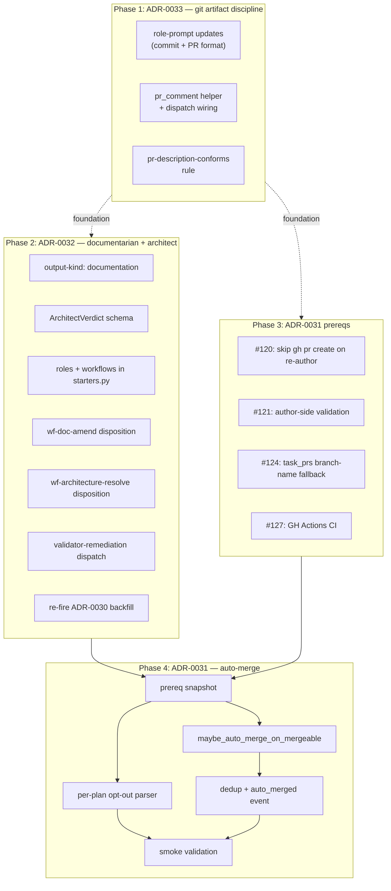

# Plan: Hands-free driving (ADRs 0031 + 0032 + 0033 + prereqs)

Ship the final stack that closes hands-free driving:

- **ADR-0033** — git artifact discipline (commits, PRs, comments) — foundation; lands first so all downstream tasks ship with the right shape.
- **ADR-0032** — documentarian + architect roles + drift-resolution workflows.
- **Prereq tasks #120, #121, #124, #127** — re-author dedup, author-side validation, DB↔main reconciliation, GH Actions CI.
- **ADR-0031** — auto-merge on mergeability=mergeable — the loop closer.

## Goal

After this plan executes, Treadmill auto-merges its own PRs when validation passes and review approves, with no operator intervention. PR comments surface human-actionable signals when the system can't decide. The validator gates merges against real CI plus the rule engine plus a federated context surface.

## Success criteria

Per phase:

- **Phase 1 (ADR-0033)**: `role-code-author` / `role-doc-author` system prompts enforce the commit + PR shapes; `pr_comment` helper exists in workers/agent; `pr-description-conforms` rule lives in `docs/knowledge-base/rules/`.
- **Phase 2 (ADR-0032)**: `documentation` output_kind routes; `ArchitectVerdict` Pydantic envelope validates; `wf-doc-amend` + `wf-architecture-resolve` dispatch end-to-end; validator-remediation trigger fires on `docs-current-with-pr.fail`; ADR-0030 backfill plan re-routed through `wf-doc-amend`.
- **Phase 3 (prereqs)**: code disposition skips `gh pr create` on re-author workflows (#120); author-side validation runs the task's validation script before `git push` (#121); `task_prs` branch-name fallback unblocks operator-completed PRs (#124); GH Actions CI runs the test suite on every PR + main (#127).
- **Phase 4 (ADR-0031)**: prereq snapshot confirms all four phase-3 tasks landed; `auto_merge: false` parses in plan frontmatter; `maybe_auto_merge_on_mergeable` fires with 30s cooling-off; smoke shows a trivial PR auto-merges 30s after `mergeability=mergeable`.

## Constraints / scope

### In scope

All 19 tasks below across the four phases.

### Out of scope

- Periodic documentarian dispatch (ADR-0032 Q32.f deferred — needs scheduler).
- Auto-merge circuit breaker (ADR-0031 Q31.d deferred — needs ADR-0098 observability).
- Separate merger identity (ADR-0031 Q31.e — single PAT for v1; awaits #109).
- Historical PR back-application (ADR-0033 Q33.d — roll forward).

### Budget

One operator session for review, dispatch, and smoke observation. Treadmill executes phases 1-3 in parallel where deps allow; phase 4 gates on phase 3 completion. Estimated calendar time: 1-2 days depending on agent throughput + retry rates.

## Diagram

Phase ordering + cross-phase deps:



## Risks / unknowns

- **role-code-author / role-documentarian hesitation on `.claude/` edits** (task #123 pattern). Mitigation: phase-1 prompt updates include explicit authorization for any task-scoped path; if the pattern recurs in phase-2 documentarian tasks, the operator hand-completes (precedent: PR #39 this session).
- **Mega-plan blast radius.** If phase 1 fails, downstream phases stall. Mitigation: phase-1 tasks are small, deps-free, and parallel — failure of one doesn't block the others. The operator can trim+re-fire the failed task as we did with skill-updates.
- **Prereq drift across phases.** Phase 4's `prereq-snapshot` task verifies all four phase-3 tasks merged. If any are stuck, the snapshot records the state honestly and the operator decides whether to wait or carve an exception.

## Sequence of work

```yaml
sequence_of_work:

  # ── Phase 1: ADR-0033 git artifact discipline ──────────────────────────────

  - id: git-artifact-role-prompt-updates
    title: role-code-author + role-doc-author prompts carry commit + PR format
    workflow: wf-author
    intent: |
      Update ``services/api/treadmill_api/starters.py`` so
      role-code-author + role-doc-author system_prompts enforce
      the ADR-0033 commit + PR shapes:

        - Commit: subject ≤72 + why + ``Refs: task/<id>, plan/<slug>,
          ADR-<NNNN>`` + ``Co-Authored-By`` (per ADR-0033 §Decision).
        - PR description: Summary / Why / Test plan / Validation /
          Refs sections.
        - Branch naming: ``task/<task-id-prefix>-<slug>`` with
          8-char UUID prefix (already in use, codified).

      Update test_starters.py with assertions on prompt content.
      Document the operator step in
      ``docs/runbooks/edit-a-role-prompt.md``.
    scope:
      files:
        - services/api/treadmill_api/starters.py
        - services/api/tests/test_starters.py
        - docs/runbooks/edit-a-role-prompt.md
    validation:
      - kind: deterministic
        description: |
          test_starters.py passes; prompts reference ADR-0033 and
          contain the format scaffolding.
        script: |
          cd services/api && uv run pytest tests/test_starters.py -q \
            && grep -q "ADR-0033" treadmill_api/starters.py \
            && grep -q "Refs:" treadmill_api/starters.py

  - id: pr-comment-template-and-dispatch
    title: pr_comment helper + dispatch wiring per ADR-0033 §PR comments
    workflow: wf-author
    intent: |
      Author ``workers/agent/treadmill_agent/pr_comment.py``
      exposing ``leave_pr_comment(workflow_id, signal, body)`` that:
        1. Formats the structured prefix
           ``[treadmill:<workflow>:<signal>]``
        2. Renders the body with required sections: Summary,
           Action items, See (template-based per Q33.c).
        3. Calls ``gh pr comment <number> --body <rendered>``.

      Tests in
      ``workers/agent/tests/test_pr_comment.py``: prefix correct;
      required sections present; gh CLI invocation mocked.

      Dispatch wiring is deferred to phase 2 (where
      wf-architecture-resolve uncertain-cap + wf-doc-amend
      Class C surfaces become first callers).
    scope:
      files:
        - workers/agent/treadmill_agent/pr_comment.py
        - workers/agent/tests/test_pr_comment.py
    validation:
      - kind: deterministic
        description: |
          pr_comment module exists; tests pass.
        script: |
          cd workers/agent && uv run pytest tests/test_pr_comment.py -q \
            && test -f treadmill_agent/pr_comment.py

  - id: pr-description-conforms-rule
    title: pr-description-conforms rule in docs/knowledge-base/rules/
    workflow: wf-author
    intent: |
      Author ``docs/knowledge-base/rules/pr-description-conforms.yaml``
      + ``tools/rule-checks/pr-description-conforms/check.sh``.

      check.sh reads the PR body (passed via stdin or fetched via
      ``gh pr view``) and verifies all five required sections are
      present: ``## Summary``, ``## Why``, ``## Test plan``,
      ``## Validation``, ``## Refs``.

      Severity blocking. Per Q33.b, distinct from
      ``docs-current-with-pr`` — separation of concerns.

      Tests in
      ``services/api/tests/test_rules_schema.py``: new rule parses;
      check.sh executable.
    scope:
      files:
        - docs/knowledge-base/rules/pr-description-conforms.yaml
        - tools/rule-checks/pr-description-conforms/check.sh
        - services/api/tests/test_rules_schema.py
    validation:
      - kind: deterministic
        description: |
          Rule YAML parses; check.sh executable; schema tests pass.
        script: |
          cd services/api && uv run pytest tests/test_rules_schema.py -q \
            && test -x tools/rule-checks/pr-description-conforms/check.sh

  # ── Phase 2: ADR-0032 documentarian + architect ────────────────────────────

  - id: output-kind-add-documentation
    title: Add documentation to OutputKind taxonomy + routing
    workflow: wf-author
    intent: |
      Per ADR-0032 Q32.a, add ``documentation`` as a new value in
      ADR-0022's ``OutputKind`` enum. Update the routing layer so
      ``documentation`` maps to the documentation disposition (to
      be authored in a later task).

      ``documentation`` is distinct from ``plan_doc``: only the
      latter triggers ADR-0021 plan-creation on merge.

      Tests in ``services/api/tests/test_output_kind.py``:
      enum includes documentation; routing recognizes it.
    scope:
      files:
        - services/api/treadmill_api/output_kind.py
        - services/api/tests/test_output_kind.py
        - workers/agent/treadmill_agent/runner.py
    validation:
      - kind: deterministic
        description: |
          OutputKind enum + routing test recognize documentation.
        script: |
          cd services/api && uv run pytest tests/test_output_kind.py -q \
            && grep -q "documentation" treadmill_api/output_kind.py

  - id: architect-verdict-schema
    title: ArchitectVerdict Pydantic envelope
    workflow: wf-author
    intent: |
      Author the Pydantic model ``ArchitectVerdict`` mirroring
      ADR-0027's ``ReviewVerdict``:

        verdict: Literal["amend", "supersede", "accept-as-is", "uncertain"]
        reasoning: str
        target_artifact: str
        remediation_summary: str | None = None

      Lives at
      ``services/api/treadmill_api/events/architect_verdict.py``.
      Re-export from
      ``treadmill_api/events/__init__.py``.

      Tests: validate well-formed; reject missing required;
      reject invalid verdict literal.
    scope:
      files:
        - services/api/treadmill_api/events/architect_verdict.py
        - services/api/treadmill_api/events/__init__.py
        - services/api/tests/test_architect_verdict.py
    validation:
      - kind: deterministic
        description: |
          Schema module exists; round-trip works.
        script: |
          cd services/api && uv run pytest tests/test_architect_verdict.py -q

  - id: roles-and-workflows-in-starters
    title: role-documentarian + role-architect + wf-doc-amend + wf-architecture-resolve
    workflow: wf-author
    depends_on:
      - task.output-kind-add-documentation.pr_merged
      - task.architect-verdict-schema.pr_merged
      - task.git-artifact-role-prompt-updates.pr_merged
    intent: |
      Author both new roles + both new workflows in
      ``starters.py``. New role prompts inherit the ADR-0033
      commit + PR + comment format discipline from phase 1's
      prompt updates.

      role-documentarian: output_kind=documentation; model=haiku;
      system_prompt reads cited code, amends doc per ADR-0030 §4;
      authorizes edits to .claude/ + docs/ paths explicitly; on
      Class C, opens learning + dispatches wf-architecture-resolve.

      role-architect: output_kind=analysis; model=haiku;
      system_prompt reads learning, returns ArchitectVerdict JSON;
      biases toward accept-as-is for minor drift.

      wf-doc-amend: 1 step → role-documentarian.
      wf-architecture-resolve: 1 step → role-architect (verdict
      routing in disposition, not a second step).

      Update test_starters.py.
    scope:
      files:
        - services/api/treadmill_api/starters.py
        - services/api/tests/test_starters.py
    validation:
      - kind: deterministic
        description: |
          starters has both roles + workflows; tests pass.
        script: |
          cd services/api && uv run pytest tests/test_starters.py -q \
            && grep -q "role-documentarian" treadmill_api/starters.py \
            && grep -q "role-architect" treadmill_api/starters.py \
            && grep -q "wf-doc-amend" treadmill_api/starters.py \
            && grep -q "wf-architecture-resolve" treadmill_api/starters.py

  - id: wf-doc-amend-disposition
    title: workers documentation.py handles wf-doc-amend + Class C escalation
    workflow: wf-author
    depends_on:
      - task.roles-and-workflows-in-starters.pr_merged
      - task.pr-comment-template-and-dispatch.pr_merged
    intent: |
      Author
      ``workers/agent/treadmill_agent/runner_dispositions/documentation.py``.

      Disposition responsibilities (per ADR-0032 §wf-doc-amend):
        1. Read step output (amended doc artifact).
        2. git add + push + open/update PR (respecting #120 once
           it lands; for now use the same code disposition pattern).
        3. If agent flags Class C in step output metadata:
           write ``docs/learnings/<date>-<slug>-gap.md``;
           dispatch wf-architecture-resolve against same task.

      Tests parametrized over Class A/B (no escalation) and Class
      C (learning + dispatch).
    scope:
      files:
        - workers/agent/treadmill_agent/runner_dispositions/documentation.py
        - workers/agent/treadmill_agent/runner.py
        - workers/agent/tests/test_runner_dispositions.py
    validation:
      - kind: deterministic
        description: |
          Disposition module exists; tests pass.
        script: |
          cd workers/agent && uv run pytest tests/test_runner_dispositions.py -q \
            && test -f treadmill_agent/runner_dispositions/documentation.py

  - id: wf-architecture-resolve-disposition
    title: wf-architecture-resolve disposition with verdict routing
    workflow: wf-author
    depends_on:
      - task.roles-and-workflows-in-starters.pr_merged
      - task.architect-verdict-schema.pr_merged
      - task.pr-comment-template-and-dispatch.pr_merged
    intent: |
      Extend ``runner_dispositions/`` (likely new
      ``architecture.py`` module). Disposition parses architect
      step output as ``ArchitectVerdict`` envelope; routes:

        - amend → dispatch wf-plan to author remediation plan
        - supersede → dispatch wf-doc-amend to author superseding
          ADR + update original's status header
        - accept-as-is → dispatch wf-doc-amend to append to
          AGENT.md Pitfalls + leave PR comment via pr_comment
          helper from phase 1 ([treadmill:wf-architecture-resolve:
          accept-as-is]) for operator confirmation
        - uncertain → re-dispatch wf-architecture-resolve
          (cap 5); on 5th attempt, leave PR comment
          ([treadmill:wf-architecture-resolve:capped]) and stop.

      Tests parametrized over the 4 verdicts.
    scope:
      files:
        - workers/agent/treadmill_agent/runner_dispositions/architecture.py
        - workers/agent/treadmill_agent/runner.py
        - workers/agent/tests/test_runner_dispositions.py
    validation:
      - kind: deterministic
        description: |
          Disposition module + tests; cap enforced.
        script: |
          cd workers/agent && uv run pytest tests/test_runner_dispositions.py -q \
            && test -f treadmill_agent/runner_dispositions/architecture.py

  - id: validator-remediation-dispatch
    title: docs-current-with-pr.fail → wf-doc-amend (fourth dispatch source)
    workflow: wf-author
    depends_on:
      - task.wf-doc-amend-disposition.pr_merged
    intent: |
      Extend ``coordination/triggers.py`` with a fourth dispatch
      source mirroring ADR-0029's
      ``maybe_dispatch_feedback_on_terminal_failure`` pattern:

        - When wf-validate.step.completed with decision=fail AND
          failing check is docs-current-with-pr → dispatch
          wf-doc-amend.
        - Different rule failures still dispatch wf-feedback
          (existing path).
        - Extend dispatch_dedup for ``docs-amend-run=<run_id>``.
        - Cap remediation per task at 5.

      Tests in test_consumer_unit.py + test_dispatch_dedup.py.
    scope:
      files:
        - services/api/treadmill_api/coordination/triggers.py
        - services/api/treadmill_api/coordination/dispatch_dedup.py
        - services/api/treadmill_api/coordination/consumer.py
        - services/api/tests/test_consumer_unit.py
        - services/api/tests/test_dispatch_dedup.py
    validation:
      - kind: deterministic
        description: |
          Trigger + dedup tests pass.
        script: |
          cd services/api && uv run pytest tests/test_consumer_unit.py tests/test_dispatch_dedup.py -q

  - id: rebackfill-via-doc-amend
    title: Re-fire ADR-0030 backfill plan through wf-doc-amend
    workflow: wf-author
    depends_on:
      - task.wf-doc-amend-disposition.pr_merged
      - task.wf-architecture-resolve-disposition.pr_merged
    intent: |
      Re-author
      ``docs/plans/2026-05-14-adr-0030-diagram-backfill.md`` so
      every task in sequence_of_work uses
      ``workflow: wf-doc-amend`` (replacing ``wf-author``). Bump
      frontmatter with a ``trigger:`` note. Document-only change;
      operator CLI-submits the plan after merge.
    scope:
      files:
        - docs/plans/2026-05-14-adr-0030-diagram-backfill.md
    validation:
      - kind: deterministic
        description: |
          All 33 tasks now use wf-doc-amend.
        script: |
          uv run --project services/api python -c "
          import sys
          sys.path.insert(0, 'services/api')
          from treadmill_api.parsers.plan_doc import parse_plan_doc
          tasks = parse_plan_doc(open('docs/plans/2026-05-14-adr-0030-diagram-backfill.md').read())
          assert len(tasks) == 33, f'expected 33, got {len(tasks)}'
          for t in tasks:
              assert t.workflow == 'wf-doc-amend', f'{t.id} still uses {t.workflow}'
          "

  # ── Phase 3: ADR-0031 prereqs (parallel; no in-phase deps) ─────────────────

  - id: prereq-120-skip-gh-pr-create-on-reauthor
    title: code disposition skips gh pr create on re-author workflows (task #120)
    workflow: wf-author
    intent: |
      Per task #120 + the [[dispositions-should-be-composable]]
      learning: code disposition's gh pr create is wrong for
      wf-feedback, wf-ci-fix, wf-conflict (re-author workflows
      that push to existing PR branches). Make gh pr create
      idempotent: if a PR for the branch exists, return its
      number rather than raising.

      Tests in
      ``workers/agent/tests/test_runner_dispositions.py``:
        - wf-author opens a new PR.
        - wf-feedback against existing PR no-ops gh pr create
          (or detects existing).
        - wf-feedback against merged+deleted branch: per the
          discussion, this is a different failure mode — log +
          skip rather than recreate.
    scope:
      files:
        - workers/agent/treadmill_agent/runner_dispositions/code.py
        - workers/agent/tests/test_runner_dispositions.py
    validation:
      - kind: deterministic
        description: |
          Disposition tests cover the three cases.
        script: |
          cd workers/agent && uv run pytest tests/test_runner_dispositions.py -q

  - id: prereq-121-author-side-validation
    title: author-side validation in code disposition (task #121)
    workflow: wf-author
    intent: |
      Per the
      authors-must-run-validation-before-submitting learning
      (docs/learnings/2026-05-14-...):
      code disposition runs the task's declared validation script
      against the working tree BEFORE git push. Non-zero exit →
      step decision=fail, capture stdout/stderr in step output,
      skip the push.

      Uses validation_runtime primitive from PR #29
      (workers/agent/treadmill_agent/validation_runtime.py).

      Tests: synthetic task with passing script (push fires);
      synthetic task with failing script (push skipped + step
      output captures stderr).
    scope:
      files:
        - workers/agent/treadmill_agent/runner_dispositions/code.py
        - workers/agent/tests/test_runner_dispositions.py
    validation:
      - kind: deterministic
        description: |
          Disposition tests cover passing + failing validation.
        script: |
          cd workers/agent && uv run pytest tests/test_runner_dispositions.py -q

  - id: prereq-124-task-prs-branch-name-fallback
    title: task_prs branch-name fallback for operator-completed PRs (task #124)
    workflow: wf-author
    intent: |
      Per task #124: when GitHub pr_merged event lacks a task_prs
      row, parse the head branch name
      ``task/<task-id-prefix>-<slug>``. If the 8-char prefix
      matches exactly one task, insert the task_prs row + fire
      the transition.

      Wire into the consumer's github branch in
      ``coordination/consumer.py``.

      Tests in
      ``services/api/tests/test_consumer_unit.py``: pr_merged
      with no task_prs row + matching branch name → row inserted
      + downstream dependent task unblocks.
    scope:
      files:
        - services/api/treadmill_api/coordination/consumer.py
        - services/api/tests/test_consumer_unit.py
    validation:
      - kind: deterministic
        description: |
          Consumer test covers the fallback path.
        script: |
          cd services/api && uv run pytest tests/test_consumer_unit.py -q

  - id: prereq-127-gh-actions-ci
    title: GH Actions CI runs Treadmill's test suite on every PR + main (task #127)
    workflow: wf-author
    intent: |
      Author ``.github/workflows/ci.yml`` running the test suite
      across services/api, workers/agent, tools/local-adapter,
      and infra. Job matrix per component; uv lockfile cached;
      check_run names follow a stable convention so wf-ci-fix
      can latch onto them.

      Trigger: pull_request (any branch → main) and push to main.
    scope:
      files:
        - .github/workflows/ci.yml
    validation:
      - kind: deterministic
        description: |
          ci.yml exists; runs the four test suites; YAML parses.
        script: |
          test -f .github/workflows/ci.yml \
            && uv run --project services/api python -c "
          import yaml
          d = yaml.safe_load(open('.github/workflows/ci.yml'))
          assert 'jobs' in d, 'no jobs key'
          " \
            && grep -q "services/api" .github/workflows/ci.yml \
            && grep -q "workers/agent" .github/workflows/ci.yml \
            && grep -q "tools/local-adapter" .github/workflows/ci.yml

  # ── Phase 4: ADR-0031 auto-merge ───────────────────────────────────────────

  - id: prereq-snapshot
    title: Phase 4 gate — verify all phase 3 + ADR-0032 prereqs landed
    workflow: wf-author
    depends_on:
      - task.prereq-120-skip-gh-pr-create-on-reauthor.pr_merged
      - task.prereq-121-author-side-validation.pr_merged
      - task.prereq-124-task-prs-branch-name-fallback.pr_merged
      - task.prereq-127-gh-actions-ci.pr_merged
      - task.rebackfill-via-doc-amend.pr_merged
    intent: |
      Author ``docs/handoffs/2026-05-14-adr-0031-prereq-snapshot.md``
      with one section per prereq citing the merging PR + commit
      SHA:
        - #120 (re-author dedup)
        - #121 (author-side validation)
        - #124 (DB ↔ main reconciliation)
        - #127 (GH Actions CI)
        - ADR-0032 plan (this plan's Phase 2)

      All deps satisfied by the task dependency graph above; this
      task is a recording milestone, not a verification gate
      (the dep graph IS the gate).
    scope:
      files:
        - docs/handoffs/2026-05-14-adr-0031-prereq-snapshot.md
    validation:
      - kind: deterministic
        description: |
          Snapshot exists; names all five prereqs.
        script: |
          test -f docs/handoffs/2026-05-14-adr-0031-prereq-snapshot.md \
            && for token in "#120" "#121" "#124" "#127" "ADR-0032"; do
                 grep -q "$token" docs/handoffs/2026-05-14-adr-0031-prereq-snapshot.md \
                   || { echo "missing $token"; exit 1; }
               done

  - id: per-plan-opt-out-parser
    title: Plan-doc parser supports auto_merge frontmatter flag
    workflow: wf-author
    depends_on:
      - task.prereq-snapshot.pr_merged
    intent: |
      Extend ``parsers/plan_doc.py`` to parse optional
      ``auto_merge: bool`` from plan frontmatter (default true).
      Plumb through to ``Plan`` SQLAlchemy model; Alembic
      migration for the new boolean column with server default
      true.

      Document the flag in
      ``.claude/skills/plan/SKILL.md``.

      Tests in test_plan_doc_parser.py.
    scope:
      files:
        - services/api/treadmill_api/parsers/plan_doc.py
        - services/api/treadmill_api/models/plan.py
        - services/api/alembic/versions/0012_plan_auto_merge.py
        - services/api/tests/test_plan_doc_parser.py
        - .claude/skills/plan/SKILL.md
    validation:
      - kind: deterministic
        description: |
          Parser + model + migration; tests pass; skill docs flag.
        script: |
          cd services/api && uv run pytest tests/test_plan_doc_parser.py -q \
            && grep -q "auto_merge" treadmill_api/models/plan.py \
            && grep -q "auto_merge" .claude/skills/plan/SKILL.md

  - id: auto-merge-trigger
    title: maybe_auto_merge_on_mergeable in coordination/triggers.py
    workflow: wf-author
    depends_on:
      - task.prereq-snapshot.pr_merged
    intent: |
      Author ``maybe_auto_merge_on_mergeable`` in
      ``coordination/triggers.py``.

      Source: ``mergeability.changed.mergeable`` event from the
      VIEW projection (ADR-0013). Wire from consumer's projection
      handler.

      Cooling-off: 30s. Store deadline on Redis key
      ``treadmill:auto-merge-deadline:<task_id>``. On any
      wf-validate or wf-review step.completed for the task, push
      deadline forward by 30s. Consumer poll loop (5s tick)
      detects elapsed deadline → fires
      ``gh api repos/.../pulls/<n>/merge`` with method=squash.

      Skip conditions:
        - plan.auto_merge=false
        - wf-validate.decision != pass
        - pending human review
        - existing auto-merge run already dispatched for this task
          (dedup namespace)

      Tests in test_auto_merge_trigger.py.
    scope:
      files:
        - services/api/treadmill_api/coordination/triggers.py
        - services/api/treadmill_api/coordination/consumer.py
        - services/api/tests/test_auto_merge_trigger.py
    validation:
      - kind: deterministic
        description: |
          Trigger function + wiring; tests pass.
        script: |
          cd services/api && uv run pytest tests/test_auto_merge_trigger.py -q \
            && grep -q "maybe_auto_merge_on_mergeable" treadmill_api/coordination/triggers.py

  - id: dispatch-dedup-and-auto-merged-event
    title: Dedup namespace + task.<id>.auto_merged event
    workflow: wf-author
    depends_on:
      - task.auto-merge-trigger.pr_merged
    intent: |
      Two additions:
        1. dispatch_dedup recognizes ``auto-merge=<task_id>``
           namespace.
        2. New event type ``task.<id>.auto_merged``:
           entity_type=task, action=auto_merged, payload
           ``{merged_sha, pr_number, repo}``. Registered in
           events/registry.py.

      Tests in test_dispatch_dedup.py +
      test_consumer_integration.py.
    scope:
      files:
        - services/api/treadmill_api/coordination/dispatch_dedup.py
        - services/api/treadmill_api/events/task.py
        - services/api/treadmill_api/events/registry.py
        - services/api/tests/test_dispatch_dedup.py
        - services/api/tests/test_consumer_integration.py
    validation:
      - kind: deterministic
        description: |
          Dedup namespace + event registered; tests pass.
        script: |
          cd services/api && uv run pytest tests/test_dispatch_dedup.py tests/test_consumer_integration.py -q

  - id: smoke-validation
    title: End-to-end smoke — auto-merge a trivial PR + verify opt-out
    workflow: wf-validate
    depends_on:
      - task.per-plan-opt-out-parser.pr_merged
      - task.dispatch-dedup-and-auto-merged-event.pr_merged
    intent: |
      Two smokes documented in
      ``docs/handoffs/2026-05-14-adr-0031-first-auto-merge.md``:

      Smoke 1 — auto-merge fires:
        Open a trivial PR (typo fix). Watch: wf-review approves,
        wf-validate passes, mergeability=mergeable, 30s elapses,
        auto-merge fires, PR state=MERGED.

      Smoke 2 — opt-out honored:
        Open a PR against a plan with ``auto_merge: false`` in
        frontmatter. Verify NO auto-merge fires.

      Record cycle counts + wall-clock latency.
    scope:
      files:
        - docs/handoffs/2026-05-14-adr-0031-first-auto-merge.md
    validation:
      - kind: deterministic
        description: |
          Handoff doc names both smoke outcomes.
        script: |
          test -f docs/handoffs/2026-05-14-adr-0031-first-auto-merge.md \
            && grep -qi "merged" docs/handoffs/2026-05-14-adr-0031-first-auto-merge.md \
            && grep -qi "opt.out\|auto_merge.*false" docs/handoffs/2026-05-14-adr-0031-first-auto-merge.md
```

## Decisions captured during execution

(empty)

## Post-mortem

Filled in on transition to `completed`/`abandoned`.
