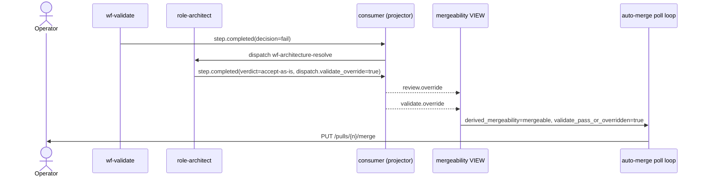

# Plan: validate.override channel + sharpen architect→feedback handoff

- **Status:** active
- **Date:** 2026-05-16
- **Related ADRs:** ADR-0031 (auto-merge cooling-off — current predicate ignores architect override of validate), ADR-0038 (deadlock arbitration — defines accept-as-is), ADR-0040 (architect tunes validator on accept-as-is — sibling), ADR-0042 (to be authored, validate.override channel)

## Goal

When the architect verdicts `accept-as-is` on a wf-validate-fail deadlock, the auto-merge predicate should honor that decision. Today the architect's accept-as-is emits `review.override` only — flipping review's vote — but the auto-merge predicate's `validate_decision = 'pass'` clause leaves validate-fail decisive and the PR stuck. Tonight's session surfaced the exact failure mode: four PRs (#120, #122, #123, #124) sat OPEN with green CI + accept-as-is verdicts because validate=fail held the gate, and a fifth (#121) needed manual merge. Secondary goal: when the architect verdicts `amend` (the precondition before accept-as-is), the `remediation_summary` must be specific enough that the feedback worker's code-author knows *what* to change — tonight's wf-feedback action steps returned *"implementation is already in place"* because the code-author misread a docs gap as a code gap.

## Success criteria

- A new `validate.override` event (`entity_type=validate`, `action=override`) is emitted by the architect disposition whenever `verdict=accept-as-is` AND the deadlock trigger was a wf-validate fail. Payload carries `reasoning` and `override_validate_check_ids: list[str]`.
- The mergeability VIEW (new alembic migration `0018_mergeability_validate_override.py`) reads `validate.override` and treats a pre-override validate-fail as pass, mirroring the existing `review.override` projection from 0016.
- Auto-merge predicate fires for the validate-override case: a synthetic accept-as-is on a previously-failing PR sets the cooling-off deadline and a merge fires (asserted by an integration test against a fixtured PR).
- Architect prompt for `amend` verdicts requires `remediation_summary` to include (a) the failing `check_id(s)`, (b) the file/path to change, (c) an action verb (`write`, `add`, `delete`, `rename`). Test asserts the prompt structure exists in `starters.py`.
- `role-feedback-analyzer` and `role-code-author` prompts pull `remediation_summary` into the dispatch context. The code-author prompt explicitly forbids *"implementation is already in place"* responses when `remediation_summary` is present — that response means the worker missed the framing.
- Smoke: a deliberately doc-less PR runs through the partnership end-to-end without operator intervention. The architect verdicts accept-as-is, both override events fire, the merge follows.

## Constraints / scope

### In scope

- `ValidateOverride` event class (Pydantic + registry).
- Alembic migration extending the mergeability VIEW.
- Architect disposition emission of `validate.override` next to `review.override` (worker-side).
- Architect prompt sharpening (`amend` remediation_summary specificity).
- Feedback role prompt sharpening (analyzer + code-author).
- Integration test + smoke task.

### Out of scope

- Changing the 30s auto-merge cooling-off duration.
- Collapsing `wf-review` and `wf-validate` into a single workflow.
- ADR-0040's `validator_tuning` emission (sibling plan).
- Promoting `wf-validate` from "blocking" to "advisory" — we keep validate authoritative; the architect's override is the explicit exception, not a downgrade.

### Budget

One session. The work is straight-line edits modeled on the existing `review.override` path; the new pieces are mirror images of the old ones plus prompt sharpening.

## Sequence of work

1. **ADR-0042** — author `docs/adrs/0042-validate-override-channel.md`. Reference ADR-0031 (auto-merge predicate), ADR-0038 (deadlock arbitration), ADR-0040 (sibling tuning emission). Single sequence diagram of the override flow.
2. **`ValidateOverride` event class** — new file `services/api/treadmill_api/events/validate.py` (mirrors `review.py`'s `ReviewOverride`). Register in `events/__init__.py`. Pydantic shape: `reasoning: str`, `override_validate_check_ids: list[str]`, `repo`, `task_id`, `pr_number`.
3. **Alembic migration 0018** — extend mergeability VIEW. The pre-override `validate_decision='fail'` row remains projected, but a sibling `validate_override` column reads from the most-recent `validate.override` event; auto-merge predicate reads `validate_decision = 'pass' OR validate_override IS NOT NULL`. Pattern matches 0016 row for row.
4. **Architect disposition** (`workers/agent/treadmill_agent/runner_dispositions/architecture.py`) — when `verdict=='accept-as-is'` AND deadlock context shows wf-validate as the failing workflow, emit both `review.override` AND `validate.override`. Test parametrized over the three deadlock-trigger flavors (validate-fail, review-fail, both-fail).
5. **Architect prompt sharpening** — `starters.py role-architect`. Append a new section to the amend-output schema requiring the specific check_id list, file paths, and verbs. Provide one positive + one negative example so the model anchors on shape, not phrasing.
6. **Feedback role prompts** — `starters.py role-feedback-analyzer` + `role-code-author`. Each role's prompt body must contain a `## Architect remediation` section that interpolates `remediation_summary` verbatim. The code-author prompt adds a forbid-list explicit about *"implementation is already in place"* as the failure signature.
7. **Smoke task** — author `docs/handoffs/2026-05-16-validate-override-smoke.md` describing the induced doc-gap test and capture the architect→override→merge timing.

## Diagram

## Risks / unknowns

- **VIEW migration conflicts.** Migration 0018 builds on 0016/0017. Mitigation: read the latest `task_status` view definition before drafting; run `alembic upgrade head` in a throw-away container before merging.
- **Architect prompt regression.** Sharpening the amend specificity risks the model's cue table for accept-as-is detection. Mitigation: keep cues additive — only extend amend output shape, leave accept-as-is detection untouched.
- **Override blast radius.** What stops the architect from accept-as-is on every fail? Today's ADR-0038 cap is 2 accept-as-is per task; that cap continues to bound blast radius. We add no additional gate.
- **Feedback prompt regression.** Forbidding "implementation is already in place" could surprise legitimate cases (re-runs where the work truly is done). Mitigation: the forbid only fires when `remediation_summary` is non-empty — a re-run with empty remediation can still report idempotency.

## Decisions captured during execution

- **2026-05-16** — Architect emits BOTH `review_override` and `validate_override` flags on every deadlock `accept-as-is`, rather than discriminating based on which gate failed. Rationale: the deadlock trigger predicate already filters for either gate's fail, so a blanket accept-as-is necessarily means "ship despite whatever gate complained." Emitting both events is harmless when one gate was already passing (UNION ALL in the VIEW prefers the most-recent signal per timestamp). Avoids plumbing failing-gate context from the trigger to the worker.
- **2026-05-16** — Architect→feedback handoff goes through PR comments, not workflow step payload plumbing. The architect's `amend` verdict now posts a `**Architect remediation**` PR comment that the feedback analyzer's existing `gh pr view` ingestion picks up verbatim. Avoids a new `workflow_run_steps.context_payload` column + migration. Trades off discoverability (PR comment threads can grow noisy) for delivery-mechanism simplicity. ADR-0042 captures the architectural commitment; the PR-comment mechanism is an implementation detail.
- **2026-05-16** — `override_validate_check_ids` ships empty (meaning "all failing checks at this sha") rather than populated. The architect's blanket accept-as-is doesn't name specific checks today. The list field is in the schema so future ADR-0040 tuning emission can populate it from the same site.

## Post-mortem

Filled in on transition to `completed` / `abandoned`.
