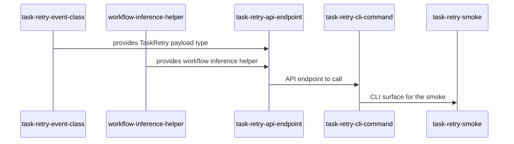

# Plan: ADR-0046 operator task retry CLI

ADR-0046 commits to a `treadmill task retry` CLI command + supporting API endpoint that performs audited, gated, single-shot retries of stuck tasks. This plan ships the implementation.

`status: active` (2026-05-18).

## Goal

After this plan executes:

1. `TaskRetry` event payload type exists in `events.task`, registered in `events.registry`, with `entity_type='task'`, `action='retry'`.
2. A `POST /api/v1/tasks/{task-id}/retry` API endpoint accepts `{workflow, reason, force_bypass_cap}`, performs the gates from ADR-0046 §"Server-side behavior", and returns the new `workflow_run.id`.
3. A `treadmill task retry <task-id> [--workflow] [--reason] [--force-bypass-cap]` CLI command calls the endpoint and surfaces operator-readable output.
4. The workflow-inference helper exists in `coordination/triggers.py`: `infer_retry_workflow(session, task_id) -> str | None`. Returns the most-recent non-terminal workflow for the task, or None if ambiguous.
5. An integration test asserts: a wf-feedback-failed task, post-retry, has a new wf-feedback run with the dedup row cleared and the cap respected (or force-bypassed with a `task.retry` audit event recorded).

## Success criteria

- `treadmill task retry <stuck-task-id> --reason "operator nudge"` against a wf-feedback-failed task creates a new wf-feedback run that flows through the standard SQS work-queue path.
- `treadmill task retry <task-already-at-cap>` errors with a clear message pointing at `--force-bypass-cap`.
- `--force-bypass-cap` produces a new run AND records a `task.retry` event with `bypassed_cap=true`.
- All four code tasks below pass their `validation` scripts.

## Constraints / scope

### In scope

- The four code tasks below plus a smoke test handoff.
- TaskRetry Pydantic event class + registry registration.
- `POST /api/v1/tasks/{task-id}/retry` endpoint + body schema.
- `treadmill task retry` CLI command.
- `infer_retry_workflow` helper.
- Integration test exercising the full retry → dispatch → worker-pickup flow.

### Out of scope

- Operator tooling around `task.retry` events (dashboards, alerts on >2 retries per task — filed as future ops-bot work).
- Bulk retry across multiple tasks — single-task scope per ADR-0046.
- Auto-detection of "tasks that would benefit from retry" — deliberately operator-driven only.

### Budget

One session per task. The work is mechanical given ADR-0046's design.

## Risks / unknowns

- **Dedup-row identification.** The endpoint must clear the row(s) that block the next dispatch — namespaced by `wf-feedback:<repo>:author-fail-run=<wf_author_run_id>` (or sibling shapes for validate-fail / review-fail). The helper has to pick the right one based on the target workflow. Mitigation: explicit table query keyed on the target workflow's namespace pattern.
- **Cap-counting concurrency.** Between the cap check and the new-run insert, a concurrent dispatch could squeeze in. Mitigation: same transaction for the check + insert. Standard sqlalchemy.

## Sequence of work

```yaml
sequence_of_work:
  - id: task-retry-event-class
    title: TaskRetry event payload + registry registration
    workflow: wf-author
    intent: |
      Author the ``TaskRetry`` Pydantic event class at
      ``services/api/treadmill_api/events/task.py`` (alongside
      ``TaskRegistered`` / ``TaskCancelled``). Fields per
      ADR-0046 §"Server-side behavior":

        - ``workflow_id: str`` — the workflow being retried
        - ``reason: str`` — operator-supplied justification
          (required, non-empty, max 500 chars).
        - ``by_operator: str`` — operator identifier from the
          request (e.g. CLI's ``--created-by``).
        - ``bypassed_cap: bool`` — true when ``--force-bypass-cap``
          was used.
        - ``previous_run_id: str | None`` — the wf-* run whose
          dedup was cleared (or null if no prior run existed).

      ENTITY_TYPE: ClassVar[str] = "task"
      ACTION: ClassVar[str] = "retry"

      Register in ``events/__init__.py`` (alphabetical order in the
      task block) AND in ``events/registry.py``'s
      ``_REGISTRY_CLASSES`` list. Add to the ``__all__`` export.

      Unit test in ``services/api/tests/test_events_task_retry.py``:
      - Pydantic validation rejects empty reason.
      - Round-trip through encode_payload / parse_payload preserves
        all fields.
      - The class appears in the EVENT_REGISTRY index for
        ``("task", "retry")``.
    scope:
      files:
        - services/api/treadmill_api/events/task.py
        - services/api/treadmill_api/events/__init__.py
        - services/api/treadmill_api/events/registry.py
        - services/api/tests/test_events_task_retry.py
    validation:
      - kind: deterministic
        description: |
          TaskRetry class registered + tests pass.
        script: |
          cd services/api \
            && grep -q "class TaskRetry" treadmill_api/events/task.py \
            && grep -q "TaskRetry" treadmill_api/events/registry.py \
            && uv run pytest tests/test_events_task_retry.py -q

  - id: workflow-inference-helper
    title: infer_retry_workflow helper in coordination/triggers.py
    workflow: wf-author
    depends_on:
      - task.task-retry-event-class.pr_merged
    intent: |
      Author ``infer_retry_workflow(session, task_id) -> str | None``
      in ``services/api/treadmill_api/coordination/triggers.py``.

      Behavior: query the task's workflow_runs joined to
      workflow_versions; return the workflow_id of the
      most-recent run whose status is NOT in
      ``{'pr_merged', 'cancelled', 'done'}`` (i.e. the
      most-recent non-terminal workflow attempted).

      Return ``None`` when no runs exist, or when the most-recent
      run is already at a terminal status (operator should pass
      ``--workflow`` explicitly).

      Unit test in ``test_workflow_inference.py``:
      - Task with only a failed wf-author run → returns 'wf-author'.
      - Task with wf-author + wf-feedback both failed → returns
        'wf-feedback' (most recent).
      - Task with all runs at pr_merged → returns None.
      - Task with no runs → returns None.
    scope:
      files:
        - services/api/treadmill_api/coordination/triggers.py
        - services/api/tests/test_workflow_inference.py
    validation:
      - kind: deterministic
        description: |
          Helper defined + unit tests pass.
        script: |
          cd services/api \
            && grep -q "def infer_retry_workflow" treadmill_api/coordination/triggers.py \
            && uv run pytest tests/test_workflow_inference.py -q

  - id: task-retry-api-endpoint
    title: POST /api/v1/tasks/{task-id}/retry endpoint
    workflow: wf-author
    depends_on:
      - task.task-retry-event-class.pr_merged
      - task.workflow-inference-helper.pr_merged
    intent: |
      Add ``POST /tasks/{task_id}/retry`` to
      ``services/api/treadmill_api/routers/tasks.py``.

      Request body (Pydantic):
        workflow_id: str | None = None  # if None, infer
        reason: str  # required, non-empty
        force_bypass_cap: bool = False

      Behavior (per ADR-0046 §"Server-side behavior"):
        1. 404 if task not found.
        2. Resolve workflow_id (explicit or via
           ``infer_retry_workflow``); 409 if neither.
        3. Check cap (``_is_capped``); 409 if at cap AND NOT
           force_bypass_cap, with body
           ``{"detail": "cap reached; pass force_bypass_cap=true"}``.
        4. Clear the matching ``workflow_dispatch_dedup`` row(s) —
           the namespace pattern for the target workflow's most-
           recent run (e.g. ``wf-feedback:<repo>:author-fail-run=<id>``).
        5. Emit ``TaskRetry`` event via dispatcher.persist_and_publish.
        6. dispatch_task(session, task) to create the new
           workflow_run + publish step.ready.
        7. Return 201 with ``{"workflow_run_id": "<uuid>"}``.

      Integration test (``test_integration_task_retry.py``):
      - Sets up a task with a failed wf-feedback run + dedup row.
      - Calls POST /tasks/.../retry with reason.
      - Asserts: TaskRetry event row exists, dedup row cleared,
        new workflow_run created, step.ready published.
    scope:
      files:
        - services/api/treadmill_api/routers/tasks.py
        - services/api/tests/test_integration_task_retry.py
    validation:
      - kind: deterministic
        description: |
          Endpoint added + integration test passes.
        script: |
          cd services/api \
            && grep -q "/{task_id}/retry" treadmill_api/routers/tasks.py \
            && uv run pytest tests/test_integration_task_retry.py -q

  - id: task-retry-cli-command
    title: treadmill task retry CLI command
    workflow: wf-author
    depends_on:
      - task.task-retry-api-endpoint.pr_merged
    intent: |
      Add ``retry`` subcommand to ``treadmill task`` in
      ``cli/treadmill_cli/cli.py``.

      Signature per ADR-0046 §"CLI surface":
        treadmill task retry <task-id>
            [--workflow <slug>]
            [--reason "<one-line>"]
            [--force-bypass-cap]

      Reason is required (Typer marks as required option).

      Behavior:
        - POST to the API endpoint.
        - On 201: print "retry dispatched: workflow_run=<uuid>".
        - On 409 cap-reached: print error + hint to pass
          --force-bypass-cap.
        - On 404: print "task not found".

      Update ``cli/treadmill_cli/api_client.py`` with a
      ``retry_task(task_id, workflow, reason, force_bypass_cap)``
      method calling the new endpoint.

      Test (``test_cli_task_retry.py``):
      - Happy path: mock 201 response → prints workflow_run_id.
      - 409 cap-reached: mock 409 → prints actionable error.
      - Missing --reason: Typer rejects before HTTP.
    scope:
      files:
        - cli/treadmill_cli/cli.py
        - cli/treadmill_cli/api_client.py
        - cli/tests/test_cli_task_retry.py
    validation:
      - kind: deterministic
        description: |
          CLI subcommand registered + tests pass.
        script: |
          cd cli \
            && uv run treadmill task retry --help 2>&1 | grep -q "task-id" \
            && uv run pytest tests/test_cli_task_retry.py -q

  - id: task-retry-smoke
    title: Smoke — operator retry of a stuck task end-to-end
    workflow: wf-author
    depends_on:
      - task.task-retry-cli-command.pr_merged
    intent: |
      Author ``docs/handoffs/2026-05-18-task-retry-smoke.md``
      documenting an end-to-end manual run of:

        1. Identify a task in ``wf-feedback: failed`` state via
           ``treadmill task list --status 'wf-feedback: failed'``.
        2. Call ``treadmill task retry <id> --reason "smoke"``.
        3. Confirm: new wf-feedback run appears within 10s,
           worker spawns within autoscaler tick, work proceeds.
        4. (Optional) ``treadmill task retry <capped-id>
           --reason "..."`` errors with cap-reached message.
        5. ``--force-bypass-cap`` against the same task succeeds
           AND records bypassed_cap=true in the TaskRetry event.

      No production code in this task — just the handoff doc.
    scope:
      files:
        - docs/handoffs/2026-05-18-task-retry-smoke.md
    validation:
      - kind: deterministic
        description: |
          Handoff doc exists with the expected sections.
        script: |
          test -f docs/handoffs/2026-05-18-task-retry-smoke.md \
            && grep -qi "treadmill task retry" docs/handoffs/2026-05-18-task-retry-smoke.md \
            && grep -qi "force-bypass-cap" docs/handoffs/2026-05-18-task-retry-smoke.md
```

## Diagram


