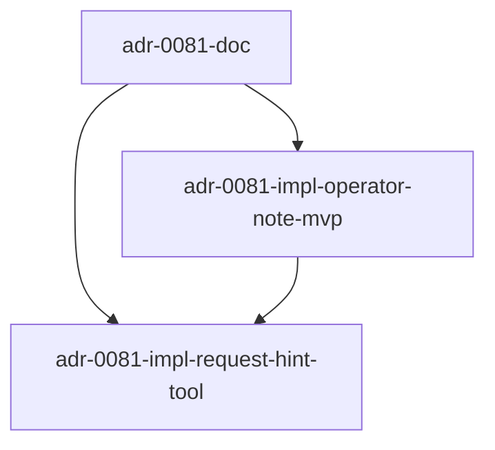

# Plan: ADR-0081 implementation — worker→operator hint channel

- **Status:** active
- **Date:** 2026-06-06
- **Related ADRs:** ADR-0081 (this plan ships it), ADR-0067 + ADR-0068
  (cc-channels relay), ADR-0029 (amend-cap budget being saved),
  ADR-0075 (operator obligations rule + fleet-wedge sub-signal hook),
  ADR-0079 (sibling token-savings work — terminal-status short-circuit)

## Goal

Ship the two-layer hint channel from ADR-0081: a passive
`operator_note` field on tasks (PR #1, the MVP) and an active
worker-initiated `request_hint` tool that relays to the dispatching
operator's cc-channels inbox (PR #2). Both feed the same
`operator_note` field so the worker-side read path is single-sourced.

## Success criteria

- A new nullable text column `operator_note` on the `tasks` table.
  Migration applies cleanly; existing rows behavior-neutral (null →
  no hint injection).
- A new endpoint `POST /api/v1/tasks/<task_id>/operator_note` accepts
  `{note: str | null}`; null clears the note. Round-trips via
  `treadmill task note <task_id> "hint here"` and
  `treadmill task note <task_id> --clear`. Both write
  `task.operator_hint_set` events.
- The worker's per-step context fetch (the GET path) returns the
  current `operator_note` value alongside the existing fields. The
  worker's system prompt assembler injects the note as a tagged
  section if non-null AND the repo's `worker_hints_enabled` flag is
  true, with the verbatim "Operator hint ... verify before acting"
  envelope from ADR-0081 §1.
- `RepoConfig.worker_hints_enabled` (BOOLEAN NOT NULL DEFAULT
  true). Set per-repo; the worker tool registry checks it before
  registering `request_hint` and the prompt assembler checks it
  before injecting `operator_note`. CLI surface:
  `treadmill onboarding update --repo <repo> --hints on|off`.
- `TREADMILL_OPERATOR_RELAY_HINTS=on|off` env var read by the
  operator session at launch (sibling to `TREADMILL_RELAY_LEVEL`).
  Defaults `on`. Documented in `launch-session.sh` and the
  per-session relay docs.
- (PR #2) A `request_hint` tool the worker can invoke from inside a
  role-step Claude call. The tool writes
  `~/.cc-channels/<created_by>/relay/<ts>-from-worker-<task-id>.md`
  with the reason + context and emits
  `task.worker_hint_requested`. Tool is non-blocking; returns
  `{acknowledged: true}` immediately.
- Tests pin: schema + endpoint round-trip, worker context fetch
  exposing the note, worker prompt assembler injecting the section,
  CLI command round-trip, `request_hint` tool writing the relay
  file with the right shape and emitting the event.
- ADR-0081 doc is on main.

## Constraints / scope

### In scope

- ADR-0081 doc + this plan.
- Alembic migration adding `operator_note TEXT NULL` to `tasks`.
- ORM column + parser updates so `Task.operator_note` exposes the
  field.
- API endpoint POST /api/v1/tasks/<task_id>/operator_note with the
  payload contract above.
- Worker context fetch path (GET /api/v1/tasks/<id> or whichever
  endpoint the worker hits per-step) exposing `operator_note`.
- Worker prompt assembler injecting the note as a tagged section.
- CLI command `treadmill task note <task_id> "..."` (set) +
  `--clear` (unset).
- Events `task.operator_hint_set` + `task.worker_hint_requested`
  with payloads per ADR-0081 §4.
- Worker `request_hint` tool — relay file write + event emit.
- AGENT.md updates per touched component.

### Out of scope

- **Synchronous worker-blocking phone-home** (worker waits for
  operator response before continuing). v1 is async-write +
  next-step-reads.
- **Per-step note targeting** (note attached to step X of task Y,
  not the whole task). v1 is per-task only; operators clear notes
  between phase shifts.
- **Multi-operator conflict resolution.** v1 accepts last-write-
  wins; the event log lets us measure if multi-operator races
  actually happen.
- **Dashboard UI for setting notes.** v1 is API + CLI only.
  Dashboard surfaces follow once we know the operator workflow.
- **Auto-summarization of hint history.** A task's events table
  captures every set/clear; no summary view at v1.
- **ADR-0075 fleet-wedge sub-signal for "high hint request
  rate."** Mentioned in ADR-0081 but lands as a separate plan
  once we have data to set the threshold.

### Budget

Two tasks (PR #1 + PR #2). Author-cycle budget: ≤4 per task. PR #1
is the foundational one; PR #2 layers the worker-initiated trigger
on top of the same plumbing.

## Sequence of work

```yaml
sequence_of_work:
  - id: adr-0081-doc
    title: "ADR-0081 — worker→operator hint channel doc"
    workflow: wf-author
    intent: |
      STUDY:
        - `docs/adrs/0067-cc-channels-one-bot-per-session-for-phone-access.md`
          + `docs/adrs/0068-treadmill-events-channel-and-shared-channel-conventions.md`
          — the relay primitives this ADR consumes.
        - `docs/adrs/0029-architect-amend-cap.md` — the budget
          being saved; quote the cap value when describing the
          token economics.
        - `docs/learnings/2026-06-05-architect-output-malformed-recurring-on-large-prompt-tasks.md`
          — the failure-mode the night session generated; the ADR
          quotes the four-task cluster as empirical motivation.
        - Existing ADR-0081 draft already in main at
          `docs/adrs/0081-worker-to-operator-hint-channel.md` (this
          task's PR will replace any draft with the final version).

      BUILD `docs/adrs/0081-worker-to-operator-hint-channel.md`
      with sections matching the /decide template:
        - **Status:** accepted
        - **Date:** 2026-06-06
        - **Related:** ADR-0029, ADR-0058, ADR-0067, ADR-0068,
          ADR-0074, ADR-0075, ADR-0079
        - **Context:** name the failure mode + the cc-channels
          plumbing already in place + the 2026-06-05 night
          session's empirical cluster.
        - **Decision:** four numbered sub-decisions —
          (1) operator_note field on tasks (MVP, PR #1),
          (2) worker-initiated request_hint tool (v2, PR #2),
          (3) operator-side workflow uses existing cc-channels
              relay surface — no new operator tooling needed,
          (4) audit trail via task.operator_hint_set +
              task.worker_hint_requested events.
        - **Diagram:** Mermaid sequenceDiagram showing the
          worker→inbox→operator→API→worker round-trip.
        - **Alternatives considered:** at least six —
          (a) synchronous worker-blocking phone-home;
          (b) new wf-operator-consult workflow type;
          (c) per-step operator_note instead of per-task;
          (d) skip MVP, jump to phone-home;
          (e) chat-style two-way conversation;
          (f) worker → architect-Claude (same blind spots).
        - **Consequences:** good (cycles saved, audit trail,
          honors existing architecture); bad (operator becomes
          load-bearing on some steps, hint-quality matters,
          two-operator race acceptance); risks (becomes a
          band-aid, token economics on simple tasks, stale
          hints across phase shifts, request_hint stalling).

      Cross-link the 2026-06-05 architect-output-malformed
      learning: append `, ADR-0081` to its `Related:` line.

      Do NOT modify any code in this task — implementation
      lands in PR #2 of this plan.

    scope:
      files:
        - docs/adrs/0081-worker-to-operator-hint-channel.md
        - docs/learnings/2026-06-05-architect-output-malformed-recurring-on-large-prompt-tasks.md
      services_affected: []
      out_of_scope:
        - services/api/
        - workers/agent/
        - tools/local-adapter/
        - cli/

    validation:
      - kind: deterministic
        description: |
          ADR file exists with required-section headings + numbered
          sub-decisions + at least six alternatives + cross-links.
        script: |
          set -euo pipefail
          ROOT="$(git rev-parse --show-toplevel)"
          ADR="$ROOT/docs/adrs/0081-worker-to-operator-hint-channel.md"
          [ -f "$ADR" ]
          grep -q "^# ADR-0081" "$ADR"
          grep -q "^## Context" "$ADR"
          grep -q "^## Decision" "$ADR"
          grep -q "^## Consequences" "$ADR"
          grep -q "^## Alternatives considered" "$ADR"
          grep -q "operator_note" "$ADR"
          grep -q "request_hint" "$ADR"
          grep -q "cc-channels" "$ADR"
          grep -q "ADR-0029" "$ADR"
          grep -q "ADR-0067" "$ADR"

  - id: adr-0081-impl-operator-note-mvp
    title: "operator_note field + endpoint + worker prompt injection (PR #1)"
    workflow: wf-author
    depends_on:
      - task.adr-0081-doc.pr_merged
    intent: |
      STUDY:
        - `docs/adrs/0081-worker-to-operator-hint-channel.md`
          (LANDED BY TASK 1) — the §1 sub-decision pins the
          envelope shape worker prompts use; reproduce verbatim.
        - `services/api/treadmill_api/models/task.py` (or wherever
          the Task ORM row is defined) for the column-addition
          pattern + recent precedent.
        - `services/api/alembic/versions/` — pick the current head
          and chain off it.
        - `cli/treadmill_cli/commands/learnings.py` for the CLI
          sub-app + ApiClient call shape (precedent for adding
          a new typer.Typer + registering on main app).
        - `services/api/treadmill_api/routers/tasks.py` for the
          existing per-task endpoint patterns.
        - `workers/agent/treadmill_agent/runner.py` for the
          per-step context fetch + system prompt assembly seam.

      BUILD:
        - Alembic migration adding two columns:
          * `tasks.operator_note TEXT NULL`
          * `repo_configs.worker_hints_enabled BOOLEAN NOT NULL
            DEFAULT true`
        - ORM Task column + RepoConfig.worker_hints_enabled +
          parser/to_dict surfaces.
        - `POST /api/v1/tasks/<task_id>/operator_note` accepting
          `{note: str | null}`. Persists to the column + emits
          `task.operator_hint_set` (payload: `note_excerpt: str,
          set_by: str`).
        - Worker per-step GET path exposes `operator_note`.
        - Worker prompt assembler injects the verbatim §1
          envelope when `operator_note` is non-null AND the
          repo's `worker_hints_enabled` is true.
        - CLI: register `note <task_id> "..."` set + `--clear`
          unset (lives under the existing `task_app` group).
          Use existing `_client()` + `ApiClient._request`.
        - CLI: extend `treadmill onboarding update` to accept
          `--hints on|off` which flips
          `worker_hints_enabled` for the named repo.

      Tests:
        - alembic head stays single after migration.
        - Endpoint round-trip: set then read back via GET.
        - Endpoint clear (null body) removes the note.
        - Endpoint emits `task.operator_hint_set` with
          note_excerpt + set_by in payload.
        - Worker context fetch returns operator_note.
        - Worker prompt assembler injects the §1 envelope when
          note present; injects nothing when null.
        - CLI set + --clear round-trip via mocked ApiClient.

      AGENT.md updates: `services/api/treadmill_api/AGENT.md` (or
      similar) + `workers/agent/AGENT.md` (the prompt assembler
      seam) + `cli/treadmill_cli/AGENT.md` (the new sub-command).

    scope:
      files:
        - services/api/alembic/versions/
        - services/api/treadmill_api/models/task.py
        - services/api/treadmill_api/routers/tasks.py
        - services/api/treadmill_api/events/task.py
        - services/api/treadmill_api/AGENT.md
        - services/api/tests/test_operator_note.py
        - workers/agent/treadmill_agent/runner.py
        - workers/agent/AGENT.md
        - workers/agent/tests/test_runner_prompt.py
        - cli/treadmill_cli/cli.py
        - cli/treadmill_cli/commands/note.py
        - cli/treadmill_cli/AGENT.md
        - cli/tests/test_cli_note.py
      services_affected:
        - services/api
        - workers/agent
        - cli
      out_of_scope:
        - tools/local-adapter/
        - services/dashboard/

    validation:
      - kind: deterministic
        description: |
          Migration applies (single alembic head), endpoint +
          worker injection + CLI all tested.
        script: |
          set -euo pipefail
          ROOT="$(git rev-parse --show-toplevel)"
          cd "$ROOT/services/api"
          heads=$(uv run alembic heads | grep -c '(head)' || true)
          test "$heads" = "1"
          uv run pytest tests/test_operator_note.py -q
          cd "$ROOT/workers/agent"
          uv run pytest tests/test_runner_prompt.py -q
          cd "$ROOT/cli"
          uv run pytest tests/test_cli_note.py -q

  - id: adr-0081-impl-request-hint-tool
    title: "Worker request_hint tool + relay write + event (PR #2)"
    workflow: wf-author
    depends_on:
      - task.adr-0081-doc.pr_merged
      - task.adr-0081-impl-operator-note-mvp.pr_merged
    intent: |
      STUDY:
        - `docs/adrs/0081-worker-to-operator-hint-channel.md`
          §2 — the request_hint tool's shape and the non-blocking
          contract.
        - `workers/agent/treadmill_agent/` — wherever the worker's
          tool registry lives (per-role-step tool surface).
        - `tools/cc-channels/cc-relay.py` for the relay file shape
          conventions; the worker writes equivalently but with a
          `[from: worker-<task-id>]` sender label.
        - `services/api/treadmill_api/events/task.py` (LANDED BY
          PR #1) for the event-class pattern.

      BUILD:
        - Worker tool `request_hint(reason: str, context: str) ->
          {acknowledged: bool}` registered in the worker tool
          registry ONLY when the repo's `worker_hints_enabled`
          flag is true. The tool:
          * resolves `created_by` from the task's context
            already passed in;
          * writes
            `~/.cc-channels/<created_by>/relay/<ts>-from-worker-<task-id>.md`
            with the body shape (reason header + context body +
            metadata footer per ADR-0081 §2);
          * POSTs to a new endpoint
            `POST /api/v1/tasks/<task_id>/worker_hint_request`
            with `{reason, context_excerpt, worker_step_id}`
            which emits `task.worker_hint_requested`;
          * returns `{acknowledged: true}` (non-blocking).
        - Operator-side relay consumer reads
          `TREADMILL_OPERATOR_RELAY_HINTS` env var (sibling to
          `TREADMILL_RELAY_LEVEL`); when set to `off`, suppresses
          forwarding of `task.worker_hint_requested` events and
          `[from: worker-...]` cc-channels relay messages to the
          operator's bot. The events table still records every
          request (per ADR-0081 §5: events always fire so the
          counterfactual is auditable).
        - New event class `TaskWorkerHintRequested` with the
          payload above + registry registration.
        - Tests:
          * Tool registers in the worker's tool list and the
            help string includes a usage example.
          * Tool writes the relay file with correct path + body.
          * Tool POSTs the event with the right payload.
          * Tool returns acknowledged=true.
          * Tool does NOT block on operator response.

      AGENT.md updates: `workers/agent/AGENT.md` notes the new
      tool and links to ADR-0081.

    scope:
      files:
        - services/api/treadmill_api/routers/tasks.py
        - services/api/treadmill_api/events/task.py
        - services/api/treadmill_api/events/registry.py
        - services/api/treadmill_api/AGENT.md
        - services/api/tests/test_worker_hint_request.py
        - workers/agent/treadmill_agent/
        - workers/agent/AGENT.md
        - workers/agent/tests/test_request_hint_tool.py
      services_affected:
        - services/api
        - workers/agent
      out_of_scope:
        - tools/local-adapter/
        - cli/
        - services/dashboard/

    validation:
      - kind: deterministic
        description: |
          Tool registered, relay file shape pinned, event emission
          tested.
        script: |
          set -euo pipefail
          ROOT="$(git rev-parse --show-toplevel)"
          grep -rq "request_hint" "$ROOT/workers/agent/treadmill_agent/"
          cd "$ROOT/services/api"
          uv run pytest tests/test_worker_hint_request.py -q
          cd "$ROOT/workers/agent"
          uv run pytest tests/test_request_hint_tool.py -q
```

## Diagram



## Risks / unknowns

- **The hint envelope's "verify before acting" instruction may be
  ignored.** Some models will follow the operator hint regardless.
  Worth measuring via the audit-trail events; if false-fix rates
  spike, the envelope language needs revising.
- **`request_hint` could become a stalling tactic.** The amend-cap
  still bounds the worker; the event log makes the tactic
  measurable. Mitigation: a follow-up could cap `request_hint`
  invocations per task at K=2.
- **Multi-operator races on the same task's operator_note.** v1
  accepts last-write-wins; the event log captures every write so
  conflicting hints are post-hoc visible. If this becomes
  operationally painful, a v2 could add optimistic-concurrency
  with an `If-Match`-style etag.
- **`request_hint` requires the worker container can write to
  `~/.cc-channels/<created_by>/relay/`.** The container's user
  home may not be the host's `joe` home. Plan implementation
  must verify the mount path; if the path isn't writable, fall
  back to the event-only path (still emits
  `task.worker_hint_requested`, just no relay file).

## Decisions captured during execution

_(populated as work lands)_

## Post-mortem

_(populated when the plan completes or aborts)_
