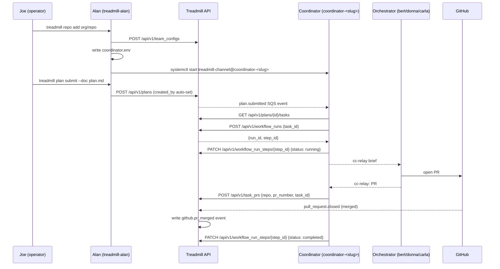

# Plan: ADR-0085 + ADR-0086 Combined Implementation

- **Status:** active
- **Date:** 2026-06-09
- **Related ADRs:** ADR-0085 (automatic team provisioning), ADR-0086 (coordinator owns task lifecycle)
- **Supersedes:** 2026-06-09-adr-0085-automatic-team-provisioning

## Goal

Implement ADR-0085 (automatic team provisioning via `team_configs`) and ADR-0086 (coordinator owns all Treadmill lifecycle bookkeeping) in one coherent changeset. The two ADRs are tightly coupled: provisioning is only useful if the coordinator can register the work it routes. This plan ships both together so the system is correct-by-construction from day one.

Execution model: this plan is bootstrapped by Alan + orchestrators directly via cc-relay. The coordinator model being fixed cannot be used to fix itself. Alan handles all Treadmill bookkeeping manually during bootstrap (step registration, PR registration, merge confirmation) until Task G ships and coordinators handle it autonomously.

## Success criteria

1. A new `team_configs` row for a repo causes `treadmill plan submit` to auto-set `created_by` and publish a `plan.submitted` SQS event — no `--created-by` flag required.
2. The autoscaler's `queue_depth_fn` calls `GET /api/v1/queue_depth` and receives a count that excludes coordinator-owned pending tasks. Coordinator-owned tasks are invisible to the worker pool.
3. `treadmill repo add <org/repo>` creates `team_configs` row, writes `coordinator.env`, and enables the coordinator systemd unit in one operation.
4. The coordinator can call `POST /api/v1/workflow_runs` to create a run for a task and `PATCH /api/v1/workflow_run_steps/{step_id}` to mark it running/completed.
5. A task with a `github.pr_merged` event returns `pr_merged` from `task_status` view even when a `pending` step exists on the same run — no more `wf-author: executing` masking a merged task.
6. `coordinator_prompt.md` instructs the coordinator to: register step start on brief dispatch, register PR on orchestrator report, confirm merge via Path A (webhook) or Path B (manual fire).

## Constraints / scope

### In scope
- `task_status` view migration (CASE reorder: `pr_merged` before `pending` check)
- `POST /api/v1/workflow_runs` + `PATCH /api/v1/workflow_run_steps/{step_id}` API endpoints
- `team_configs` table, store, CRUD router, `GET /api/v1/queue_depth` endpoint
- `plans.py` routing: auto-`created_by` from `team_configs`; `plan.submitted` event
- Autoscaler `get_depth_from_api()` replacing SQS `get_depth()`
- `treadmill repo add` CLI command
- `coordinator_prompt.md` + `brief_worker.py` lifecycle responsibilities

### Out of scope
- Retiring the autoscaler entirely (that waits until all active repos have team_configs entries)
- Per-plan worker availability broadcast (ADR-0085 §5 — deferred; coordinator retries + escalates)
- ADR-0050 onboarding integration (team_configs row in onboarding transaction — follow-up)
- Coordinator DSPy tuning track (ADR-0084 follow-up, separate plan)
- Migrating the in-flight ADR-0085 plan (3a30f88b) tasks — cancel those tasks; this plan supersedes

### Budget
- 7 orchestrator-days of focused work. Abort and post-mortem if Phase 3 is not merged within 5 calendar days of Phase 1 merge.

## Sequence of work

```yaml
sequence_of_work:
  - id: task-status-view-fix
    title: "task_status view: pr_merged wins over pending step (ADR-0086 §5)"
    workflow: wf-author
    depends_on: []
    intent: |
      The task_status view (20260520_0500_task_status_merged_precedence.py) returns
      'wf-author: executing' when a step has status 'pending' (clause 4) — even when
      a github.pr_merged event already exists for that task. Coordinator-dispatched
      tasks have a 'pending' step (created by the coordinator, no started_at) so they
      mask pr_merged.

      Add a new Alembic migration that inserts a single CASE clause between clause 3
      (registered) and clause 4 (executing):
        WHEN EXISTS (
            SELECT 1 FROM events e
            WHERE e.task_id = t.id
              AND e.entity_type = 'github'
              AND e.action = 'pr_merged'
        ) THEN 'pr_merged'

      CRITICAL: do NOT rewrite the view from scratch. Read
      20260520_0500_task_status_merged_precedence.py in full first to capture the
      exact current SQL (multiple _VIEW_SECTION_* constants assembled at migration
      time), then insert only the one new clause. The clause-5/6 pr_merged overlays
      ('pr_merged (wf-X: failed)', 'pr_opened') must be preserved unchanged.

      Add a test in test_integration_task_status.py:
        def test_status_pr_merged_wins_over_pending_step(...):
            fixtures.add_run_with_steps(task_id, "wf-author", ["pending"])
            fixtures.add_event(task_id, "github", "pr_merged")
            assert _status_for(engine, task_id) == "pr_merged"

      Update services/api/AGENT.md: add a "Recent changes" note about the pr_merged
      precedence fix and reference ADR-0086.
    scope:
      files:
        - services/api/alembic/versions/
        - services/api/AGENT.md
        - services/api/tests/test_integration_task_status.py
      services_affected:
        - treadmill-api
      out_of_scope:
        - Any other view clause changes
        - task_mergeability view
    validation:
      - kind: deterministic
        description: >
          New migration exists with task_status and pr_merged present; test added;
          full task_status test suite passes.
        script: |
          set -euo pipefail
          find services/api/alembic/versions/ -name "20260609*.py" | xargs grep -l "task_status" | grep -q . || (echo "FAIL: no 2026-06-09 migration for task_status" && exit 1)
          grep -q "pr_merged" services/api/alembic/versions/20260609*.py || (echo "FAIL: pr_merged clause not in new migration" && exit 1)
          cd services/api && python -m pytest tests/test_integration_task_status.py -q 2>&1 | tail -5

  - id: workflow-runs-api
    title: "API: POST /api/v1/workflow_runs + PATCH /api/v1/workflow_run_steps/{step_id}"
    workflow: wf-author
    depends_on: []
    intent: |
      Add two new API endpoints the coordinator uses for lifecycle bookkeeping.
      Neither endpoint exists today (confirmed by grepping routers/). Pattern: follow
      workflow_triggers.py for the POST; follow steps.py for the PATCH.

      Create services/api/treadmill_api/routers/workflow_runs.py with a single APIRouter.
      Register it in cli.py under two URL prefixes (standard FastAPI pattern — define
      one router with full subpaths, prefix="/api/v1", or two routers in one module):

      POST /api/v1/workflow_runs
        Body: {"task_id": "<uuid>", "trigger": "coordinator"}
        Creates a workflow_runs row for the task + one workflow_run_steps row with
        step_name="author" and status="pending". Returns {"run_id": "<uuid>",
        "step_id": "<uuid>"}. Returns 409 if a workflow_runs row already exists for
        this task_id. Returns 404 if task_id not found.

      PATCH /api/v1/workflow_run_steps/{step_id}
        Body (all fields optional): {"status": "running|completed|failed",
        "started_at": "<iso8601>", "completed_at": "<iso8601>"}
        Partial-update the named step row. Only update fields present in body.
        Returns 404 if step_id not found.

      Wire the new router into services/api/treadmill_api/cli.py using the same
      app.include_router() pattern as existing routers.

      Write tests/test_routers_workflow_runs.py covering:
        - POST creates run + step, returns run_id and step_id
        - POST returns 409 on duplicate task_id
        - POST returns 404 for unknown task_id
        - PATCH status=running sets started_at
        - PATCH status=completed sets completed_at
        - PATCH returns 404 for unknown step_id

      Update services/api/AGENT.md: add both endpoints to "Key surfaces".
    scope:
      files:
        - services/api/treadmill_api/routers/workflow_runs.py
        - services/api/treadmill_api/cli.py
        - services/api/AGENT.md
        - services/api/tests/test_routers_workflow_runs.py
      services_affected:
        - treadmill-api
      out_of_scope:
        - Changing existing workflow_triggers.py or steps.py
        - Any autoscaler or coordinator changes
    validation:
      - kind: deterministic
        description: >
          workflow_runs.py router exists; both endpoints registered in cli.py; tests pass.
        script: |
          set -euo pipefail
          test -f services/api/treadmill_api/routers/workflow_runs.py || (echo "FAIL: workflow_runs.py not found" && exit 1)
          grep -q "workflow_runs" services/api/treadmill_api/cli.py || (echo "FAIL: workflow_runs router not wired in cli.py" && exit 1)
          cd services/api && python -m pytest tests/test_routers_workflow_runs.py -q 2>&1 | tail -5

  - id: team-config-schema
    title: "team_configs: table + store + CRUD + GET /api/v1/queue_depth"
    workflow: wf-author
    depends_on: []
    intent: |
      Add the team_configs table and all API surfaces the other tasks depend on.

      1. Alembic migration (services/api/alembic/versions/20260609_1000_team_configs.py):
         CREATE TABLE team_configs (
             id                UUID PRIMARY KEY DEFAULT gen_random_uuid(),
             repo              VARCHAR(255) NOT NULL UNIQUE,
             coordinator_label VARCHAR(64)  NOT NULL,
             worker_labels     TEXT[]       NOT NULL DEFAULT '{}',
             created_at        TIMESTAMPTZ  NOT NULL DEFAULT now(),
             updated_at        TIMESTAMPTZ  NOT NULL DEFAULT now()
         );

      2. SQLAlchemy model services/api/treadmill_api/models/team_config.py
         following the pattern of models/run.py. Export TeamConfig from models/__init__.py.

      3. Store services/api/treadmill_api/team_config_store.py following the pattern of
         onboarding_store.py (class-based, AsyncSession injected). Methods:
           get_by_repo(repo: str) -> TeamConfig | None
           upsert(repo, coordinator_label, worker_labels) -> TeamConfig
           list_all() -> list[TeamConfig]

      4. Router services/api/treadmill_api/routers/team_configs.py:
           POST   /api/v1/team_configs              — upsert
           GET    /api/v1/team_configs              — list all
           GET    /api/v1/team_configs/{repo:path}  — get by repo
           DELETE /api/v1/team_configs/{repo:path}  — delete row
           GET    /api/v1/queue_depth               — see below

         queue_depth logic (confirmed column names — task_status VIEW uses `id` and
         `derived_status`; tasks table has NO status column and NO cancelled_at column):
           SELECT
               COUNT(*) FILTER (WHERE ts.derived_status = 'registered')     AS visible,
               COUNT(*) FILTER (WHERE ts.derived_status LIKE '%: executing') AS in_flight
           FROM task_status ts
           LEFT JOIN tasks t ON t.id = ts.id
           WHERE COALESCE(t.created_by, '') NOT IN (
               SELECT coordinator_label FROM team_configs
           )
         Returns {"visible": <int>, "in_flight": <int>}. Cancelled tasks return
         derived_status='cancelled' and are naturally excluded by both filters.
         COALESCE handles null created_by (operator-direct submits count as worker-pool work).

      5. Wire router into cli.py using app.include_router() pattern.

      6. tests/test_routers_team_configs.py: upsert + get, list all, delete, queue_depth
         excludes coordinator-labelled tasks (use a fixture that inserts a team_configs row
         and tasks with matching created_by, verify they are absent from queue_depth).

      7. Update services/api/AGENT.md.
    scope:
      files:
        - services/api/alembic/versions/
        - services/api/treadmill_api/models/team_config.py
        - services/api/treadmill_api/models/__init__.py
        - services/api/treadmill_api/team_config_store.py
        - services/api/treadmill_api/routers/team_configs.py
        - services/api/treadmill_api/cli.py
        - services/api/AGENT.md
        - services/api/tests/test_routers_team_configs.py
      services_affected:
        - treadmill-api
      out_of_scope:
        - plan submit routing (task plan-submit-routing)
        - autoscaler changes (task autoscaler-api-depth)
        - CLI provisioning (task repo-add-cli)
    validation:
      - kind: deterministic
        description: >
          Migration exists; model + store + router present; derived_status in queue_depth
          query; tests pass.
        script: |
          set -euo pipefail
          find services/api/alembic/versions/ -name "*.py" | xargs grep -l "team_configs" | grep -q . || (echo "FAIL: no migration for team_configs" && exit 1)
          test -f services/api/treadmill_api/models/team_config.py || (echo "FAIL: TeamConfig model not found" && exit 1)
          test -f services/api/treadmill_api/team_config_store.py || (echo "FAIL: team_config_store.py not found" && exit 1)
          test -f services/api/treadmill_api/routers/team_configs.py || (echo "FAIL: team_configs router not found" && exit 1)
          grep -q "derived_status" services/api/treadmill_api/routers/team_configs.py || (echo "FAIL: queue_depth not using derived_status from task_status view" && exit 1)
          cd services/api && python -m pytest tests/test_routers_team_configs.py -q 2>&1 | tail -5

  - id: plan-submit-routing
    title: "plans.py: auto-set created_by from team_configs; publish plan.submitted event"
    workflow: wf-author
    depends_on:
      - task.team-config-schema.pr_merged
    intent: |
      Extend the plan submission path so the coordinator is notified automatically
      and created_by is derived without a --created-by flag.

      In services/api/treadmill_api/routers/plans.py:

      1. On plan creation, look up team_configs for plan.repo using TeamConfigStore
         (injected via Depends — first store injection in plans.py; follow the pattern
         from onboarding_store.py + onboarding.py: define get_team_config_store() factory
         and inject via Depends(get_team_config_store)). If a record exists and created_by
         is absent from the request body, set created_by = team_config.coordinator_label.
         If no record exists, fall through to the existing behavior.

      2. After dispatcher.persist_and_publish() writes the Plan + task graph, publish a
         plan.submitted event using the same dispatcher mechanism. Payload:
           {"plan_id": str(plan.id), "repo": plan.repo,
            "coordinator_label": coordinator_label, "task_count": len(tasks)}
         If no team_config exists for the repo, skip this event (no coordinator to notify).

      Update test_integration_plans_router.py to add two tests:
        - repo has team_config row: created_by is auto-set, plan.submitted event exists
        - repo has no team_config: created_by from body is preserved; no plan.submitted event
      Neutralize existing tests by providing a mock TeamConfigStore returning None for
      all repos (so they see the "no team_config" path and don't break on the new dependency).

      Update services/api/AGENT.md and cli/AGENT.md.
    scope:
      files:
        - services/api/treadmill_api/routers/plans.py
        - services/api/AGENT.md
        - cli/AGENT.md
        - services/api/tests/test_integration_plans_router.py
      services_affected:
        - treadmill-api
      out_of_scope:
        - team_configs CRUD (task team-config-schema)
        - autoscaler (task autoscaler-api-depth)
        - coordinator prompt (task coordinator-lifecycle-wiring)
    validation:
      - kind: deterministic
        description: >
          plans.py reads team_configs for created_by; publishes plan.submitted; tests pass.
        script: |
          set -euo pipefail
          grep -q "team_config" services/api/treadmill_api/routers/plans.py || (echo "FAIL: plans.py not reading team_configs" && exit 1)
          grep -q "plan.submitted" services/api/treadmill_api/routers/plans.py || (echo "FAIL: plan.submitted event not published" && exit 1)
          cd services/api && python -m pytest tests/test_integration_plans_router.py -q 2>&1 | tail -5

  - id: autoscaler-api-depth
    title: "Autoscaler: replace SQS get_depth with GET /api/v1/queue_depth"
    workflow: wf-author
    depends_on:
      - task.team-config-schema.pr_merged
    intent: |
      Replace the autoscaler's SQS-direct get_depth() with an API call so
      coordinator-owned tasks are excluded from the scaling signal.

      In tools/local-adapter/treadmill_local/autoscaler.py:

      1. Rename get_depth() → get_depth_sqs() (preserve for reference; do not delete).

      2. Add get_depth_from_api(api_base_url: str, client: httpx.Client) -> tuple[int, int]:
           resp = client.get(f"{api_base_url}/api/v1/queue_depth", timeout=5.0)
           resp.raise_for_status()
           data = resp.json()
           return data["visible"], data["in_flight"]
         On any exception (connection error, timeout, non-2xx): log at WARNING level
         and return (0, 0) — autoscaler scales down to zero rather than failing.

      3. In the run_autoscaler() entrypoint, identify the env var the autoscaler already
         uses for API calls (grep for TREADMILL_API in autoscaler.py — the var is
         TREADMILL_API_BASE_URL, default http://localhost:8000). Replace
         queue_depth_fn=get_depth with:
           queue_depth_fn=lambda: get_depth_from_api(api_base_url, client)
         using the httpx.Client already constructed near line 563.

      4. Log at INFO on each successful call:
           "queue_depth: %d visible, %d in_flight (coordinator-owned excluded)"

      Update test_autoscaler.py:
        - Rename test_get_depth_closure_* fixtures to test on get_depth_sqs (unchanged behavior)
        - Add test_get_depth_from_api_* tests mocking httpx.Client.get:
            success: returns (visible, in_flight) from JSON
            http_error: returns (0, 0) and logs WARNING
            connection_error: returns (0, 0) and logs WARNING

      Update tools/local-adapter/AGENT.md.
    scope:
      files:
        - tools/local-adapter/treadmill_local/autoscaler.py
        - tools/local-adapter/AGENT.md
        - tools/local-adapter/tests/test_autoscaler.py
      services_affected: []
      out_of_scope:
        - Removing get_depth_sqs entirely
        - Retiring the autoscaler from treadmill-local up
    validation:
      - kind: deterministic
        description: >
          get_depth_from_api present; old function renamed to get_depth_sqs; tests pass.
        script: |
          set -euo pipefail
          grep -q "get_depth_from_api" tools/local-adapter/treadmill_local/autoscaler.py || (echo "FAIL: get_depth_from_api not in autoscaler" && exit 1)
          grep -q "get_depth_sqs" tools/local-adapter/treadmill_local/autoscaler.py || (echo "FAIL: get_depth_sqs (renamed original) not present" && exit 1)
          grep -q "TREADMILL_API_BASE_URL" tools/local-adapter/treadmill_local/autoscaler.py || (echo "FAIL: TREADMILL_API_BASE_URL not used" && exit 1)
          cd tools/local-adapter && python -m pytest tests/test_autoscaler.py -q 2>&1 | tail -5

  - id: repo-add-cli
    title: "treadmill repo add: provision team_configs + coordinator.env + systemd"
    workflow: wf-author
    depends_on:
      - task.team-config-schema.pr_merged
    intent: |
      Implement treadmill repo add <org/repo> as the one-command provisioning path.

      Create cli/treadmill_cli/commands/repo.py with a Typer app named repo_app
      (follow the pattern of commands/onboarding.py for the command structure).

      Command: treadmill repo add <org/repo>
        --coordinator-label  (optional; default: coordinator-<slug> where slug = repo
                              with / replaced by - and lowercased)
        --workers            (optional csv; default: treadmill-bert,treadmill-donna,treadmill-carla)

      Steps in order:
        a. Derive slug and coordinator_label from defaults or flags.
        b. Call POST /api/v1/team_configs via api_client with {repo, coordinator_label,
           worker_labels: list from --workers}.
        c. Create ~/.treadmill/teams/<slug>/ directory (mkdir -p semantics).
        d. Write ~/.treadmill/teams/<slug>/coordinator.env:
             TREADMILL_ROLE=coordinator
             TREADMILL_LABEL=<coordinator_label>
             TREADMILL_API_URL=<from TREADMILL_API_BASE_URL env or http://localhost:8000>
             TREADMILL_COORDINATOR_PLANS=
        e. Run: systemctl --user enable treadmill-channel@<coordinator_label>.service
           (subprocess.run, capture stderr; print WARNING if systemd unavailable; do not raise)
        f. Run: systemctl --user start treadmill-channel@<coordinator_label>.service (same)
        g. Print summary: repo, coordinator_label, worker_labels, systemd unit, env file path.

      Command is idempotent: POST /api/v1/team_configs is an upsert; coordinator.env
      overwrite is fine; systemctl enable on an already-enabled unit is a no-op.

      Wire repo_app into cli/treadmill_cli/cli.py: app.add_typer(repo_app).

      Write cli/tests/test_cli_repo_add.py:
        - Mock api_client.post and subprocess.run
        - Assert: POST called with correct payload; coordinator.env written with correct
          content; systemctl enable and start called with correct unit name
        - Assert idempotency: second call does not raise

      Update cli/AGENT.md.
    scope:
      files:
        - cli/treadmill_cli/commands/repo.py
        - cli/treadmill_cli/cli.py
        - cli/AGENT.md
        - cli/tests/test_cli_repo_add.py
      services_affected: []
      out_of_scope:
        - plan submit routing (task plan-submit-routing)
        - coordinator prompt (task coordinator-lifecycle-wiring)
    validation:
      - kind: deterministic
        description: >
          commands/repo.py exists; repo command wired in cli.py; coordinator.env written;
          systemctl called; tests pass.
        script: |
          set -euo pipefail
          test -f cli/treadmill_cli/commands/repo.py || (echo "FAIL: commands/repo.py not found" && exit 1)
          grep -q "repo_app\|repo" cli/treadmill_cli/cli.py || (echo "FAIL: repo command not wired in cli.py" && exit 1)
          grep -q "coordinator.env\|coordinator_label" cli/treadmill_cli/commands/repo.py || (echo "FAIL: coordinator.env not written" && exit 1)
          grep -q "systemctl" cli/treadmill_cli/commands/repo.py || (echo "FAIL: systemd enable/start not called" && exit 1)
          cd cli && python -m pytest tests/test_cli_repo_add.py -q 2>&1 | tail -5

  - id: coordinator-lifecycle-wiring
    title: "coordinator_prompt.md + brief_worker.py: ADR-0086 lifecycle responsibilities"
    workflow: wf-author
    depends_on:
      - task.workflow-runs-api.pr_merged
      - task.plan-submit-routing.pr_merged
    intent: |
      Update the coordinator session instructions and brief template to implement
      ADR-0086 (coordinator owns all Treadmill lifecycle bookkeeping) and
      ADR-0085 §3 (coordinator self-registers new plans). Single task to avoid
      two PRs racing on the same files.

      In tools/coordinator/coordinator_prompt.md, add five explicit responsibilities:

      1. On plan.submitted event (SQS/treadmill-events):
           - Parse plan_id and coordinator_label from payload.
           - If coordinator_label == TREADMILL_LABEL, add plan_id to in-memory
             watched-plans set (NOT by rewriting coordinator.env — env vars cannot
             be reloaded into a running process).
           - Query GET /api/v1/plans/{plan_id}/tasks to build the task board.
           - Begin briefing unassigned, unblocked tasks to available workers.
           - Log: "plan.submitted: plan_id={} now watching {} plans"

      2. On task assign (immediately before sending cc-relay brief):
           - Call POST /api/v1/workflow_runs with {task_id, trigger: "coordinator"}.
             Response: {run_id, step_id}.
           - Call PATCH /api/v1/workflow_run_steps/{step_id} with
             {status: "running", started_at: <now ISO8601>}.
           - Store step_id keyed by task_id in working memory.
           - Log: "task {task_id}: run {run_id} created, step {step_id} marked running"

      3. On orchestrator PR report (cc-relay reply containing "PR: #N" and "Branch: X"):
           - Parse PR number (integer) and branch name from reply lines.
           - Call POST /api/v1/task_prs with {repo, pr_number, task_id, branch}.
           - Log: "task {task_id}: PR #{pr_number} registered"

      4. On merge (two paths):
           Path A (primary) — wait for github.pr_merged event via SQS/treadmill-events.
             When received: call PATCH /api/v1/workflow_run_steps/{step_id} with
             {status: "completed", completed_at: <now>}.
           Path B (backstop) — if orchestrator reports "PR #N merged" and no
             github.pr_merged event arrives within 60 seconds: confirm with
             `gh pr view {pr_number} --json mergedAt --jq .mergedAt`. If merged:
             call POST /api/v1/events with {entity_type: "github", action: "pr_merged",
             task_id, payload: {repo, pr_number, merged_sha, head_branch}}, then PATCH
             step to completed.

      5. On startup (orphan recovery):
           - Query GET /api/v1/tasks?created_by={TREADMILL_LABEL}&status=running (or
             the equivalent filter — confirm endpoint with API). For each orphaned task
             (assigned but no completed step): verify PR state with GitHub, re-register
             step if run missing, resume monitoring.
           - Log: "startup orphan recovery: {} orphaned tasks across {} plans"

      In tools/coordinator/brief_worker.py, add to the acknowledgement section of the
      brief template: the orchestrator MUST include in its reply the exact lines
        PR: #<number>
        Branch: <branch-name>
      so the coordinator's PR-registration handler can parse them reliably.

      Update tools/coordinator/README.md (or AGENT.md if that is the doc file) to
      describe the full lifecycle the coordinator now owns.

      Update docs/adrs/0086-coordinator-owns-task-lifecycle.md status from 'proposed'
      to 'accepted'.
    scope:
      files:
        - tools/coordinator/coordinator_prompt.md
        - tools/coordinator/brief_worker.py
        - docs/adrs/0086-coordinator-owns-task-lifecycle.md
      services_affected: []
      out_of_scope:
        - Coordinator code changes (coordinator is a prompt-driven Claude Code session)
        - Changes to cc-relay.py or treadmill-events infrastructure
        - Worker/orchestrator session instructions
    validation:
      - kind: llm-judge
        description: >
          coordinator_prompt.md describes all five ADR-0086 responsibilities; brief template
          requires PR number and branch in orchestrator acknowledgement.
        prompt: >
          Does the changed coordinator_prompt.md (1) handle plan.submitted by adding
          plan_id to an in-memory watched-plans set and querying the task board,
          (2) call POST /api/v1/workflow_runs and PATCH /api/v1/workflow_run_steps
          before sending a task brief, (3) call POST /api/v1/task_prs when an
          orchestrator reports a PR number, (4) describe both webhook (Path A) and
          manual-fire (Path B) merge confirmation paths, and (5) describe startup
          orphan recovery via API query? Does brief_worker.py require "PR: #N" and
          "Branch: <name>" lines in the orchestrator reply? All six behaviors must be
          present and clearly described. The plan.submitted handler must NOT write to
          coordinator.env.
```

## Diagram



## Risks / unknowns

- **`POST /api/v1/task_prs` — confirm it exists**: used by Task G; if the route signature has changed since ADR-0084 was written, Task G implementer must adapt.
- **Alembic migration numbering**: Tasks A and C both add migrations; if dispatched in parallel, use timestamps that don't collide (`20260609_0900` for A, `20260609_1000` for C). Orchestrators must pick non-colliding names.
- **Existing plans.py tests**: Task D adds a `TeamConfigStore` dependency to the plans router. Existing `test_integration_plans_router.py` tests may fail if they use a session fixture that lacks the new dependency. Task D implementer must audit and neutralize those tests.
- **`TREADMILL_API_URL` env var in autoscaler**: Task E assumes this is already present in the autoscaler's environment. Grep `tools/local-adapter/treadmill_local/autoscaler.py` for how other API calls are made before writing the httpx call.
- **systemctl in CLI tests**: Task F must mock `subprocess.run` for systemctl calls so tests pass in CI without a live systemd.
- **Bootstrap gap**: until Task G ships, Alan manually registers steps and PRs via direct API calls. This is the expected operating mode; do not patch it away with a coordinator workaround.

## Bootstrap execution model

Alan (this session) handles all Treadmill lifecycle bookkeeping for this plan's tasks manually:

1. After briefing each orchestrator, Alan calls `POST /api/v1/workflow_runs` + `PATCH .../{step_id}` to mark the step running (once Task B ships; until then, use direct DB insert via `psql` or skip — the view fix from Task A prevents stale `executing` from blocking downstream).
2. When an orchestrator reports a PR open, Alan calls `POST /api/v1/task_prs`.
3. When a PR merges, Alan confirms merge event exists in DB; if webhook missed it, fires it manually.

Orchestrators are briefed via `cc-relay --type action` directly from Alan. No coordinator session is involved for this plan.

## Decisions captured during execution

_(to be filled as work proceeds)_

## Post-mortem

_(to be filled when plan completes or is abandoned)_
